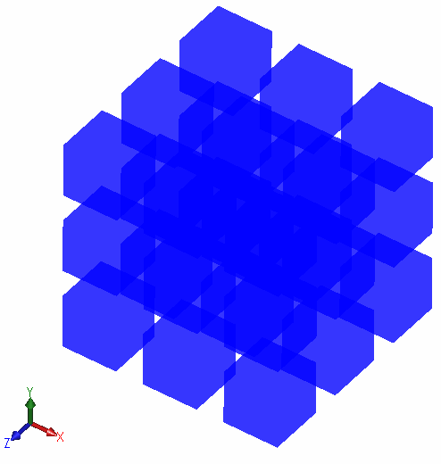

{ width=250 }

This example demonstrates how to render cubes in the predefined grid with transparency using OpenGL and SOLIDWORKS API.

Cubes are rendered automatically on all opened 3D models (parts or assemblies).

Parameters can be configured by changing the constants declared in the add-in:

~~~ cs
private const int INST_COUNT = 27;
private const int ROWS_COUNT = 3;
private const int COLUMNS_COUNT = 3;
private const double DIST = 0.05;
private const double WIDTH = 0.1;
private const double HEIGHT = 0.1;
private const double LENGTH = 0.1;
private readonly Color COLOR = Color.FromArgb(200, Color.Blue);
~~~

Note, this approach is a simple method of rendering OpenGL objects, but it doesn't provide the best performance benefits. Refer the [Import XAML File And Render Using VBO](/docs/codestack/solidworks-api/adornment/opengl/vbo-xaml-importer/) for a code example of rendering high performance graphics using Open GL Vertex Buffer Object (VBO).

Source code can be downloaded from [GitHub](https://github.com/codestackdev/solidworks-api-examples/tree/master/swex/add-in/opengl/OpenGlBoxGrid)

## AddIn.cs

This the add-in entry point. [SwEx.AddIn](/docs/codestack/labs/solidworks/swex/add-in/) framework is used to manage documents lifecycle by providing the wrapper class.

~~~ cs
using CodeStack.SwEx.AddIn;
using CodeStack.SwEx.AddIn.Attributes;
using System;
using System.Runtime.InteropServices;

namespace CodeStack.OpenGlBoxGrid
{
    [ComVisible(true), Guid("FAB0F03B-785E-4113-B120-E18E7C73B9EB")]
    [AutoRegister("OpenGL Box Grid")]
    public class AddIn : SwAddInEx
    {
        public override bool OnConnect()
        {
            CreateDocumentsHandler<OpenGlDocumentHandler>();
            return true;
        }
    }
}

~~~

## OpenGlDocumentHandler.cs

This is a handler class for each model document which subscribes to the OpenGL Buffer Swap notification provided by SOLIDWORKS and performs the calculation of coordinates of cubes based on the input parameters and renders in the model's graphics view.

~~~ cs
using CodeStack.SwEx.AddIn.Base;
using SolidWorks.Interop.sldworks;
using System.Drawing;
using static CodeStack.OpenGlBoxGrid.OpenGL;

namespace CodeStack.OpenGlBoxGrid
{
    public class OpenGlDocumentHandler : IDocumentHandler
    {
        private const int INST_COUNT = 27;
        private const int ROWS_COUNT = 3;
        private const int COLUMNS_COUNT = 3;
        private const double DIST = 0.05;
        private const double WIDTH = 0.1;
        private const double HEIGHT = 0.1;
        private const double LENGTH = 0.1;
        private readonly Color COLOR = Color.FromArgb(200, Color.Blue);

        private ModelView m_View;

        public void Init(ISldWorks app, IModelDoc2 model)
        {
            m_View = model.IActiveView;

            if (m_View != null)
            {
                m_View.BufferSwapNotify += OnBufferSwapNotify;
            }
        }

        private int OnBufferSwapNotify()
        {
            int level = 0;
            int row = 0;
            int column = 0;

            for (int i = 0; i < INST_COUNT; i++)
            {
                if (row == ROWS_COUNT)
                {
                    row = 0;
                    column++;

                    if (column == COLUMNS_COUNT)
                    {
                        column = 0;
                        level++;
                    }
                }

                RenderBox(new double[] 
                {
                    row * (WIDTH + DIST),
                    column * (LENGTH + DIST),
                    level * (HEIGHT + DIST)
                },
                WIDTH, LENGTH, HEIGHT,
                COLOR);

                row++;
            }
            
            return 0;
        }

        private void RenderBox(double[] pt, double width, double length, double height, Color color)
        {
            var vertices = new double[][]
            {
                new double[] { pt[0] - width / 2, pt[1] + length / 2, pt[2] + height / 2 },
                new double[] { pt[0] - width / 2, pt[1] - length / 2, pt[2] + height / 2 },
                new double[] { pt[0] + width / 2, pt[1] + length / 2, pt[2] + height / 2 },
                new double[] { pt[0] + width / 2, pt[1] - length / 2, pt[2] + height / 2 },
                new double[] { pt[0] + width / 2, pt[1] + length / 2, pt[2] - height / 2 },
                new double[] { pt[0] + width / 2, pt[1] - length / 2, pt[2] - height / 2 },
                new double[] { pt[0] - width / 2, pt[1] + length / 2, pt[2] - height / 2 },
                new double[] { pt[0] - width / 2, pt[1] - length / 2, pt[2] - height / 2 },
                new double[] { pt[0] - width / 2, pt[1] + length / 2, pt[2] + height / 2 },
                new double[] { pt[0] - width / 2, pt[1] - length / 2, pt[2] + height / 2 }
            };
            
            RenderTriangleStrip(vertices, color);

            RenderTriangleStrip(new double[][]
            {
                vertices[1], vertices[7], vertices[3], vertices[5]
            }, color);

            RenderTriangleStrip(new double[][]
            {
                vertices[0], vertices[2], vertices[6], vertices[4]
            }, color);
        }
        
        private void RenderTriangleStrip(double[][] vertices, Color color)
        {
            glDisable(GL_LIGHTING);
            glEnable(GL_BLEND);

            glBlendFunc(GL_SRC_ALPHA, GL_ONE_MINUS_SRC_ALPHA);

            glBegin(GL_TRIANGLE_STRIP);

            glColor4f(color.R / 255f, color.G / 255f, color.B / 255f, color.A / 255f);

            foreach (var vertex in vertices)
            {
                glVertex3d(vertex[0], vertex[1], vertex[2]);
            }

            glEnd();
        }

        public void Dispose()
        {
            if (m_View != null)
            {
                m_View.BufferSwapNotify -= OnBufferSwapNotify;
            }
        }
    }
}

~~~

## OpenGL.cs

List of imports for OpenGL functions.

~~~ cs
using System.Runtime.InteropServices;

namespace CodeStack.OpenGlBoxGrid
{
    public static class OpenGL
    {
        [DllImport("opengl32")]
        public static extern void glBegin(uint mode);

        [DllImport("opengl32")]
        public static extern void glEnd();

        [DllImport("opengl32")]
        public static extern void glVertex3d(double x, double y, double z);

        [DllImport("opengl32.dll")]
        public static extern void glDisable(uint cap);

        [DllImport("opengl32.dll")]
        public static extern void glColor4f(float R, float G, float B, float A);

        [DllImport("opengl32.dll")]
        public static extern void glEnable(uint cap);

        [DllImport("opengl32.dll")]
        public static extern void glBlendFunc(uint sfactor, uint dfactor);

        public const int GL_TRIANGLE_STRIP = 0x0005;
        public const uint GL_LIGHTING = 0x0B50;
        public const int GL_BLEND = 0x0BE2;
        public const int GL_SRC_ALPHA = 0x0302;
        public const int GL_ONE_MINUS_SRC_ALPHA = 0x0303;
    }
}

~~~

