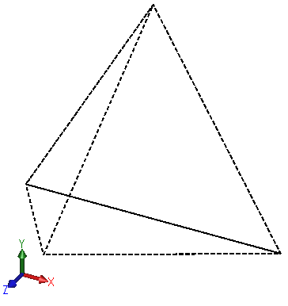
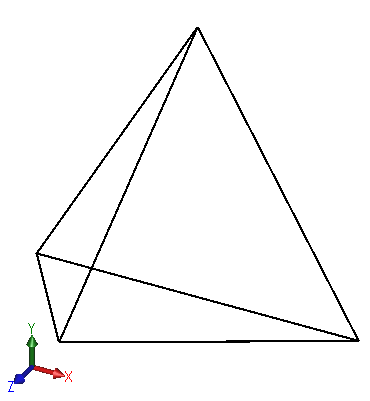

本示例演示了如何使用OpenGL图形渲染四面体几何体，并处理不同的显示模式（填充、填充带边缘、隐藏线、隐藏线可见、线框）。

一旦编译了插件，每次打开或创建新的3D模型（零件或装配）时，四面体都会被渲染。

在SOLIDWORKS模型视图的快捷菜单中更改显示模式以查看图形更新。

{ width=350 }

## 显示模式

### 填充带边缘

通过在三角形上方渲染两层图形：填充的三角形和未填充的线条。

{ width=200 }

### 填充

通过渲染三角形来实现。

{ width=200 }

### 隐藏线

通过将多边形模式设置为线条来实现。

{ width=200 }

### 隐藏线可见

通过以线条模式渲染虚线来实现。

{ width=200 }

### 线框

通过以线条模式渲染图形来实现。

{ width=200 }

源代码可以从[GitHub](https://github.com/codestackdev/solidworks-api-examples/tree/master/swex/add-in/opengl/OglTetrahedron)下载。

## AddIn.vb

这是插件的入口点。使用[SwEx.AddIn](/docs/codestack/labs/solidworks/swex/add-in/)框架通过提供包装类来管理文档的生命周期。

~~~ vb
Imports CodeStack.SwEx.AddIn
Imports CodeStack.SwEx.AddIn.Attributes
Imports System.Runtime.InteropServices

<ComVisible(True), Guid("A28F5BB7-E468-48B6-9BBD-9E7A31FF8CC8")>
<AutoRegister("OpenGL Box Tetrahedron")>
Public Class AddIn
	Inherits SwAddInEx

	Public Overrides Function OnConnect() As Boolean
		CreateDocumentsHandler(Of OpenGlDocumentHandler)()
		Return True
	End Function
End Class
~~~

## OpenGlDocumentHandler.vb

这是每个模型文档的处理程序类，它订阅SOLIDWORKS提供的OpenGL缓冲区交换通知，并执行四面体三角形坐标的计算和渲染几何体。

~~~ vb
Imports CodeStack.SwEx.AddIn.Base
Imports SolidWorks.Interop.sldworks
Imports System.Drawing
Imports SolidWorks.Interop.swconst
Imports CodeStack.OglTetrahedron.OpenGl

Public Class OpenGlDocumentHandler
	Implements IDocumentHandler

	ReadOnly m_FaceColor As Color = Color.Green
	ReadOnly m_EdgeColor As Color = Color.Black

	Dim m_MathUtils As IMathUtility
	Dim m_Model As IModelDoc2
	Dim m_View As ModelView

	Public Sub Init(ByVal app As ISldWorks, ByVal model As IModelDoc2) Implements IDocumentHandler.Init

		m_MathUtils = app.IGetMathUtility
		m_Model = model
		m_View = model.IActiveView

		If m_View IsNot Nothing Then
			AddHandler m_View.BufferSwapNotify, AddressOf OnBufferSwapNotify
		End If

	End Sub

	Private Function OnBufferSwapNotify() As Integer

		Dim a As Double() = New Double() {0, 0, 0}
		Dim b As Double() = New Double() {1, 0, 0}
		Dim c As Double() = New Double() {0.5, Math.Sqrt(3) / 2, 0}
		Dim d As Double() = New Double() {0.5, Math.Sqrt(3) / 6, Math.Sqrt(6) / 3}

		Select Case CType(m_View.DisplayMode, swViewDisplayMode_e)
			Case swViewDisplayMode_e.swViewDisplayMode_ShadedWithEdges
				DrawTetrahedron(m_FaceColor, True, False, False, 3.0F)
				DrawTetrahedron(m_EdgeColor, True, True, False, 3.0F)
			Case swViewDisplayMode_e.swViewDisplayMode_Shaded
				DrawTetrahedron(m_FaceColor, True, False, False, 3.0F)
			Case swViewDisplayMode_e.swViewDisplayMode_HiddenLinesRemoved '
				DrawTetrahedron(m_EdgeColor, False, False, False, 3.0F)
			Case swViewDisplayMode_e.swViewDisplayMode_HiddenLinesGrayed '
				DrawTetrahedron(m_EdgeColor, True, True, True, 1.0F)
			Case swViewDisplayMode_e.swViewDisplayMode_Wireframe
				DrawTetrahedron(m_EdgeColor, True, True, False, 3.0F)
		End Select

		Dim pt1 As IMathPoint = m_MathUtils.CreatePoint(New Double() {0, 0, 0})
		Dim pt2 As IMathPoint = m_MathUtils.CreatePoint(New Double() {1, 1, 1})

		m_Model.Extension.SetVisibleBox(pt1, pt2)

		Return 0

	End Function

	Private Sub DrawTetrahedron(color As Color, fill As Boolean, wireframe As Boolean, dashed As Boolean, width As Single)

		Dim a As Double() = New Double() {0, 0, 0}
		Dim b As Double() = New Double() {1, 0, 0}
		Dim c As Double() = New Double() {0.5, Math.Sqrt(3) / 2, 0}
		Dim d As Double() = New Double() {0.5, Math.Sqrt(3) / 6, Math.Sqrt(6) / 3}

		DrawTriangle(a, c, b, color, fill, wireframe, dashed, width)
		DrawTriangle(a, d, c, color, fill, wireframe, dashed, width)
		DrawTriangle(c, d, b, color, fill, wireframe, dashed, width)
		DrawTriangle(d, a, b, color, fill, wireframe, dashed, width)

	End Sub

	Private Sub DrawTriangle(a() As Double, b() As Double, c() As Double, color As Color, fill As Boolean, wireframe As Boolean, dashed As Boolean, width As Single)

		glPolygonMode(GL_FRONT_AND_BACK, IIf(fill, GL_FILL, GL_LINE))

		glDisable(GL_LIGHTING)

		If wireframe Then

			glEnable(GL_LINE_SMOOTH)

			If dashed Then
				glEnable(GL_LINE_STIPPLE)
				glLineStipple(4, &HAAAA)
			End If

		End If

		glBegin(IIf(wireframe, GL_LINE_LOOP, GL_TRIANGLES))

		If wireframe Then
			glLineWidth(width)
		End If

		glColor4f(color.R / 255.0F, color.G / 255.0F, color.B / 255.0F, color.A / 255.0F)
		glVertex3d(a(0), a(1), a(2))
		glVertex3d(b(0), b(1), b(2))
		glVertex3d(c(0), c(1), c(2))

		glEnd()

		glDisable(GL_LINE_SMOOTH)
		glDisable(GL_LINE_STIPPLE)

	End Sub

	Public Sub Dispose() Implements IDisposable.Dispose
		If m_View IsNot Nothing Then
			RemoveHandler m_View.BufferSwapNotify, AddressOf OnBufferSwapNotify
		End If
	End Sub

End Class

~~~

## OpenGL.vb

OpenGL函数的导入列表。

~~~ vb
Imports System.Runtime.InteropServices

Public Class OpenGl

	<DllImport("opengl32")>
	Public Shared Sub glBegin(ByVal mode As UInteger)
	End Sub

	<DllImport("opengl32")>
	Public Shared Sub glEnd()
	End Sub

	<DllImport("opengl32")>
	Public Shared Sub glVertex3d(ByVal x As Double, ByVal y As Double, ByVal z As Double)
	End Sub

	<DllImport("opengl32.dll")>
	Public Shared Sub glDisable(ByVal cap As UInteger)
	End Sub

	<DllImport("opengl32.dll")>
	Public Shared Sub glColor4f(ByVal R As Single, ByVal G As Single, ByVal B As Single, ByVal A As Single)
	End Sub

	<DllImport("opengl32.dll")>
	Public Shared Sub glEnable(ByVal cap As UInteger)
	End Sub

	<DllImport("opengl32.dll")>
	Public Shared Sub glPolygonMode(ByVal face As UInteger, ByVal mode As UInteger)
	End Sub

	<DllImport("opengl32.dll")>
	Public Shared Sub glLineWidth(ByVal width As Single)
	End Sub

	<DllImport("opengl32.dll")>
	Public Shared Sub glLineStipple(ByVal factor As Integer, ByVal pattern As UShort)
	End Sub

	Public Const GL_FRONT_AND_BACK As Integer = &H408
	Public Const GL_LINE As UInteger = &H1B01
	Public Const GL_FILL As UInteger = &H1B02

	Public Const GL_TRIANGLES As UInteger = &H4
	Public Const GL_LINE_LOOP As UInteger = &H2
	Public Const GL_LIGHTING As UInteger = &HB50
	Public Const GL_LINE_SMOOTH As UInteger = &HB20
	Public Const GL_LINE_STIPPLE As UInteger = &HB24

End Class

~~~