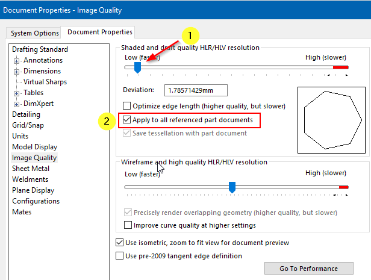
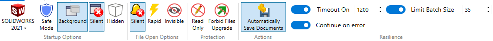

Author: [Eddy Alleman](https://www.linkedin.com/in/eddyalleman/) 

{ width=650 }

When working in large assemblies, there are document options you can set when you want your files to be saved as light as possible:

## Shaded and draft quality HLR/HLV resolution 
Controls the tessellation of curved surfaces for shaded rendering output. A higher resolution setting results in slower model rebuilding but more accurate curves.
Low (faster) - High (slower)  

This means that if you are working in an assembly, you can set all the referenced files to Low ImageQuality manually.

But in case you have a lot of files and need to work in large assemblies a macro can help and make the files lighter before opening the root assembly.

This macro sets both options (1) and (2) as shown in the above image. Option (2) is not available for parts.

The real power begins if you use this macro with Batch+. You can let it run when you're not working on your assembly.

{ width=800 }

~~~ vb
Option Explicit

' An assembly or a part file must be the active document.

' the document options are set to use coarse quality
' and the checkmark "Apply to all referenced part documents" is set to ON if the active document is an assembly

Dim swxApp As SldWorks.SldWorks
Dim swModel As SldWorks.ModelDoc2

Sub main()

try_:

    On Error GoTo catch_

    Set swxApp = Application.SldWorks
    
    Set swModel = swxApp.ActiveDoc

    'Check if active document is a Part or an Assembly file
    Select Case True
    
           Case swModel Is Nothing, (swModel.GetType <> swDocASSEMBLY And swModel.GetType <> swDocPART)
              Call swxApp.SendMsgToUser2("Please open an assembly or part file", swMbInformation, swMbOk)
                           
           Case Else
               Call SetCoarseQuality
               
    End Select

    GoTo finally_:
    
catch_:

        Debug.Print "Error: " & Err.Number & ":" & Err.Source & ":" & Err.Description
    
finally_:
    
End Sub

Private Function SetCoarseQuality() As Boolean
                  
    'set to use coarse quality
    Dim boolstatus As Boolean
    boolstatus = swModel.Extension.SetUserPreferenceInteger(swUserPreferenceIntegerValue_e.swImageQualityShaded, _
                                                              swUserPreferenceOption_e.swDetailingNoOptionSpecified, _
                                                              swImageQualityShaded_e.swShadedImageQualityCoarse)
        
    'option "Apply to all referenced part documents" is set to ON
    If swModel.GetType = swDocASSEMBLY Then
      
       Dim res As Boolean
       res = swModel.Extension.SetUserPreferenceToggle(swImageQualityApplyToAllReferencedPartDoc, _
                                                         swDetailingNoOptionSpecified, True)
        
    End If
           
End Function
~~~

