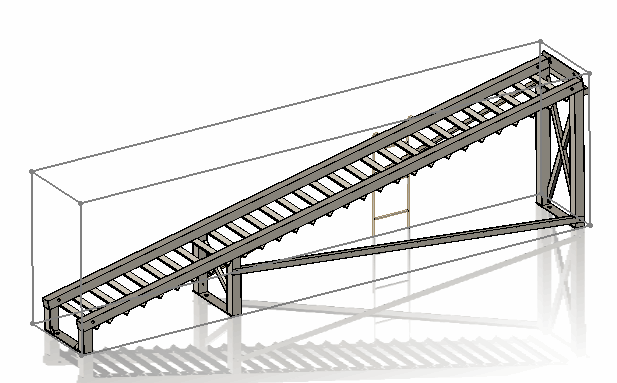
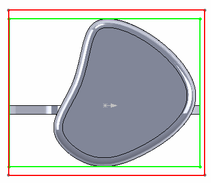
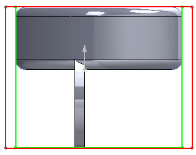

{ width=250 }

根据[SOLIDWORKS API帮助文档](https://help.solidworks.com/2016/english/api/sldworksapi/solidworks.interop.sldworks~solidworks.interop.sldworks.ipartdoc~getpartbox.html)中的*备注*部分所述的内容，使用[IBody2::GetExtremePoint](https://help.solidworks.com/2016/english/api/sldworksapi/solidworks.interop.sldworks~solidworks.interop.sldworks.ibody2~getextremepoint.html)方法（或其他边界框API）可以计算出零件文档中的近似边界框。

返回的值是近似值，不应用于比较或计算目的。此外，在重新构建模型后，边界框可能会发生变化。

要计算精确的边界框，需要通过在XYZ方向上找到每个实体的极值点来计算。通过[IBody2::GetExtremePoint](https://help.solidworks.com/2016/english/api/sldworksapi/solidworks.interop.sldworks~solidworks.interop.sldworks.ibody2~getextremepoint.html)方法可以找到每个实体的极值点。

以下宏将使用SOLIDWORKS API计算活动零件文档的边界框、宽度、高度和长度，同时使用两种方法。

结果将创建带有边界框的3D草图。

### 精度

近似计算的边界框可能会有超过10%的误差。对于以下[示例零件](bbox-precision.SLDPRT)，边界框体积之间的差异为14%。以下图像显示了差异（绿色框是精确计算，红色框是近似计算）：

{ width=250 }

{ width=250 }

{ width=250 }

> 通过极值点计算的精确边界框与SOLIDWORKS 2018中添加的[边界框特征](https://help.solidworks.com/2018/English/WhatsNew/t_bounding_box_for_part_assem.htm)创建的边界框完全相同。

### 性能

提取近似框的速度比精确计算快300多倍。对于单个实体零件，近似计算边界框的时间为0.016毫秒，而精确计算相同零件的时间为5.57毫秒。对于包含63个实体的多实体零件，近似计算时间为0.018毫秒，精确计算时间为16.68毫秒。

总结起来，平均每秒可以计算超过60000个近似边界框，而只能计算约50个精确边界框（超过1000倍的差异）。

### 通过极值点计算精确边界框

``` vb
Dim swApp As SldWorks.SldWorks

Sub main()

    Set swApp = Application.SldWorks
    Dim swPart As SldWorks.PartDoc
    
    Set swPart = swApp.ActiveDoc
    
    If Not swPart Is Nothing Then
            
        Dim vBBox As Variant
    
        vBBox = GetPreciseBoundingBox(swPart)
     
        DrawBox swPart, CDbl(vBBox(0)), CDbl(vBBox(1)), CDbl(vBBox(2)), CDbl(vBBox(3)), CDbl(vBBox(4)), CDbl(vBBox(5))
        
        Debug.Print "宽度: " & CDbl(vBBox(3)) - CDbl(vBBox(0))
        Debug.Print "长度: " & CDbl(vBBox(5)) - CDbl(vBBox(2))
        Debug.Print "高度: " & CDbl(vBBox(4)) - CDbl(vBBox(1))
        
    Else
        
        MsgBox "请打开零件"
        
    End If
    
End Sub

Function GetPreciseBoundingBox(part As SldWorks.PartDoc) As Variant
    
    Dim dBox(5) As Double
    
    Dim vBodies As Variant
    vBodies = part.GetBodies2(swBodyType_e.swSolidBody, True)
        
    Dim minX As Double
    Dim minY As Double
    Dim minZ As Double
    Dim maxX As Double
    Dim maxY As Double
    Dim maxZ As Double
        
    If Not IsEmpty(vBodies) Then
    
        Dim i As Integer
        
        For i = 0 To UBound(vBodies)
        
            Dim swBody As SldWorks.Body2
    
            Set swBody = vBodies(i)
            
            Dim x As Double
            Dim y As Double
            Dim z As Double
            
            swBody.GetExtremePoint 1, 0, 0, x, y, z
            
            If i = 0 Or x > maxX Then
                maxX = x
            End If
            
            swBody.GetExtremePoint -1, 0, 0, x, y, z
            
            If i = 0 Or x < minX Then
                minX = x
            End If
            
            swBody.GetExtremePoint 0, 1, 0, x, y, z
            
            If i = 0 Or y > maxY Then
                maxY = y
            End If
            
            swBody.GetExtremePoint 0, -1, 0, x, y, z
            
            If i = 0 Or y < minY Then
                minY = y
            End If
            
            swBody.GetExtremePoint 0, 0, 1, x, y, z
            
            If i = 0 Or z > maxZ Then
                maxZ = z
            End If
            
            swBody.GetExtremePoint 0, 0, -1, x, y, z
            
            If i = 0 Or z < minZ Then
                minZ = z
            End If
            
        Next
    
    End If
    
    dBox(0) = minX: dBox(1) = minY: dBox(2) = minZ
    dBox(3) = maxX: dBox(4) = maxY: dBox(5) = maxZ
    
    GetPreciseBoundingBox = dBox
    
End Function

Sub DrawBox(model As SldWorks.ModelDoc2, minX As Double, minY As Double, minZ As Double, maxX As Double, maxY As Double, maxZ As Double)

    model.ClearSelection2 True
            
    model.SketchManager.Insert3DSketch True
    model.SketchManager.AddToDB = True
    
    model.SketchManager.CreateLine maxX, minY, minZ, maxX, minY, maxZ
    model.SketchManager.CreateLine maxX, minY, maxZ, minX, minY, maxZ
    model.SketchManager.CreateLine minX, minY, maxZ, minX, minY, minZ
    model.SketchManager.CreateLine minX, minY, minZ, maxX, minY, minZ

    model.SketchManager.CreateLine maxX, maxY, minZ, maxX, maxY, maxZ
    model.SketchManager.CreateLine maxX, maxY, maxZ, minX, maxY, maxZ
    model.SketchManager.CreateLine minX, maxY, maxZ, minX, maxY, minZ
    model.SketchManager.CreateLine minX, maxY, minZ, maxX, maxY, minZ
    
    model.SketchManager.CreateLine minX, minY, minZ, minX, maxY, minZ
    model.SketchManager.CreateLine minX, minY, maxZ, minX, maxY, maxZ
    
    model.SketchManager.CreateLine maxX, minY, minZ, maxX, maxY, minZ
    model.SketchManager.CreateLine maxX, minY, maxZ, maxX, maxY, maxZ
    
    model.SketchManager.AddToDB = False
    model.SketchManager.Insert3DSketch True
    
End Sub

```


### 计算近似边界框

``` vb
Dim swApp As SldWorks.SldWorks

Sub main()

    Set swApp = Application.SldWorks
    
    Dim swPart As SldWorks.PartDoc
    
    Set swPart = swApp.ActiveDoc
    
    If Not swPart Is Nothing Then
                
        Dim vBBox As Variant
        
        vBBox = swPart.GetPartBox(True)
         
        DrawBox swPart, CDbl(vBBox(0)), CDbl(vBBox(1)), CDbl(vBBox(2)), CDbl(vBBox(3)), CDbl(vBBox(4)), CDbl(vBBox(5))
        
        Debug.Print "宽度: " & vBBox(3) - vBBox(0)
        Debug.Print "长度: " & vBBox(5) - vBBox(2)
        Debug.Print "高度: " & vBBox(4) - vBBox(1)
        
    Else
        
        MsgBox "请打开零件"
        
    End If
    
End Sub

Sub DrawBox(model As SldWorks.ModelDoc2, minX As Double, minY As Double, minZ As Double, maxX As Double, maxY As Double, maxZ As Double)

    model.ClearSelection2 True
            
    model.SketchManager.Insert3DSketch True
    model.SketchManager.AddToDB = True
    
    model.SketchManager.CreateLine maxX, minY, minZ, maxX, minY, maxZ
    model.SketchManager.CreateLine maxX, minY, maxZ, minX, minY, maxZ
    model.SketchManager.CreateLine minX, minY, maxZ, minX, minY, minZ
    model.SketchManager.CreateLine minX, minY, minZ, maxX, minY, minZ

    model.SketchManager.CreateLine maxX, maxY, minZ, maxX, maxY, maxZ
    model.SketchManager.CreateLine maxX, maxY, maxZ, minX, maxY, maxZ
    model.SketchManager.CreateLine minX, maxY, maxZ, minX, maxY, minZ
    model.SketchManager.CreateLine minX, maxY, minZ, maxX, maxY, minZ
    
    model.SketchManager.CreateLine minX, minY, minZ, minX, maxY, minZ
    model.SketchManager.CreateLine minX, minY, maxZ, minX, maxY, maxZ
    
    model.SketchManager.CreateLine maxX, minY, minZ, maxX, maxY, minZ
    model.SketchManager.CreateLine maxX, minY, maxZ, maxX, maxY, maxZ
    
    model.SketchManager.AddToDB = False
    model.SketchManager.Insert3DSketch True
    
End Sub


```