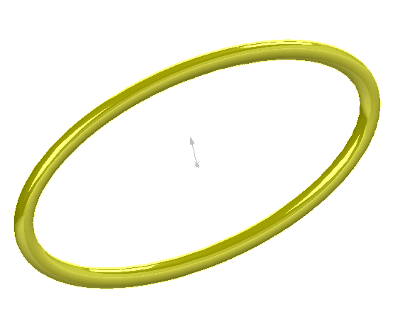

 该示例演示了如何使用SOLIDWORKS API将圆形剖面沿椭圆路径扫描以创建临时体。
image: elliptical-sweep.png
labels: [拓扑结构, 几何, 片, 模型, 球体]
---
{ width=250 }

该示例演示了如何使用SOLIDWORKS API将圆形剖面沿椭圆路径扫描以创建临时体。

[SOLIDWORKS API方法IModeler::CreateSweptBody](https://help.solidworks.com/2012/english/api/sldworksapi/SOLIDWORKS.Interop.sldworks~SOLIDWORKS.Interop.sldworks.IModeler~CreateSweptBody.html)要求预先选择剖面和路径，这意味着无法使用曲线进行扫描操作。

但是，该宏演示了如何从临时线体中创建边缘。

使用[仅用于API的对象选择](/docs/codestack/solidworks-api/document/selection/api-only-selection/)技术可以在不显示任何线体并且不在图形区域中显示任何可见选择的情况下创建扫描体。所有用户选择也将被保留。

* 打开零件文档
* 可选择任何对象（这不会影响扫描操作）。
* 运行宏。宏显示临时体，所有用户选择的对象都将被保留。
* 停止宏的执行
* 继续宏以隐藏预览

~~~ vb
Dim swApp As SldWorks.SldWorks

Sub main()

    Set swApp = Application.SldWorks
    
    Dim swModel As SldWorks.ModelDoc2
    
    Set swModel = swApp.ActiveDoc
    
    If Not swModel Is Nothing Then
                
        Dim swSweptBody As SldWorks.Body2
                
        Dim swPath As SldWorks.Curve
        
        Set swPath = GetPath()
        
        Dim vPtOnPath As Variant
        
        vPtOnPath = swPath.GetClosestPointOn(0, 0, 0)
        
        Dim dCenter(2) As Double
        dCenter(0) = vPtOnPath(0): dCenter(1) = vPtOnPath(1): dCenter(2) = vPtOnPath(2)
        
        Dim swProfile As SldWorks.Curve
        Set swProfile = GetProfile(dCenter)
        
        Set swSweptBody = CreateSweptBody(swModel, swProfile, swPath)

        swSweptBody.Display3 swModel, RGB(255, 255, 0), swTempBodySelectOptions_e.swTempBodySelectOptionNone
        
        Stop
        Set swSweptBody = Nothing
        
    Else
        MsgBox "请打开模型"
    End If

End Sub

Function CreateSweptBody(model As SldWorks.ModelDoc2, profile As SldWorks.Curve, path As SldWorks.Curve) As SldWorks.Body2
    
    Dim swModeler As SldWorks.modeler
    Set swModeler = swApp.GetModeler
    
    Dim swProfileBody As SldWorks.Body2
    Set swProfileBody = profile.CreateWireBody
        
    Dim swPathBody As SldWorks.Body2
    Set swPathBody = path.CreateWireBody()
    
    Dim swSelMgr As SldWorks.SelectionMgr
    Set swSelMgr = model.SelectionManager
    
    swSelMgr.SuspendSelectionList

    AddToCurrentSelectionSet swSelMgr, swProfileBody.GetEdges(), 1
    AddToCurrentSelectionSet swSelMgr, swPathBody.GetEdges(), 4
    
    Dim swSweptBody As SldWorks.Body2
    Set swSweptBody = swModeler.CreateSweptBody(model, True, False, swTwistControlType_e.swTwistControlFollowPath, True, False, swTangencyType_e.swTangencyNone, swTangencyType_e.swTangencyNone, False, 0, 0, swThinWallType_e.swThinWallMidPlane, 0, 0, False)
        
    Set CreateSweptBody = swSweptBody
    
    Set swProfileBody = Nothing
    Set swPathBody = Nothing
    
    swSelMgr.ResumeSelectionList
    
End Function

Sub AddToCurrentSelectionSet(selMgr As SldWorks.SelectionMgr, vObjects As Variant, selMark As Integer)
    
    Dim swSelData As SldWorks.SelectData
    
    Set swSelData = selMgr.CreateSelectData
    
    swSelData.Mark = selMark
    
    Dim i As Integer
    
    For i = 0 To UBound(vObjects)
        Dim obj As Object
        Set obj = vObjects(i)
        selMgr.AddSelectionListObject obj, swSelData
    Next
    
End Sub

Function GetProfile(center As Variant) As SldWorks.Curve

    Dim swModeler As SldWorks.modeler
    Set swModeler = swApp.GetModeler
    
    Dim dAxis(2) As Double
    dAxis(0) = 0: dAxis(1) = 0: dAxis(2) = 1
    
    Const radius As Double = 0.01
    Dim dStartPt(2) As Double
    dStartPt(0) = radius + center(0): dStartPt(1) = center(1): dStartPt(2) = center(2)
    
    Dim swProfileCurve As SldWorks.Curve
    Set swProfileCurve = swModeler.CreateArc(center, dAxis, radius, dStartPt, dStartPt)
    
    Set GetProfile = swProfileCurve
    
End Function

Function GetPath() As SldWorks.Curve

    Dim swModeler As SldWorks.modeler
    Set swModeler = swApp.GetModeler

    Const majorRadius As Double = 0.2
    Const minorRadius As Double = 0.1
    
    Dim dCenter(2) As Double
    dCenter(0) = 0: dCenter(1) = 0: dCenter(2) = 0
    
    Dim dMajorAxis(2) As Double
    dMajorAxis(0) = 0.5: dMajorAxis(1) = 0: dMajorAxis(2) = 1
    
    Dim dMinorAxis(2) As Double
    dMinorAxis(0) = 0.25: dMinorAxis(1) = 1: dMinorAxis(2) = 0
    
    Dim swPath As SldWorks.Curve
    
    Set swPath = swModeler.CreateEllipse(dCenter, majorRadius, minorRadius, dMajorAxis, dMinorAxis)

    Set GetPath = swPath

End Function
~~~