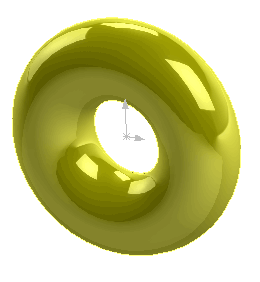

该示例演示了如何使用SOLIDWORKS API从环面创建片体。

几何图形是使用[SOLIDWORKS API的IModeler::CreateToroidalSurface](https://help.solidworks.com/2018/english/api/sldworksapi/solidworks.interop.sldworks~solidworks.interop.sldworks.imodeler~createtoroidalsurface.html)方法创建的。

运行宏后，将显示临时片体。可以旋转和选择该片体，但它不会显示在特征树中。继续执行宏以销毁该片体。

```vb
Dim swApp As SldWorks.SldWorks
Dim swModel As SldWorks.ModelDoc2
Dim swModeler As SldWorks.Modeler

Sub main()

    Set swApp = Application.SldWorks
    
    Set swModel = swApp.ActiveDoc
    
    If Not swModel Is Nothing Then
    
        Set swModeler = swApp.GetModeler
    
        Dim dCenter(2) As Double
        Dim dAxis(2) As Double
        Dim dRef(2) As Double
        
        Const MAJOR_RADIUS As Double = 0.1
        Const MINOR_RADIUS As Double = 0.05
        
        dCenter(0) = 0: dCenter(1) = 0: dCenter(2) = 0
        dAxis(0) = 0: dAxis(1) = 0: dAxis(2) = 1
        dRef(0) = 1: dRef(1) = 0: dRef(2) = 0
        
        Dim swSurf As SldWorks.Surface
        Set swSurf = swModeler.CreateToroidalSurface(dCenter, dAxis, dRef, MAJOR_RADIUS, MINOR_RADIUS)
        
        Dim swBody As SldWorks.Body2
        Dim swCurve(0) As SldWorks.Curve
        Set swBody = swSurf.CreateTrimmedSheet(swCurve)
        
        swBody.Display3 swModel, RGB(255, 255, 0), swTempBodySelectOptions_e.swTempBodySelectable
    
        Stop '继续隐藏片体
        
        Set swBody = Nothing
        
    Else
        MsgBox "请打开零件文档"
    End If
    
End Sub
```

