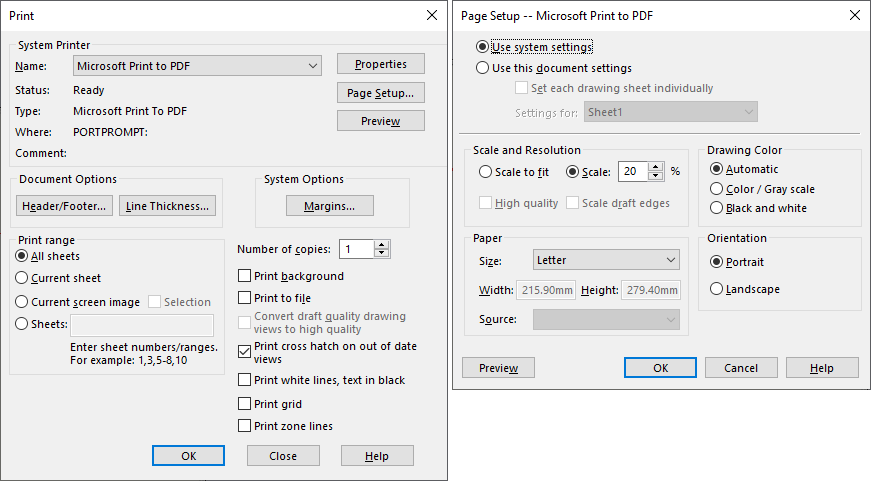

{ width=500 }

这个VBA宏允许打印活动的SOLIDWORKS文档。可以指定打印的设置：打印机名称、打印范围、方向、纸张大小和比例。

## 设置

要配置设置，请根据下面的描述更改宏顶部的常量的值。

~~~ vb
Const PRINTER_NAME As String = "Microsoft Print To PDF" '打印机的全名
Const PRINT_RANGE As String = "1-3,5" '要打印的范围。指定*以打印所有页面或一个范围
Const PRINT_ORIENTATION As Integer = swPageSetupOrientation_e.swPageSetupOrient_Landscape '方向：横向或纵向
Const PRINTER_PAPER_SIZE As String = "A3" '要打印的纸张大小
Const PRINT_SCALE As String = "*" '打印比例。使用*以适应比例或比例的值（1到1000）
~~~

~~~ vb
Private Declare PtrSafe Function DeviceCapabilities Lib "winspool.drv" Alias "DeviceCapabilitiesA" (ByVal lpDeviceName As String, ByVal lpPort As String, ByVal iIndex As Long, ByRef lpOutput As Any, ByRef lpDevMode As Any) As Long

Dim swApp As SldWorks.SldWorks

Const PRINTER_NAME As String = "Microsoft Print To PDF"
Const PRINT_RANGE As String = "1-3,5"
Const PRINT_ORIENTATION As Integer = swPageSetupOrientation_e.swPageSetupOrient_Landscape
Const PRINTER_PAPER_SIZE As String = "A3"
Const PRINT_SCALE As String = "*"

Sub main()
    
    Set swApp = Application.SldWorks
    
    Dim swModel As SldWorks.ModelDoc2
    
    Set swModel = swApp.ActiveDoc
    
    If swModel Is Nothing Then
        Err.Raise vbError, "", "请打开文档"
    End If
    
    Dim swPageSetup As SldWorks.PageSetup
    
    Set swPageSetup = swModel.PageSetup
    
    Dim origPrinter As String
    Dim origPrinterPaperSize As Integer
    Dim origScaleToFit As Boolean
    Dim origScale As Double
    Dim origOrientation As Integer
    Dim origUsePageSetup As Integer
    
    origPrinter = swModel.Printer
    origPrinterPaperSize = swPageSetup.PrinterPaperSize
    origScaleToFit = swPageSetup.ScaleToFit
    origScale = swPageSetup.Scale2
    origOrientation = swPageSetup.Orientation
    origUsePageSetup = swModel.Extension.UsePageSetup
    
    swModel.Printer = PRINTER_NAME
    swPageSetup.PrinterPaperSize = GetPaper(PRINTER_NAME, PRINTER_PAPER_SIZE)
    
    If PRINT_SCALE = "*" Then
        swPageSetup.ScaleToFit = True
    Else
        swPageSetup.ScaleToFit = False
        swPageSetup.Scale2 = CDbl(PRINT_SCALE)
    End If
    
    swPageSetup.Orientation = PRINT_ORIENTATION
    
    swModel.Extension.UsePageSetup = swPageSetupInUse_e.swPageSetupInUse_Document
    
    Dim swPrintSpec As SldWorks.PrintSpecification
    Set swPrintSpec = swModel.Extension.GetPrintSpecification
    
    swPrintSpec.printRange = GetPrintRange(PRINT_RANGE)
        
    swModel.Extension.PrintOut4 PRINTER_NAME, "", swPrintSpec
    
    swModel.Printer = origPrinter
    swPageSetup.PrinterPaperSize = origPrinterPaperSize
    swPageSetup.ScaleToFit = origScaleToFit
    swPageSetup.Scale2 = origScale
    swPageSetup.Orientation = origOrientation
    swModel.Extension.UsePageSetup = origUsePageSetup
    
End Sub

Function GetPrintRange(range As String) As Variant
    
    Dim printRange() As Long
    
    If range = "*" Then
        ReDim printRange(1)
        printRange(0) = -1
        printRange(1) = -1
    Else
        
        Dim vPageRanges As Variant
        vPageRanges = Split(range, ",")
        
        ReDim printRange((UBound(vPageRanges) + 1) * 2 - 1)
        
        Dim i As Integer
        
        For i = 0 To UBound(vPageRanges)
            
            Dim vStartEndPages As Variant
            vStartEndPages = Split(Trim(CStr(vPageRanges(i))), "-")
            
            Dim startPage As Long
            Dim endPage As Long
            startPage = CLng(vStartEndPages(0))
            
            If UBound(vStartEndPages) = 0 Then
                endPage = startPage
            ElseIf UBound(vStartEndPages) = 1 Then
                endPage = CLng(vStartEndPages(1))
            Else
                Err.Raise vbError, "", "无效的页面范围：" & CStr(vPageRanges(i))
            End If
            
            printRange(i * 2) = startPage
            printRange(i * 2 + 1) = endPage
            
        Next
        
    End If
        
    GetPrintRange = printRange
    
End Function

Function GetPaper(printerName As String, paperName As String) As Integer
    
    Const DC_PAPERNAMES As Integer = &H10
    Const DC_PAPERS As Integer = &H2
    
    Dim papersCount As Integer
    papersCount = DeviceCapabilities(printerName, "", DC_PAPERS, ByVal vbNullString, 0)
    
    If papersCount > 0 Then
    
        Dim papersCodes() As Integer
        ReDim papersCodes(papersCount - 1)
        
        DeviceCapabilities printerName, "", DC_PAPERS, papersCodes(0), 0
        
        Dim papersNames As String
        papersNames = String$(64 * papersCount, 0)
        DeviceCapabilities printerName, "", DC_PAPERNAMES, ByVal papersNames, 0
      
        Dim i As Integer
        
        For i = 0 To papersCount
            If LCase(ParsePaperName(papersNames, 64 * i + 1)) = LCase(paperName) Then
                GetPaper = papersCodes(i)
            End If
        Next
    Else
        Err.Raise vbError, "", "指定的打印机没有可用的尺寸"
    End If
    
End Function

Function ParsePaperName(papersNames As String, offset As Integer) As String

    Dim paperName As String
    
    paperName = Mid(papersNames, offset, 64)
    
    Dim nullCharIndex As Integer
    nullCharIndex = InStr(paperName, vbNullChar)
    
    If nullCharIndex <> 0 Then
        paperName = Left$(paperName, nullCharIndex - 1)
    End If
     
    ParsePaperName = paperName
    
End Function
~~~