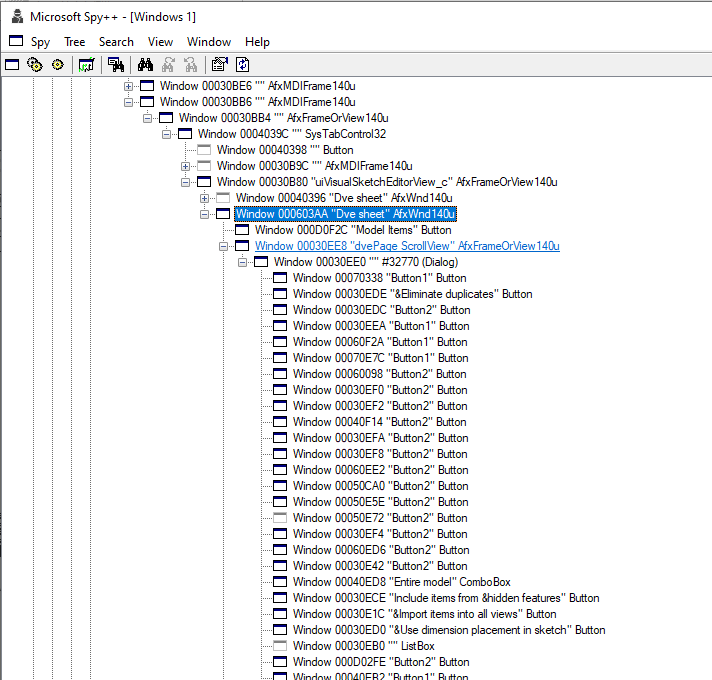

In some cases certain SOLIDWORKS functions or options may not be available within SOLIDWORKS API commands or may work incorrectly.

In this case one of the possible workarounds (if other workarounds are not available) is to use Windows API to invoke and configure the commands.

This example demonstrate how to insert model dimensions into the SOLIDWORKS drawing view using Windows API. This example emulates the functionality of [IDrawingDoc::InsertModelAnnotations3](https://help.solidworks.com/2015/english/api/sldworksapi/solidworks.interop.sldworks~solidworks.interop.sldworks.idrawingdoc~insertmodelannotations3.html) API methods.

{ width=400 }

This is a C# Console Application which accepts the path to a drawing as an input parameter. The following steps will be performed:

* Connect or create new instance of SOLIDWORKS
* Open the specified drawing file
* Open the **Insert Model Items** property manager page by running the command using SOLIDWORKS API
* Iterate all controls and set the source to **Entire Model** and **Include items from hidden features** option
* Close Property Manager Page by clicking OK button
* Save and close the document

While invoking Windows API it is required to develop a strategy of finding the specific controls and command ids.

Spy++ utility by Microsoft which is built-in into Visual Studio can be a useful tool to analyze Windows controls:

{ width=400 }

Refer [Calling Windows API commands](https://blog.codestack.net/missing-solidworks-api-command#calling-windows-command) blog article for more information about this method.

## Limitations

* Low-level code which is less readable and more complex
* In some cases there is no permanent ids of controls, so it is required to use additional logic such as control title or order which may differ from session to session, release to release or be locale dependent
* Windows API performs a low level calls so it is required to be careful working with memory, releasing pointers, etc. as it may cause an unexpected behavior. Read Windows API documentation for more information about the specific API calls
* There is no feedback about the result of the operation (only low level API results) which means that it may be hard to identify if operation performed successfully. The operation may also produce model popup windows which needs to be handled separately.

~~~ cs
using SolidWorks.Interop.sldworks;
using SolidWorks.Interop.swconst;
using System;
using System.Collections.Generic;
using System.Linq;
using System.Runtime.InteropServices;
using System.Text;

namespace InsertModelItemsWinAPI
{
    class Program
    {
        public class SearchData
        {
            public string ClassName;
            public string Title;
            public List<IntPtr> Results;

            public SearchData()
            {
                Results = new List<IntPtr>();
            }
        }

        #region Windows API

        [DllImport("user32.dll", CharSet = CharSet.Auto)]
        private static extern int SendMessage(IntPtr hWnd, int msg, int wParam, int lParam);
        
        [DllImport("user32.dll", SetLastError = true, CharSet = CharSet.Auto)]
        public static extern int GetWindowTextLength(IntPtr hWnd);

        [DllImport("user32.dll", CharSet = CharSet.Auto, SetLastError = true)]
        public static extern int GetWindowText(IntPtr hWnd, StringBuilder lpString, int nMaxCount);

        [DllImport("user32.dll", SetLastError = true, CharSet = CharSet.Auto)]
        public static extern int GetClassName(IntPtr hWnd, StringBuilder lpClassName, int nMaxCount);

        public delegate bool WindowEnumProc(IntPtr hWnd, ref SearchData lParam);

        [DllImport("user32.dll")]
        public static extern bool EnumChildWindows(IntPtr hWnd, WindowEnumProc func, ref SearchData lParam);

        #endregion

        static void Main(string[] args)
        {
            var app = (ISldWorks)Activator.CreateInstance(Type.GetTypeFromProgID("SldWorks.Application"));

            int errs = -1;
            int warns = -1;

            var filePath = args.First();

            var doc = app.OpenDoc6(filePath, (int)swDocumentTypes_e.swDocDRAWING, (int)swOpenDocOptions_e.swOpenDocOptions_Silent, "", ref errs, ref warns);
            
            const int WM_COMMAND = 0x0111;
            const int MODEL_ITEMS_CMD = 38374;

            //get the handle to SOLIDWORKS window
            var hWnd = new IntPtr(app.IFrameObject().GetHWnd());

            //open 'Model Items' property manager page
            SendMessage(hWnd, WM_COMMAND, MODEL_ITEMS_CMD, 0);

            var modelItemPageWnd = FindPropertyPageByName(hWnd, "Model Items");

            //Find the check box 'Include items from hidden features'
            var includeHiddenItemsWnd = FindWindows(modelItemPageWnd, "Include items from &hidden features", "Button").First();

            //check the found checkbox
            SetCheckBox(includeHiddenItemsWnd, true);

            //Find the source ComboBox (this is a first ComboBox in the page)
            var srcComboBox = FindWindows(modelItemPageWnd, "", "ComboBox").First();

            //Set the ComboBox selection to the first item (Entire Model)
            SetComboBox(srcComboBox, 0);

            const int swCommands_PmOK = -2;

            //Click OK on the PMPage to complete the operation
            app.RunCommand(swCommands_PmOK, "");

            doc.Save3((int)swSaveAsOptions_e.swSaveAsOptions_Silent, ref errs, ref warns);
            app.CloseDoc(doc.GetTitle());
        }

        private static void SetCheckBox(IntPtr checkBoxWnd, bool value)
        {
            const int BST_UNCHECKED = 0x0000;
            const int BST_CHECKED = 0x0001;
            const int BM_SETCHECK = 0x00F1;

            SendMessage(checkBoxWnd, BM_SETCHECK, value ? BST_CHECKED : BST_UNCHECKED, 0);
        }

        private static void SetComboBox(IntPtr comboBoxWnd, int index) 
        {
            const int CB_SETCURSEL = 0x014E;
            SendMessage(comboBoxWnd, CB_SETCURSEL, index, 0);
        }

        private static IntPtr FindPropertyPageByName(IntPtr swHwnd, string name)
        {
            var pagesWnd = FindWindows(swHwnd, "Dve sheet", "AfxWnd140u");

            foreach (var pageWnd in pagesWnd) 
            {
                if (FindWindows(pageWnd, name, "Button").Any()) 
                {
                    return pageWnd;
                }
            }

            throw new Exception($"Failed to find the property page '{name}'");
        }

        private static IntPtr[] FindWindows(IntPtr parentWnd, string title, string className)
        {
            var data = new SearchData()
            {
                ClassName = className,
                Title = title
            };

            var callbackProc = new WindowEnumProc(EnumChildWindowsCallback);
            EnumChildWindows(parentWnd, callbackProc, ref data);

            return data.Results.ToArray();
        }

        private static bool EnumChildWindowsCallback(IntPtr hWnd, ref SearchData data)
        {
            GetWindowInfo(hWnd, out string title, out string className);

            if ((string.IsNullOrEmpty(data.ClassName) || className == data.ClassName) && (string.IsNullOrEmpty(data.Title) || title == data.Title))
            {
                data.Results.Add(hWnd);
            }

            return true;
        }

        private static void GetWindowInfo(IntPtr hWnd, out string title, out string className)
        {
            var length = GetWindowTextLength(hWnd);
            var sb = new StringBuilder(length + 1);
            
            GetWindowText(hWnd, sb, sb.Capacity);

            title = sb.ToString();

            sb = new StringBuilder(256);
            
            GetClassName(hWnd, sb, sb.Capacity);

            className = sb.ToString().Trim();
        }
    }
}
~~~

