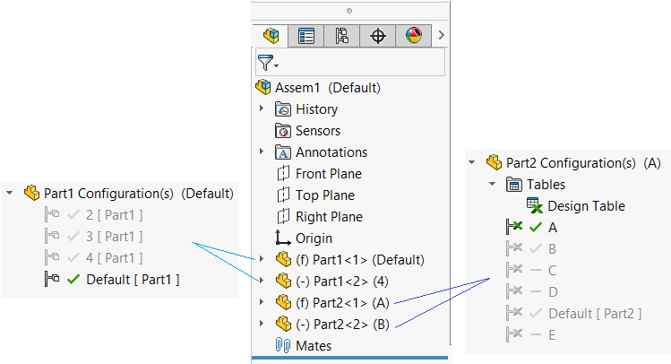

 VBA宏，用于在装配中创建所有选定部件的副本并清除其中的配置
image: purged-components-result1.png
labels: [component, replace, purge]
group: Assembly
---
在某些情况下，可能需要从装配中删除（清除）所有未使用的部件配置。这对于紧固件或工具箱部件特别有用，因为文件中可能包含数千个配置，但在装配中只使用了几个。

该宏允许创建所有选定部件的副本，清除其配置并在装配中替换它们。

> 强烈建议在使用此宏之前备份您的装配

您可以手动选择部件，也可以使用[高级部件选择工具](https://help.solidworks.com/2016/English/SolidWorks/sldworks/c_Advanced_Component_Selection_SWassy.htm)根据条件选择部件（例如紧固件或工具栏）：

要使用其他条件，请使用[扩展的高级选择宏](/docs/codestack/solidworks-api/document/assembly/components/advanced-selection/)。

## 注意事项

* 该宏仅适用于永久部件。对于虚拟部件，将生成错误。
* 该宏仅适用于基于零件（*.sldprt）的部件。
* 该宏仅适用于完全加载的部件，不支持抑制或轻量级部件。
* 宏在处理后不保存文档。使用“全部保存”保存所有修改。
* 宏将所有替换部件复制到与源部件相同的位置。
* 可以在特征管理器树中选择组件，也可以从图形视图中选择组件（还可以选择组件的任何实体，例如面或边）。
* 如果存在设计表，将删除设计表。
* 如果目标文件已创建，则宏不会替换现有文件，并生成“文件已存在”错误。请手动删除所有这些文件。如果宏失败，一些文件可能已加载到内存中，尽管它们在装配中未使用。使用“全部关闭”命令释放这些文件。
* 将重新连接约束。

## 选项

### 替换名称

通过更改*REPLACEMENT_NAME*常量来指定替换文件的名称。使用带有\[title\]和\[conf\]占位符的自由文本，这些占位符将分别替换为源文件的标题和组件的引用配置。如果将*GROUP_BY_CONFIGURATIONS*选项设置为True，则\[conf\]占位符将被所有配置名称的连接替换，以_符号分隔。

### 配置分组

*GROUP_BY_CONFIGURATIONS*选项允许指定是否应为不同配置中引用相同文档的组件替换为单个组件，还是应为每个组件创建新的单个配置部件。

### 示例

有2个具有多个配置的文件

* Part1.sldprt包含4个配置：Default、2、3和4
* Part2.sldprt包含由设计表驱动的6个配置：Default、A、B、C、D、E
* Part1在装配中以Default和4两个配置中各放置了2次
* Part2在装配中以A和B两个配置中各放置了2次

用户选择前3个部件并运行宏。根据指定的设置，将产生以下结果

### 选项1

~~~ vb
Const GROUP_BY_CONFIGURATIONS As Boolean = False
Const REPLACEMENT_NAME As String = "[title]_[conf]"
~~~

结果将生成3个具有单个配置的新文件：Part1_Default.sldprt、Part1_4.sldprt、Part2_A.sldprt（设计表已删除），并替换所有选定的部件。第4个部件不会更改，因为最初未选择它。

### 选项2

~~~ vb
Const GROUP_BY_CONFIGURATIONS As Boolean = True
Const REPLACEMENT_NAME As String = "[title]_[conf]_replacement"
~~~

结果将生成2个新文件：Part1_Default_4_replacement.sldprt（具有2个配置），Part2_A_replacement.sldprt（设计表已删除），并替换所有选定的部件。第4个部件不会更改，因为最初未选择它。

~~~ vb
Const GROUP_BY_CONFIGURATIONS As Boolean = False
Const REPLACEMENT_NAME As String = "[title]_[conf]"

Dim swApp As SldWorks.SldWorks

Sub main()

    Set swApp = Application.SldWorks
    
try:
    On Error GoTo catch
    
    Dim swAssy As SldWorks.AssemblyDoc
    
    Set swAssy = swApp.ActiveDoc
    
    If Not swAssy Is Nothing Then
        
        Dim vComps As Variant
        vComps = GetReplacementComponents(swAssy)
        
        Dim swCompGroups As Object
        Set swCompGroups = GroupByModel(vComps)
        
        Dim replacementsMap As Object

        Set replacementsMap = CreateReplacementModels(swCompGroups)
        
        ReplaceComponents swAssy, vComps, replacementsMap
        
    Else
        Err.Raise vbError, "", "打开装配文档"
    End If
    
    GoTo finally
    
catch:
    swApp.SendMsgToUser2 Err.Description, swMessageBoxIcon_e.swMbStop, swMessageBoxBtn_e.swMbOk
finally:
    
End Sub

Sub ReplaceComponents(assy As SldWorks.AssemblyDoc, comps As Variant, replacementMap As Object)
    
    Dim i As Integer
    
    For i = 0 To UBound(comps)
        
        Dim swComp As SldWorks.Component2
        Set swComp = comps(i)
        
        Dim srcKey As String
        
        srcKey = swComp.GetModelDoc2().GetPathName
        
        If Not GROUP_BY_CONFIGURATIONS Then
            srcKey = srcKey & "::" & swComp.ReferencedConfiguration
        End If
        
        If False <> swComp.Select4(False, Nothing, False) Then
            Dim fileName As String
            fileName = replacementMap.item(srcKey)
            
            If False = assy.ReplaceComponents2(fileName, swComp.ReferencedConfiguration, False, swReplaceComponentsConfiguration_e.swReplaceComponentsConfiguration_MatchName, True) Then
                Err.Raise vbError, "", "替换组件" & swComp.Name2 & "失败"
            End If
            
        Else
            Err.Raise vbError, "", ""
        End If
        
    Next
    
End Sub

Function CreateReplacementModels(modelsMap As Object) As Object
    
    Const PLACEHOLDER_TITLE As String = "[title]"
    Const PLACEHOLDER_CONF As String = "[conf]"

    Dim replacementsMap As Object
    Set replacementsMap = CreateObject("Scripting.Dictionary")
    
    Dim i As Integer
    
    Dim vModels As Variant
    vModels = modelsMap.keys
    
    For i = 0 To UBound(vModels)
        
        Dim swModel As SldWorks.ModelDoc2
        Set swModel = vModels(i)
        
        Dim refConfs As Collection
        Set refConfs = modelsMap.item(swModel)
        
        Dim path As String
        Dim dir As String
        Dim title As String
        
        path = swModel.GetPathName
        title = Mid(path, InStrRev(path, "\") + 1, InStrRev(path, ".") - InStrRev(path, "\") - 1)
        dir = Left(path, InStrRev(path, "\"))
        
        Dim newTitle As String
        Dim newPath As String
        Dim j As Integer
        
        If GROUP_BY_CONFIGURATIONS Then
            
            Dim confs As String
            confs = ""
            For j = 1 To refConfs.Count
                confs = confs & refConfs(j) & IIf(j <> refConfs.Count, "_", "")
            Next
            
            newTitle = Replace(REPLACEMENT_NAME, PLACEHOLDER_TITLE, title)
            newTitle = Replace(newTitle, PLACEHOLDER_CONF, confs)
            newPath = dir & newTitle & ".sldprt"
            
            CreateFileCopy path, newPath
            
            RemoveConfigurations newPath, refConfs
            replacementsMap.Add path, newPath
        Else
            For j = 1 To refConfs.Count
                
                newTitle = Replace(REPLACEMENT_NAME, PLACEHOLDER_TITLE, title)
                newTitle = Replace(newTitle, PLACEHOLDER_CONF, refConfs(j))
                newPath = dir & newTitle & ".sldprt"
                
                CreateFileCopy path, newPath
                
                Dim keepConf As Collection
                Set keepConf = New Collection
                keepConf.Add refConfs(j)
                
                RemoveConfigurations newPath, keepConf
                replacementsMap.Add path & "::" & refConfs(j), newPath
            Next
        End If
        
    Next
    
    Set CreateReplacementModels = replacementsMap
    
End Function

Sub CreateFileCopy(srcFile As String, destFile As String)
    
    Dim fso As Object
    Set fso = CreateObject("Scripting.FileSystemObject")

    fso.CopyFile srcFile, destFile, False
    
End Sub

Sub RemoveConfigurations(filePath As String, confsToKeep As Collection)
    
try:
    On Error GoTo catch
    
    Dim swModel As SldWorks.ModelDoc2
    
    Dim swDocSpec As SldWorks.DocumentSpecification
    Set swDocSpec = swApp.GetOpenDocSpec(filePath)
    
    swApp.DocumentVisible False, swDocumentTypes_e.swDocPART
    Set swModel = swApp.OpenDoc7(swDocSpec)
    swApp.DocumentVisible True, swDocumentTypes_e.swDocPART
    
    swModel.ShowConfiguration2 confsToKeep(1)
    
    Dim vConfNames As Variant
    
    vConfNames = swModel.GetConfigurationNames
    
    Dim i As Integer
    
    For i = 0 To UBound(vConfNames)
        
        Dim confName As String
        confName = CStr(vConfNames(i))
        
        If Not CollectionContains(confsToKeep, confName) Then
            swModel.DeleteConfiguration2 confName
        End If
        
    Next
    
    If False <> swModel.Extension.HasDesignTable() Then
        swModel.DeleteDesignTable
    End If
    
    GoTo finally
    
catch:
    swApp.DocumentVisible True, swDocumentTypes_e.swDocPART
    Err.Raise Err.Number, Err.Source, Err.Description
finally:
    
End Sub

Function GroupByModel(comps As Variant) As Object
    
    Dim modelsMap As Object
    Set modelsMap = CreateObject("Scripting.Dictionary")
    
    Dim refConfNames As Collection
    
    Dim i As Integer
    
    For i = 0 To UBound(comps)
        
        Dim swComp As SldWorks.Component2
        Set swComp = comps(i)
        
        Dim swCompModel As SldWorks.ModelDoc2
        Set swCompModel = swComp.GetModelDoc2
        
        If Not modelsMap.exists(swCompModel) Then
            Set refConfNames = New Collection
            refConfNames.Add swComp.ReferencedConfiguration
            modelsMap.Add swCompModel, refConfNames
        Else
            Set refConfNames = modelsMap.item(swCompModel)
            
            If Not CollectionContains(refConfNames, swComp.ReferencedConfiguration) Then
                refConfNames.Add swComp.ReferencedConfiguration
            End If
        End If
    Next
    
    Set GroupByModel = modelsMap
    
End Function

Function GetReplacementComponents(model As SldWorks.ModelDoc2) As Variant
    
    Dim swComps() As SldWorks.Component2
    Dim isInit As Boolean
    
    Dim i As Integer
    
    Dim swSelMgr As SldWorks.SelectionMgr
    Set swSelMgr = model.SelectionManager
    
    For i = 1 To swSelMgr.GetSelectedObjectCount2(-1)
        
        Dim swComp As SldWorks.Component2
        Set swComp = swSelMgr.GetSelectedObjectsComponent4(i, -1)
        
        If False = swComp.IsVirtual Then
        
            Dim swCompModel As SldWorks.ModelDoc2
            Set swCompModel = swComp.GetModelDoc2
            
            If swCompModel Is Nothing Then
                Err.Raise vbError, "", "无法从组件获取文档：" & swComp.Name2 & "。确保组件已完全解析且未抑制"
            End If
            
            If Not TypeOf swCompModel Is SldWorks.PartDoc Then
                Err.Raise vbError, "", "仅支持零件组件"
            End If
            
            If isInit Then
                If Not Contains(swComps, swComp) Then
                    ReDim Preserve swComps(UBound(swComps) + 1)
                    Set swComps(UBound(swComps)) = swComp
                End If
            Else
                ReDim swComps(0)
                Set swComps(0) = swComp
                isInit = True
            End If
            
        Else
            Err.Raise vbError, "", "不支持虚拟组件"
        End If
        
    Next
    
    If isInit Then
        GetReplacementComponents = swComps
    Else
        GetReplacementComponents = Empty
    End If
    
End Function

Function Contains(arr As Variant, item As Object) As Boolean
    
    Dim i As Integer
    
    For i = 0 To UBound(arr)
        If arr(i) Is item Then
            Contains = True
            Exit Function
        End If
    Next
    
    Contains = False
    
End Function

Function CollectionContains(coll As Collection, item As String) As Boolean
    
    Dim i As Integer
    
    For i = 1 To coll.Count
        If LCase(coll.item(i)) = LCase(item) Then
            CollectionContains = True
            Exit Function
        End If
    Next
    
    CollectionContains = False
    
End Function
~~~