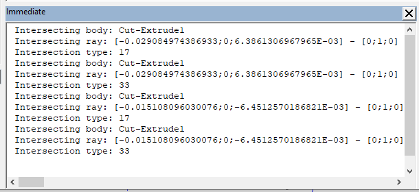
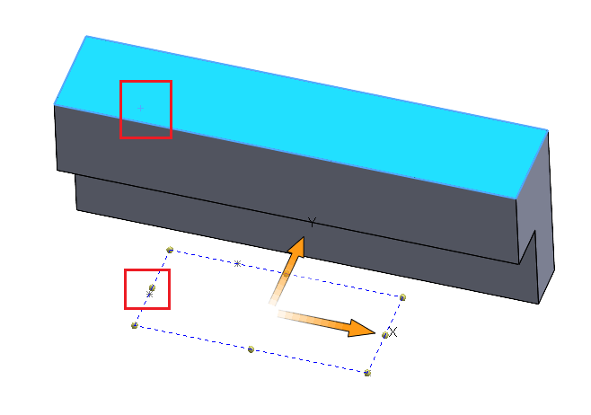

 在SOLIDWORKS模型中使用射线找到交点和拓扑实体的VBA宏示例
image: ray-intersection-entities.png
---

这个VBA宏示例演示了如何在活动的SOLIDWORKS零件文档中的所有实体之间以及从所选草图的草图点创建的射线之间找到交点和相应的拓扑实体。

## 如何运行宏

- 打开或创建一个具有可见实体的零件文档。
- 创建带有草图点的2D草图。草图点将用作射线的起始点。草图法线将用作射线的方向。
- 选择上述草图。
- 运行宏。宏将找到所有的交点并在每个找到的结果上暂停。
    - 宏将把每个射线的信息输出到[VBA立即窗口](/docs/codestack/visual-basic/vba/vba-editor/windows#immediate-window)中。信息包括实体的名称、射线信息（起始点和方向）以及交点类型，如[swRayPtsResults_e](https://help.solidworks.com/2020/english/api/swconst/SolidWorks.Interop.swconst~SolidWorks.Interop.swconst.swRayPtsResults_e.html)中定义的。
    
    

    - 宏将选择射线所击中的相应实体（面或边）。选择点将指示射线击中实体的位置。
    - 使用F5或VBA编辑器中的**运行**按钮继续执行宏以遍历所有结果。

    

```vb
Dim swApp As SldWorks.SldWorks
Const HIT_RADIUS As Double = 0.00000001

Sub main()

    Set swApp = Application.SldWorks
    
    Dim swModel As SldWorks.ModelDoc2
    Dim swPart As SldWorks.PartDoc
    
    Set swModel = swApp.ActiveDoc
    Set swPart = swModel
    
    Dim swSelMgr As SldWorks.SelectionMgr
    Set swSelMgr = swModel.SelectionManager
    
    Dim swSketch As SldWorks.sketch
    
    If swSelMgr.GetSelectedObjectType3(1, -1) = swSelectType_e.swSelSKETCHES Then
        Dim swFeat As SldWorks.Feature
        Set swFeat = swSelMgr.GetSelectedObject6(1, -1)
        Set swSketch = swFeat.GetSpecificFeature2
    Else
        Err.Raise vbError, "", "未选择带有草图点射线的草图"
    End If
    
    Dim vRayStartPts As Variant
    Dim vRayVecs As Variant
    
    GetRaysFromSketchPoints swSketch, vRayStartPts, vRayVecs
    
    Dim vBodies As Variant
    vBodies = swPart.GetBodies2(swBodyType_e.swSolidBody, True)
    
    Dim interCount As Integer
    interCount = swModel.Extension.RayIntersections(vBodies, vRayStartPts, vRayVecs, swRayPtsOpts_e.swRayPtsOptsENTRY_EXIT + swRayPtsOpts_e.swRayPtsOptsTOPOLS, HIT_RADIUS, 0, True)
    
    If interCount > 0 Then
        
        Dim vInterPoints As Variant
        vInterPoints = swModel.GetRayIntersectionsPoints()
        
        Dim vInterTopol As Variant
        vInterTopol = swModel.GetRayIntersectionsTopology
        
        Dim i As Integer
        
        For i = 0 To interCount - 1
            
            Dim bodyIndex As Integer
            Dim rayIndex As Integer
            Dim interType As Integer
            Dim dHitPt(2) As Double
            
            bodyIndex = CInt(vInterPoints(i * 9))
            rayIndex = CInt(vInterPoints(i * 9 + 1))
            interType = CInt(vInterPoints(i * 9 + 2))
            
            dHitPt(0) = CDbl(vInterPoints(i * 9 + 3))
            dHitPt(1) = CDbl(vInterPoints(i * 9 + 4))
            dHitPt(2) = CDbl(vInterPoints(i * 9 + 5))
            
            Dim swEnt As SldWorks.Entity
            Set swEnt = vInterTopol(i)
            
            Debug.Print "交点实体：" & vBodies(bodyIndex).Name
            Debug.Print "交点射线：[" & vRayStartPts(rayIndex * 3) & ";" & vRayStartPts(rayIndex * 3 + 1) & ";" & vRayStartPts(rayIndex * 3 + 2) & "] - [" & vRayVecs(rayIndex * 3) & ";" & vRayVecs(rayIndex * 3 + 1) & ";" & vRayVecs(rayIndex * 3 + 2) & "]"
            Debug.Print "交点类型：" & interType
            
            Dim swSelData As SldWorks.SelectData
            Set swSelData = swSelMgr.CreateSelectData
            
            swSelData.X = dHitPt(0)
            swSelData.Y = dHitPt(1)
            swSelData.Z = dHitPt(2)
            
            swEnt.Select4 False, swSelData
            
            Stop
            
        Next
        
    Else
        Err.Raise vbError, "", "未找到交点"
    End If
    
End Sub

Sub GetRaysFromSketchPoints(sketch As SldWorks.sketch, rayStartPts As Variant, rayVecs As Variant)
    
    If False = sketch.Is3D() Then
        
        Dim dRayStartPts() As Double
        Dim dRayVecs() As Double
        
        Dim vSkPoints As Variant
        vSkPoints = sketch.GetSketchPoints2
        
        If Not IsEmpty(vSkPoints) Then
            
            Dim swTransform As SldWorks.MathTransform
            Set swTransform = sketch.ModelToSketchTransform.Inverse
            
            Dim swMathUtils As SldWorks.MathUtility
            Set swMathUtils = swApp.GetMathUtility
            
            Dim dVec(2) As Double
            dVec(0) = 0: dVec(1) = 0: dVec(2) = 1
            
            Dim swMathVec As SldWorks.MathVector
            Set swMathVec = swMathUtils.CreateVector(dVec)
            Set swMathVec = swMathVec.MultiplyTransform(swTransform)
            
            ReDim dRayStartPts((UBound(vSkPoints) + 1) * 3 - 1)
            ReDim dRayVecs((UBound(vSkPoints) + 1) * 3 - 1)
            
            Dim i As Integer
            
            For i = 0 To UBound(vSkPoints)
                
                Dim swMathPt As SldWorks.MathPoint
                Dim dPt(2) As Double
                
                Dim swSkPt As SldWorks.SketchPoint
                Set swSkPt = vSkPoints(i)
                dPt(0) = swSkPt.X: dPt(1) = swSkPt.Y: dPt(2) = 0
                
                Set swMathPt = swMathUtils.CreatePoint(dPt)
                Set swMathPt = swMathPt.MultiplyTransform(swTransform)
                
                Dim vData As Variant
                vData = swMathPt.ArrayData
                
                dRayStartPts(i * 3) = vData(0)
                dRayStartPts(i * 3 + 1) = vData(1)
                dRayStartPts(i * 3 + 2) = vData(2)
                
                vData = swMathVec.ArrayData
                
                dRayVecs(i * 3) = vData(0)
                dRayVecs(i * 3 + 1) = vData(1)
                dRayVecs(i * 3 + 2) = vData(2)
                
            Next
            
            rayStartPts = dRayStartPts
            rayVecs = dRayVecs
            
        Else
            Err.Raise vbError, "", "指定的草图中没有草图点"
        End If
        
    Else
        Err.Raise vbError, "", "只能使用2D草图进行射线"
    End If
    
End Sub
```

