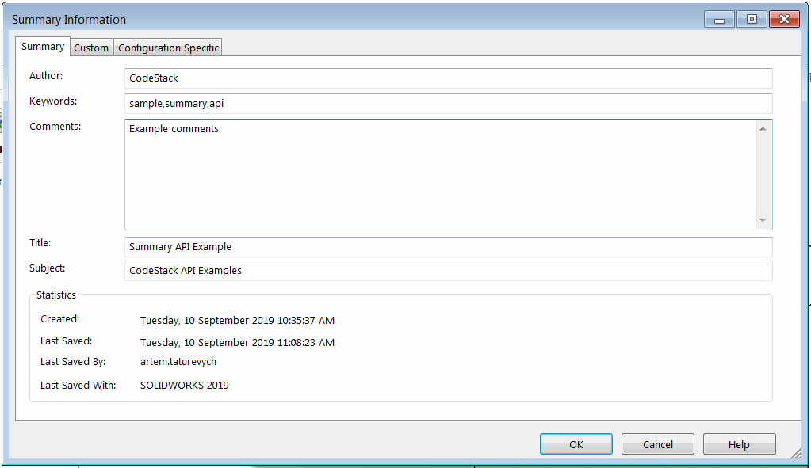

{ width=500 }

此VBA宏使用SOLIDWORKS API从活动SOLIDWORKS文档的自定义属性中提取*摘要信息*选项卡中的数据。这些信息包括作者、关键字、注释、标题、创建信息和最后保存信息。

此宏还提取了文件创建时的SOLIDWORKS版本。

结果以以下格式输出到[VBA编辑器的即时窗口](/docs/codestack/visual-basic/vba/vba-editor/windows#immediate-window)中：

~~~
作者: CodeStack
关键字: 示例,摘要,API
注释: 示例注释
标题: 摘要API示例
主题: CodeStack API示例
创建时间: 2019年9月10日 星期二 上午10:35:37
最后保存时间: 2019年9月10日 星期二 上午11:08:23
最后保存者: artem.taturevych
最后保存版本: SOLIDWORKS 2019
创建版本: SOLIDWORKS 2012
~~~

~~~ vb
Dim swApp As SldWorks.SldWorks

Sub main()

    Set swApp = Application.SldWorks
    
    Dim swModel As SldWorks.ModelDoc2
    
    Set swModel = swApp.ActiveDoc
    
    If Not swModel Is Nothing Then
    
        Dim vHistory As Variant
        vHistory = swModel.VersionHistory()
            
        Debug.Print "作者: " & swModel.SummaryInfo(swSummInfoField_e.swSumInfoAuthor)
        Debug.Print "关键字: " & swModel.SummaryInfo(swSummInfoField_e.swSumInfoKeywords)
        Debug.Print "注释: " & swModel.SummaryInfo(swSummInfoField_e.swSumInfoComment)
        Debug.Print "标题: " & swModel.SummaryInfo(swSummInfoField_e.swSumInfoTitle)
        Debug.Print "主题: " & swModel.SummaryInfo(swSummInfoField_e.swSumInfoSubject)
        
        Debug.Print "创建时间: " & swModel.SummaryInfo(swSummInfoField_e.swSumInfoCreateDate2)
        Debug.Print "最后保存时间: " & swModel.SummaryInfo(swSummInfoField_e.swSumInfoSaveDate2)
        Debug.Print "最后保存者: " & swModel.SummaryInfo(swSummInfoField_e.swSumInfoSavedBy)
        Debug.Print "最后保存版本: " & ConvertFileVersionToSwMajorVersion(ExtractSwRevisonFromHistoryRecord(CStr(vHistory(UBound(vHistory)))))
        Debug.Print "创建版本: " & ConvertFileVersionToSwMajorVersion(ExtractSwRevisonFromHistoryRecord(CStr(vHistory(0))))
        
    Else
        Err.Raise vbError, "", "请打开模型"
    End If
    
End Sub

Function ExtractSwRevisonFromHistoryRecord(fileVers As String) As String
    
    ExtractSwRevisonFromHistoryRecord = Left(fileVers, InStr(fileVers, "[") - 1)
    
End Function

Function ConvertFileVersionToSwMajorVersion(versNumber As Integer) As String
    
    Dim swVersMajor As String
    
    If versNumber >= 5000 Then
        swVersMajor = 2012 + (versNumber - 5000) / 1000
    Else
        Select Case versNumber
            Case 44
                swVersMajor = 95
            Case 243
                swVersMajor = 96
            Case 483
                swVersMajor = 97
            Case 629
                swVersMajor = "97Plus"
            Case 822
                swVersMajor = 98
            Case 1008
                swVersMajor = "98Plus"
            Case 1137
                swVersMajor = 99
            Case 1500
                swVersMajor = 2000
            Case 1750
                swVersMajor = 2001
            Case 1950
                swVersMajor = "2001Plus"
            Case 2200
                swVersMajor = 2003
            Case 2500
                swVersMajor = 2004
            Case 2800
                swVersMajor = 2005
            Case 3100
                swVersMajor = 2006
            Case 3400
                swVersMajor = 2007
            Case 3800
                swVersMajor = 2008
            Case 4100
                swVersMajor = 2009
            Case 4400
                swVersMajor = 2010
            Case 4700
                swVersMajor = 2011
        End Select
    End If
    
    ConvertFileVersionToSwMajorVersion = "SOLIDWORKS " & swVersMajor
    
End Function
~~~