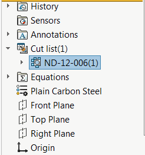
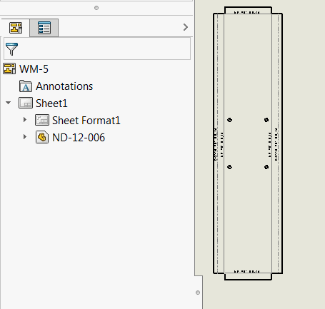

 使用SOLIDWORKS API将活动工作表中的所有展开图视图重命名为相应的切割清单名称的VBA宏
image: renamed-flat-pattern-drawing-view.png
labels: [重命名视图,切割清单,展开图]
group: 绘图
---
{ width=250 }

钣金体的切割清单名称可用于存储重要信息，例如零件编号。此VBA宏允许使用SOLIDWORKS API将活动绘图工作表中的所有钣金展开图视图重命名为相应的切割清单项名称。

{ width=250 }

~~~ vb
Dim swApp As SldWorks.SldWorks

Sub main()

    Set swApp = Application.SldWorks
    
    Dim swDraw As SldWorks.DrawingDoc
    
try:
    
    On Error GoTo catch
    
    Set swDraw = swApp.ActiveDoc
    
    If Not swDraw Is Nothing Then
        RenameFlatPatternViews swDraw, swDraw.GetCurrentSheet
    Else
        Err.Raise vbError, "", "请打开绘图文档"
    End If
    
    GoTo finally
    
catch:
    MsgBox Err.Description & " (" & Err.Number & ")", vbCritical
finally:
    
End Sub

Sub RenameFlatPatternViews(draw As SldWorks.DrawingDoc, sheet As SldWorks.sheet)
    
    Dim vViews As Variant
    
    vViews = GetSheetViews(draw, sheet)
    
    If Not IsEmpty(vViews) Then
        
        Dim i As Integer
        
        For i = 0 To UBound(vViews)
        
            Dim swView As SldWorks.view
            Set swView = vViews(i)
            
            If swView.IsFlatPatternView() Then
                
                Debug.Print "正在重命名 " & swView.Name
                
                Dim swBody As SldWorks.Body2
                Set swBody = GetFlatPatternViewBody(swView)
                Dim swCutListFeat As SldWorks.Feature
                
                Dim activeConf As String
                activeConf = swView.ReferencedDocument.ConfigurationManager.ActiveConfiguration.Name
                
                swView.ReferencedDocument.ShowConfiguration2 swView.ReferencedConfiguration
                
                Set swCutListFeat = GetCutListFromBody(swView.ReferencedDocument, swBody)
                
                swView.ReferencedDocument.ShowConfiguration2 activeConf
                
                If swCutListFeat Is Nothing Then
                    Err.Raise vbError, "", "未找到 " & swView.Name & " 的切割清单"
                End If
                
                swView.SetName2 swCutListFeat.Name
                
            End If
        Next
        
    End If
    
End Sub

Function GetFlatPatternViewBody(view As SldWorks.view) As SldWorks.Body2
    
    Dim vVisComps As Variant
    vVisComps = view.GetVisibleComponents()
    
    If IsEmpty(vVisComps) Then
        Err.Raise vbError, "", view.Name & " 没有可见组件"
    End If
    
    Dim swComp As SldWorks.Component2
    Set swComp = vVisComps(0)
    
    Dim vFaces As Variant
    vFaces = view.GetVisibleEntities(swComp, swViewEntityType_e.swViewEntityType_Face)
    
    If IsEmpty(vFaces) Then
        Err.Raise vbError, "", view.Name & " 没有可见面"
    End If
    
    Dim swFace As SldWorks.Face2
    Set swFace = vFaces(i)
    
    Dim swBody As SldWorks.Body2
    
    Set swBody = swFace.GetBody
    
    Set GetFlatPatternViewBody = swBody
    
End Function

Function GetCutListFromBody(model As SldWorks.ModelDoc2, body As SldWorks.Body2) As SldWorks.Feature
    
    Dim swFeat As SldWorks.Feature
    Dim swBodyFolder As SldWorks.BodyFolder
    
    Set swFeat = model.FirstFeature
    
    Do While Not swFeat Is Nothing
        
        If swFeat.GetTypeName2 = "CutListFolder" Then
            
            Set swBodyFolder = swFeat.GetSpecificFeature2
            
            Dim vBodies As Variant
            
            vBodies = swBodyFolder.GetBodies
            
            Dim i As Integer
            
            If Not IsEmpty(vBodies) Then
                For i = 0 To UBound(vBodies)
                    
                    Dim swCutListBody As SldWorks.Body2
                    Set swCutListBody = vBodies(i)
                    
                    If UCase(swCutListBody.Name) = UCase(body.Name) Then
                        Set GetCutListFromBody = swFeat
                        Exit Function
                    End If
                    
                Next
            End If
            
        End If
        
        Set swFeat = swFeat.GetNextFeature
        
    Loop

End Function

Function GetSheetViews(draw As SldWorks.DrawingDoc, sheet As SldWorks.sheet) As Variant

    Dim vSheets As Variant
    vSheets = draw.GetViews()
    
    Dim i As Integer
    
    For i = 0 To UBound(vSheets)
    
        Dim vViews As Variant
        vViews = vSheets(i)
        
        Dim swSheetView As SldWorks.view
        Set swSheetView = vViews(0)
        
        If UCase(swSheetView.Name) = UCase(sheet.GetName()) Then
            
            If UBound(vViews) > 0 Then
                
                Dim swViews() As SldWorks.view
                
                ReDim swViews(UBound(vViews) - 1)
                
                Dim j As Integer
                
                For j = 1 To UBound(vViews)
                    Set swViews(j - 1) = vViews(j)
                Next
                
                GetSheetViews = swViews
                Exit Function
                
            End If
            
        End If
        
    Next
    
End Function
~~~