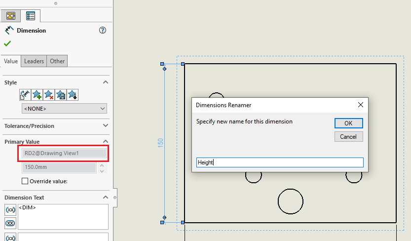
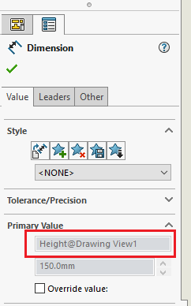

SOLIDWORKS allows assigning the custom dimension names in the 3D documents (parts and assemblies).

However dimension name is read-only and cannot be changed for the dimensions in the drawing view.

In some cases it might be beneficial to assign the custom name to dimensions in the drawing views. For example when dimensions are part of the [inspection report](/docs/codestack/solidworks-api/document/drawing/export-dimensions/) or a part of drawings automation software such as DriveWorks.

This VBA macro allows to assign the custom name of the dimensions in the drawing views.

Select the dimension which name should be changed and run the macro.

Specify new name in the appeared box.

{width=600}

After the name is specified dimension name is set to new value.

> It is also possible to assign the full name of the dimension in the format of \<Dimension Name\>@\<Feature Name\> (e.g. MyDimension@MyView). In this case macro will rename the parent view as well. This is beneficial for the views which cannot be renamed (e.g. Section Views)

~~~ vb
Dim swApp As SldWorks.SldWorks

Sub main()

    Set swApp = Application.SldWorks
    
    Dim swModel As SldWorks.ModelDoc2
    
    Set swModel = swApp.ActiveDoc
    
    If swModel Is Nothing Then
        Err.Raise vbError, "", "Select drawing dimension"
    End If

    Dim swDispDim As SldWorks.DisplayDimension
    
    Set swDispDim = swModel.SelectionManager.GetSelectedObject6(1, -1)
    
    If swDispDim Is Nothing Then
        Err.Raise vbError, "", "Please seelct dimension"
    End If
    
    Dim swDim As SldWorks.dimension
    Set swDim = swDispDim.GetDimension2(0)
    
    Dim newName As String
    newName = InputBox("Specify new name for this dimension", "Dimensions Renamer", swDim.Name)
    
    If newName <> "" Then
        
        If InStr(newName, "@") <> 0 Then
            
            Dim vNameParts As Variant
            vNameParts = Split(newName, "@")
            newName = vNameParts(0)
            
            Dim featName As String
            featName = vNameParts(1)
            
            RenameFeature swModel, swDim, featName
            
        End If
        
        swDim.Name = newName
    End If
    
End Sub

Sub RenameFeature(model As SldWorks.ModelDoc2, dimension As SldWorks.dimension, newFeatName As String)
    
    Dim vDimNameParts As Variant
    vDimNameParts = Split(dimension.FullName, "@")
    
    Dim featName As String
    featName = vDimNameParts(1)
    
    Dim swFeat As SldWorks.Feature
    Set swFeat = model.FeatureByName(featName)
    
    If swFeat Is Nothing Then
        Err.Raise vbError, "", "Faield to find the feature by name: " & featName
    End If
    
    swFeat.Name = newFeatName
    
End Sub
~~~

