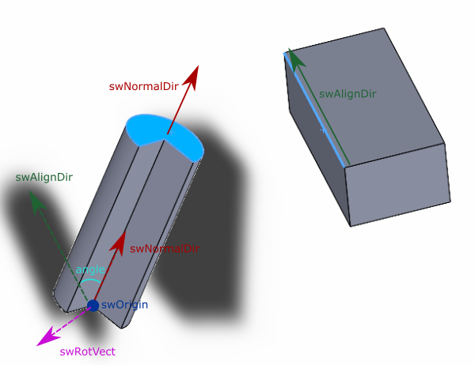

这个 VBA 示例演示了如何使用 [IMathUtility::CreateTransformRotateAxis](https://help.solidworks.com/2017/English/api/sldworksapi/SOLIDWORKS.Interop.sldworks~SOLIDWORKS.Interop.sldworks.IMathUtility~CreateTransformRotateAxis.html) SOLIDWORKS API 来旋转组件并将其面的法线与线性边的方向对齐。

作为前提条件，选择装配中第一个组件上的平面面和第二个组件上的线性边。第一个组件不能被固定，也不能有任何约束。结果是第一个组件以使其法线与边的方向共线的方式旋转。组件围绕原点旋转。

## 解释

为了以预期的方式转换组件，需要计算其变换。为此，需要找到旋转的原点、旋转向量和角度。

首先，我们创建面法线和边方向的向量。需要应用组件的变换以将向量表示为相同的坐标系中的向量。这两个向量之间的角度是变换的所需角度。

为了找到旋转向量，需要找到法线和方向的垂直向量。可以通过求叉积来实现。

最后，旋转点是将组件的原点变换到装配坐标系中的点。

~~~ vb
Dim swApp As SldWorks.SldWorks

Sub main()

    Set swApp = Application.SldWorks
    
    Dim swModel As SldWorks.ModelDoc2
    
    Set swModel = swApp.ActiveDoc
    
    Dim swSelMgr As SldWorks.SelectionMgr
    
    Set swSelMgr = swModel.SelectionManager
    
    Dim swFace As SldWorks.Face2
    Dim swEdge As SldWorks.Edge
    
    Set swFace = swSelMgr.GetSelectedObject6(1, -1)
    
    Dim swComp As SldWorks.Component2
    Set swComp = swFace.GetComponent()
    Dim swCompTransform As SldWorks.MathTransform
    Set swCompTransform = swComp.Transform2
    
    Set swEdge = swSelMgr.GetSelectedObject6(2, -1)
    
    Dim swMathUtils As SldWorks.MathUtility
    Set swMathUtils = swApp.GetMathUtility
    
    Dim swNormalDir As SldWorks.MathVector
    Set swNormalDir = swMathUtils.CreateVector(swFace.Normal)
    Set swNormalDir = swNormalDir.MultiplyTransform(swCompTransform)
    
    Dim swAlignDir As SldWorks.MathVector
    Dim vLineParams As Variant
    vLineParams = swEdge.GetCurve().lineParams
    Dim dVec(2) As Double
    dVec(0) = vLineParams(3): dVec(1) = vLineParams(4): dVec(2) = vLineParams(5)
    Set swAlignDir = swMathUtils.CreateVector(dVec)
    Set swAlignDir = swAlignDir.MultiplyTransform(swEdge.GetComponent().Transform2)
    
    Dim swOrigin As SldWorks.MathPoint
    Dim dOrigin(2) As Double
    dOrigin(0) = 0: dOrigin(1) = 0: dOrigin(2) = 0
    Set swOrigin = swMathUtils.CreatePoint(dOrigin)
    
    Set swOrigin = swOrigin.MultiplyTransform(swCompTransform)
    
    Dim swRotVect As SldWorks.MathVector
    Set swRotVect = swNormalDir.Cross(swAlignDir)
        
    Dim angle As Double
    angle = GetAngle(swNormalDir, swAlignDir)
    
    Dim swTransform As SldWorks.MathTransform
    Set swTransform = swMathUtils.CreateTransformRotateAxis(swOrigin, swRotVect, angle)
    
    Set swTransform = swCompTransform.Multiply(swTransform)
    
    swComp.Transform2 = swTransform
    
    swModel.GraphicsRedraw2
    
End Sub

Function GetAngle(vec1 As MathVector, vec2 As MathVector) As Double
    
    'cos a= a*b/(|a|*|b|)
    GetAngle = ACos(vec1.Dot(vec2) / (vec1.GetLength() * vec2.GetLength()))
    
End Function

Function ACos(val As Double) As Double
    
    If val = 1 Then
        ACos = 0
    ElseIf val = -1 Then
        ACos = 4 * Atn(1)
    Else
        ACos = Atn(-val / Sqr(-val * val + 1)) + 2 * Atn(1)
    End If
    
End Function
~~~