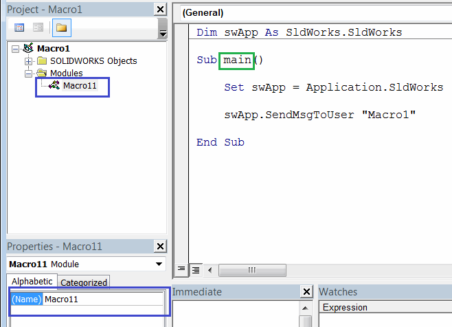

可以使用[SOLIDWORKS API函数ISldWorks::RunMacro2](https://help.solidworks.com/2010/english/api/sldworksapi/solidworks.interop.sldworks~solidworks.interop.sldworks.isldworks~runmacro2.html)从另一个宏中运行宏。

这使得在一个宏中运行多个宏成为可能。当在宏工具栏上[添加自定义宏按钮](/docs/codestack/solidworks-api/getting-started/macros/macro-buttons/)时，这非常有用，因为可以通过单击一个按钮来执行多个命令。

以下示例允许在一个宏中运行多个SOLIDWORKS宏。

~~~ vb
Dim swApp As SldWorks.SldWorks

Sub main()

    Set swApp = Application.SldWorks
    
    RunMacro "C:\Macros\Macro1.swp", "Macro11", "main"
    RunMacro "C:\Macros\Macro2.swp", "Macro21", "main"
    RunMacro "C:\Macros\Macro3.swp", "Macro31", "main"
    
End Sub

Sub RunMacro(path As String, moduleName As String, procName As String)
    swApp.RunMacro2 path, moduleName, procName, swRunMacroOption_e.swRunMacroUnloadAfterRun, 0
End Sub
~~~

更改**RunMacro**调用的参数以调用您自己的一组宏。

~~~ vb
RunMacro "宏的完整路径", "模块名称", "入口函数名称"
~~~

其中

{ width=350 }

* **宏的完整路径** - .swp或.dll的完整路径，用于[VBA或VSTA宏](/docs/codestack/solidworks-api/getting-started/macros/types)
* **模块名称** - 定义主入口函数的模块的名称。通常是宏名称后跟1。
* **入口函数名称** - 入口函数的名称。此函数不能有参数。通常命名为**main**

> 根据需要修改宏。您可以添加或删除对**RunMacro**的调用，并更改路径、模块和函数名称以匹配库中宏的路径

以下宏提供了更高级的运行宏功能。它允许指定多个逗号分隔的宏以及使用完整路径或相对路径的文件夹。

这样可以更好地维护宏。

此宏还处理以下错误：

* 当找不到指定的宏路径时：

{ width=250 }

* 当无法运行宏时（例如宏损坏）

{ width=250 }

要配置宏，需要修改**MACROS_PATH**变量的值：

* 可以通过逗号分隔它们来指定要运行的多个宏，例如**Macro1.swp, Macro2.swp**
* 可以使用完整路径（例如**D:\Macros\Macro1.swp**）或使用相对路径（例如**Macro1.swp**）指定宏。如果后者，宏必须与此主宏位于同一文件夹中
* 可以指定要运行的宏的文件夹（例如**D:\Macros**或**Macros**）。与宏路径一样，接受完整路径或相对文件夹路径。在这种情况下，将运行指定文件夹中的所有宏
* 如果指定空字符串，即 

~~~ vb
Const MACROS_PATH As String = " "
~~~

将运行放置此主宏的文件夹中的所有宏。此选项非常有用，因为只需将主宏复制到宏库的位置即可运行，无需修改它。

~~~ vb
#If VBA7 Then
     Private Declare PtrSafe Function PathIsRelative Lib "shlwapi" Alias "PathIsRelativeA" (ByVal path As String) As Boolean
#Else
     Private Declare Function PathIsRelative Lib "shlwapi" Alias "PathIsRelativeA" (ByVal Path As String) As boolean
#End If
        
Const MACROS_PATH As String = "Macro1.swp, D:\Macro2.swp, D:\MacrosFolder, Macros\Assembly"

Const PATH_DELIMETER As String = ","
Const MACRO_EXT As String = "swp"

Dim swApp As SldWorks.SldWorks

Sub main()

    Set swApp = Application.SldWorks
              
    Dim swMacrosColl As Collection
    Set swMacrosColl = New Collection
    
    AddMacros swMacrosColl
    
    Set swMacrosColl = ResolvePaths(swMacrosColl)
    
    RunMacros swMacrosColl

End Sub

Function ResolvePaths(swMacrosColl As Collection) As Collection

    Dim fso As Object
    Set fso = CreateObject("Scripting.FileSystemObject")
    
    Dim resColl As Collection
    Set resColl = New Collection
    
    Dim i As Integer
    
    For i = 1 To swMacrosColl.Count
        
        Dim path As String
        path = swMacrosColl(i)
        
        If PathIsRelative(path) Then
            path = fso.BuildPath(swApp.GetCurrentMacroPathFolder(), path)
        End If
        
        If fso.FolderExists(path) Then
            
            swMacrosColl.Remove i
            
            For Each file In fso.GetFolder(path).Files
                If LCase(fso.GetExtensionName(file)) = LCase(MACRO_EXT) Then
                    AddMacroToCollection resColl, file.path
                End If
            Next
            
        ElseIf fso.FileExists(path) Then
            AddMacroToCollection resColl, path
        Else
            Err.Raise vbObjectError, , "找不到宏文件：" & path
        End If
        
    Next
    
    Set ResolvePaths = resColl
    
End Function

Sub AddMacroToCollection(coll As Collection, item As String)
    
    If UCase(item) <> UCase(swApp.GetCurrentMacroPathName()) Then
        Dim i As Integer
        
        For i = 1 To coll.Count
            If UCase(coll.item(i)) = UCase(item) Then
                Exit Sub
            End If
        Next
        
        coll.Add item
    End If
    
End Sub

Sub RunMacros(swMacrosColl As Collection)
    
    Dim i As Integer
    
    For i = 1 To swMacrosColl.Count
        Dim path As String
        path = swMacrosColl(i)
        Dim macroErr As Long
        
        Dim moduleName As String
        Dim procName As String
        
        GetMacroEntryPoint path, moduleName, procName
        
        If False = swApp.RunMacro2(path, moduleName, procName, swRunMacroOption_e.swRunMacroUnloadAfterRun, macroErr) Then
            Err.Raise vbObjectError, , "无法运行宏：" & path & "，错误：" & macroErr
        End If
        
    Next
    
End Sub

Sub GetMacroEntryPoint(macroPath As String, ByRef moduleName As String, ByRef procName As String)
        
    Dim vMethods As Variant
    vMethods = swApp.GetMacroMethods(macroPath, swMacroMethods_e.swMethodsWithoutArguments)
    
    Dim i As Integer
    
    If Not IsEmpty(vMethods) Then
    
        For i = 0 To UBound(vMethods)
            Dim vData As Variant
            vData = Split(vMethods(i), ".")
            
            If i = 0 Or LCase(vData(1)) = "main" Then
                moduleName = vData(0)
                procName = vData(1)
            End If
        Next
        
    End If
    
End Sub

Sub AddMacros(swMacrosColl As Collection)
    
    Dim vPaths As Variant
    vPaths = Split(MACROS_PATH, PATH_DELIMETER)
    
    Dim i As Integer
    
    For i = 0 To UBound(vPaths)
    
        Dim path As String
        path = Trim(vPaths(i))
        swMacrosColl.Add path
        
    Next
    
End Sub
~~~