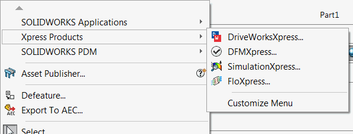

该示例演示了如何使用SOLIDWORKS API运行Xpress产品（DriveWorks、DFM、Simulation、Flo）。这相当于点击菜单命令。

```vb
#If VBA7 Then
     Private Declare PtrSafe Function SendMessage Lib "User32" Alias "SendMessageA" (ByVal hWnd As Long, ByVal wMsg As Long, ByVal wParam As Long, lParam As Any) As Long
#Else
     Private Declare Function SendMessage Lib "User32" Alias "SendMessageA" (ByVal hWnd As Long, ByVal wMsg As Long, ByVal wParam As Long, lParam As Any) As Long
#End If
 
Enum XpressProducts_e
    DriveWorksXpress = 54423
    DFMXpress = 54424
    SimulationXpress = 38155
    FloXpress = 54422
End Enum
 
Dim swApp As SldWorks.SldWorks
 
Sub main()
 
     Set swApp = Application.SldWorks
     
     RunXpressProduct swApp, DriveWorksXpress
     RunXpressProduct swApp, DFMXpress
     RunXpressProduct swApp, SimulationXpress
     RunXpressProduct swApp, FloXpress
     
 End Sub
 
Sub RunXpressProduct(swApp As SldWorks.SldWorks, product As XpressProducts_e)
    
    If SupportsEnvironment(swApp, product) Then
        
        Const WM_COMMAND As Long = &H111
        
        Dim swFrame As SldWorks.Frame
        
        Set swFrame = swApp.Frame
        
        SendMessage swFrame.GetHWnd(), WM_COMMAND, CLng(product), 0
        
    End If
     
End Sub
 
Function SupportsEnvironment(swApp As SldWorks.SldWorks, product As XpressProducts_e) As Boolean
    
    Dim swActiveModel As SldWorks.ModelDoc2
    Set swActiveModel = swApp.ActiveDoc
    
    Dim swDocType As swDocumentTypes_e
    
    If swActiveModel Is Nothing Then
        swDocType = swDocNONE
    Else
        swDocType = swActiveModel.GetType
    End If
    
    Select Case product
        Case XpressProducts_e.DFMXpress
            If swDocType <> swDocPART Then
                MsgBox "DFMXpress只能在零件中运行"
                SupportsEnvironment = False
                Exit Function
            End If
        Case XpressProducts_e.SimulationXpress
            If swDocType <> swDocPART And swDocType <> swDocASSEMBLY Then
                MsgBox "SimulationXpress只能在零件或装配体中运行"
                SupportsEnvironment = False
                Exit Function
            End If
        Case XpressProducts_e.FloXpress
            If swDocType <> swDocPART And swDocType <> swDocASSEMBLY Then
                MsgBox "FloXpress只能在零件或装配体中运行"
                SupportsEnvironment = False
                Exit Function
            End If
    End Select
    
    SupportsEnvironment = True
    
End Function
```
