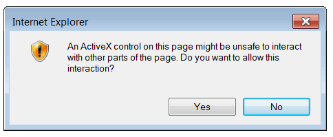
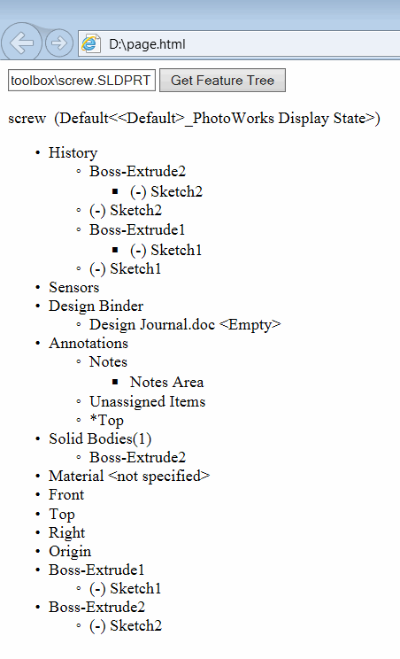

该示例演示了如何使用SOLIDWORKS API将SOLIDWORKS零件文件的特征树加载到HTML页面中，使用JavaScript和Internet Explorer中的ActiveX（这将无法在其他浏览器中工作，因为默认情况下不支持ActiveX，可能需要安装特殊插件来启用支持）。

* 创建一个新的HTML文件
* 将以下代码复制粘贴到文件中

```html
<!DOCTYPE html>
<html>
<body>

	<input type="text" placeholder="零件文件路径" id="filePath"></input>
	<button type="button" onclick="RenderFeatureTree()">获取特征树</button>

	<p id="featTree">特征树</p>

	<script>
		function RenderFeatureTree() {

			var swApp = new ActiveXObject("SldWorks.Application");
			var filePath = document.getElementById('filePath').value;

			var docSpec = swApp.GetOpenDocSpec(filePath);
			docSpec.ReadOnly = true;
			docSpec.Silent = true;
			var swModel = swApp.OpenDoc7(docSpec);

			var swFeatMgr = swModel.FeatureManager;

			var swRootFeatNode = swFeatMgr.GetFeatureTreeRootItem2(1);

			var root = document.getElementById("featTree");

			RenderFeatureNode(swRootFeatNode, root);

			swApp.CloseDoc(swModel.GetTitle());
		}

		function RenderFeatureNode(featNode, parentElem) {

			parentElem.innerText = featNode.Text

			var ul = document.createElement("UL");
			parentElem.appendChild(ul);

			var swChildFeatNode = featNode.GetFirstChild()

			while (swChildFeatNode !== null) {
				var li = document.createElement("LI");
				ul.appendChild(li);
				RenderFeatureNode(swChildFeatNode, li);
				swChildFeatNode = swChildFeatNode.GetNext();
			}
		}
	</script>
</body>
</html>
```

* 保存文件并在MS Internet Explorer中打开


由于此页面使用了ActiveX，因此可能会显示以下消息：


点击“允许阻止的内容”按钮

* 在文本框输入字段中输入SOLIDWORKS零件的完整路径

* 点击“获取特征树”按钮

* 在弹出窗口中点击“是”

{ width=350 }

结果，零件的特征树将在页面上呈现出来

{ width=250 }