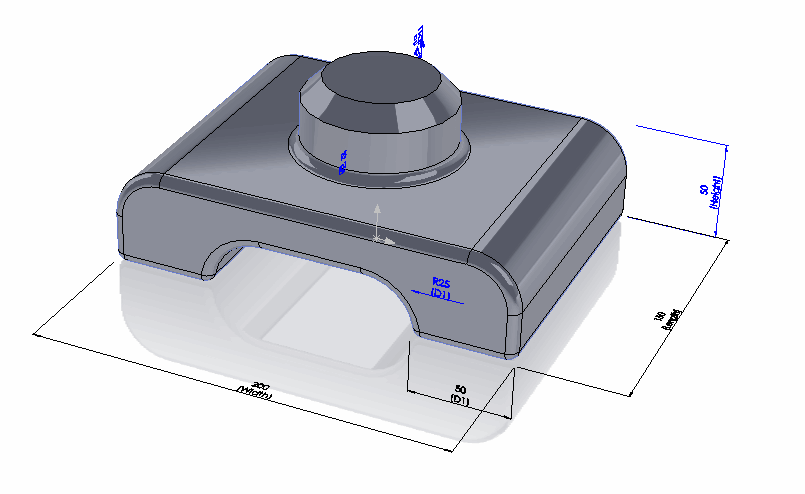

这个PowerShell脚本允许使用SOLIDWORKS API根据指定参数生成模型，基于模板。

* 创建两个文件，并将下面的代码粘贴进去。

## model-generator.ps1
~~~ ps1
$curDir = Split-Path $script:MyInvocation.MyCommand.Path
$templateFilePath = $curDir + "\template.SLDPRT"

$outFilePath=$args[0]
$width=$args[1]
$length=$args[2]
$height=$args[3]

$Source = @"
Imports System
Imports System.Collections.Generic

Public Class ModelGenerator

    Public Shared Sub GenerateModelFromTemplate(templatePath as String, outFilePath As String, width As String, length As String, height As String)
        
        Dim swApp As Object = Activator.CreateInstance(Type.GetTypeFromProgID("SldWorks.Application"))
        swApp.CommandInProgress = True
        swApp.UserControlBackground = True
        
        If swApp Is Nothing Then
            Console.WriteLine("无法连接到SOLIDWORKS实例")
            Exit Sub
        End If

        Const PARAM_WIDTH As String = "Width@Base"
        Const PARAM_LENGTH As String = "Length@Base"
        Const PARAM_HEIGHT As String = "Height@Boss"

        Dim openDocSpec As Object
        Console.WriteLine("正在打开模板模型：" + templatePath)
        openDocSpec = swApp.GetOpenDocSpec(templatePath)
        openDocSpec.Silent = True
        openDocSpec.ReadOnly = True
        
        Dim model As Object = swApp.OpenDoc7(openDocSpec)

        If model IsNot Nothing Then

            Try
                Console.WriteLine("正在设置参数")

                Dim parameters As New Dictionary(Of String, Double)
                parameters.Add(PARAM_WIDTH, Double.Parse(width))
                parameters.Add(PARAM_LENGTH, Double.Parse(length))
                parameters.Add(PARAM_HEIGHT, Double.Parse(height))

                For Each paramData As KeyValuePair(Of String, Double) In parameters

                    Dim paramName As String = paramData.Key
                    Dim param As Object = model.Parameter(paramName)

                    If param IsNot Nothing Then

                        Const swSetValue_InAllConfigurations As Integer = 2
                        Const swSetValue_Successful As Integer = 0

                        Dim paramValue As Double = paramData.Value

                        If param.SetSystemValue3(paramValue, swSetValue_InAllConfigurations, Nothing) = swSetValue_Successful Then
                            Console.WriteLine(String.Format("{0}={1}", paramName, paramValue))
                        Else
                            Throw New Exception(String.Format("无法将参数{0}设置为{1}", paramName, paramValue))
                        End If
                    Else
                        Throw New Exception("找不到参数：" + paramName)
                    End If

                Next

                Console.WriteLine("正在保存模型到" + outFilePath)

                Const swSaveAsCurrentVersion As Integer = 0
                Const swSaveAsOptions_Silent As Integer = 1
                Const swSaveAsOptions_Copy As Integer = 2

                model.ForceRebuild3(False)

                If model.Extension.GetWhatsWrongCount() > 0 Then
                    Console.WriteLine("模型存在重建错误")
                End If

                Dim err As Integer = model.SaveAs3(outFilePath, swSaveAsCurrentVersion, swSaveAsOptions_Silent + swSaveAsOptions_Copy)
                
                If err <> 0  Then
                    Throw New Exception(String.Format("无法将文档保存到{0}。错误代码：{1}", outFilePath, err))
                End If

            Catch ex As Exception
                Console.WriteLine("错误：" & ex.Message)
            Finally
                swApp.CommandInProgress = False
                Dim modelTitle As String = model.GetTitle()
                System.Runtime.InteropServices.Marshal.ReleaseComObject(model)
                model = Nothing
                GC.Collect()
                swApp.CloseDoc(modelTitle)
            End Try
        Else
            Console.WriteLine("无法打开模板模型：" + templatePath)
        End If
        
    End Sub

End Class
"@

Add-Type -TypeDefinition $Source -Language VisualBasic

[ModelGenerator]::GenerateModelFromTemplate($templateFilePath, $outFilePath, $width, $length, $height)

~~~

## model-generator.cmd
~~~ cmd
SET inputFilePath=%1
SET outFilePath=%2

SET outFilePath=%1
SET width=%2
SET length=%3
SET height=%4

PowerShell -NoProfile -ExecutionPolicy Bypass -File "%~dp0model-generator.ps1" %outFilePath% %width% %length% %height%
~~~

下载[模板模型](template.SLDPRT)并将其保存到与上述两个脚本相同的文件夹中。

这是一个带有3个驱动参数（宽度、高度和长度）的模板模型。

{ width=350 }

脚本将修改此模型并保存为新文件。

* 启动命令行并执行以下命令

~~~ bat
[model-generator.cmd的完整路径] [输出SOLIDWORKS文件的完整路径] [宽度] [长度] [高度]
~~~

结果将生成文件，并且进程日志将直接显示在控制台中：

{ width=450 }

模板文件不会被修改，生成的模型将带有更新后的参数。

{ width=350 }