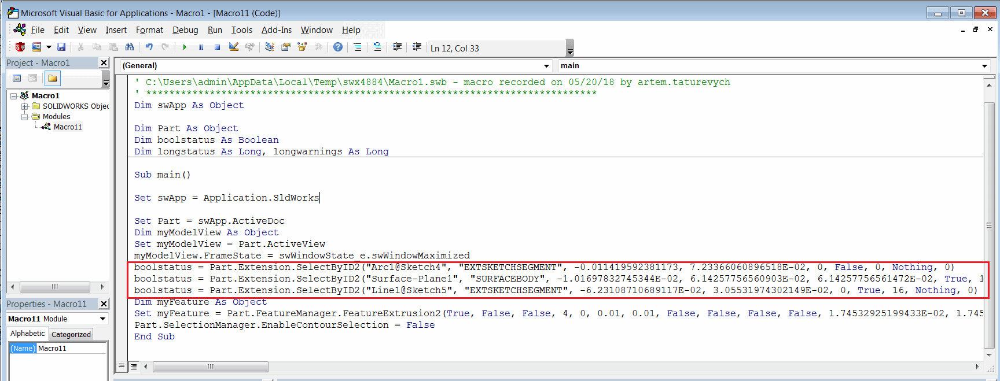

---
title: 使用API按名称和坐标选择SOLIDWORKS对象
caption: 按名称和坐标选择对象
description: 本文介绍了使用[IModelDocExtension::SelectByID2](https://help.solidworks.com/2012/english/api/sldworksapi/solidworks.interop.sldworks~solidworks.interop.sldworks.imodeldocextension~selectbyid2.html) SOLIDWORKS API方法的优缺点。该方法是选择SOLIDWORKS中的元素的最常用方式之一，可以通过名称或坐标来选择元素。

这是一种在[录制宏](https://help.solidworks.com/2016/english/solidworks/sldworks/t_record_pause_macro.htm)时表示用户选择的主要方法。

{ width=500 }

不建议使用此方法进行选择，原因如下：

* 通过坐标（即*Name*参数为空，*X*、*Y*、*Z*参数已指定）选择对象（如面、顶点、边或注释）可能会失败，如果目标实体在活动视图方向之外。即在当前视图位置无法从用户界面选择此元素。

* 草图元素（线、弧、点、样条等）没有永久名称。因此，在SelectByID2方法中使用宏记录的名称是无效的。

* 如果通过坐标选择时，目标对象被另一个元素重叠，可能会选择错误的对象。

然而，有一些情况下可以使用此方法：

* 通过永久名称选择对象，例如特征、组件。仍然建议使用直接选择方法（例如[IFeature::Select2](https://help.solidworks.com/2012/english/api/sldworksapi/solidworks.interop.sldworks~solidworks.interop.sldworks.ifeature~select2.html)、[IComponent2::Select4](https://help.solidworks.com/2012/english/api/sldworksapi/SOLIDWORKS.Interop.sldworks~SOLIDWORKS.Interop.sldworks.IComponent2~Select4.html) SOLIDWORKS API方法）

* 在绘图中选择图纸（[ISheet](https://help.solidworks.com/2012/english/api/sldworksapi/solidworks.interop.sldworks~solidworks.interop.sldworks.isheet.html)接口中没有直接的选择方法）

* 当SOLIDWORKS页面处于活动状态时。根据SOLIDWORKS API帮助文档（参见[此处](https://help.solidworks.com/2012/english/api/sldworksapi/solidworks.interop.sldworks~solidworks.interop.sldworks.imodeldocextension~selectbyid2.html)的*Remarks*部分）

> 在打开属性管理器页面或运行命令时，使用此方法而不是使用以下对象的选择方法：IAnnotation、IComponent2、IFeature、IFeatureManager、ISketchHatch、ISketchPoint、ISketchSegment、ISketchSpline。之前列出的对象的选择方法在打开属性管理器页面或运行命令时效果不佳。无论命令是否正在运行，此方法IModelDocExtension::SelectByID2都可以正确处理选择。

* 在开发输入操纵器（如操纵杆、鼠标、键盘、空间鼠标等）的驱动软件时，需要将用户输入直接转换为图形区域。