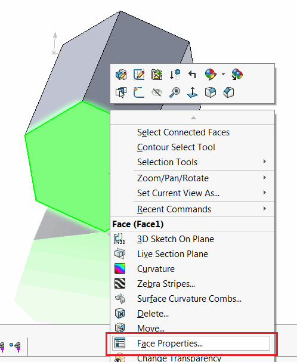
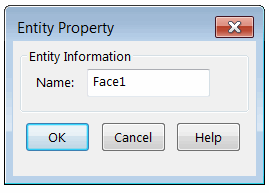

 使用SOLIDWORKS API在零件、装配体（从组件）或绘图（从视图）中选择命名实体（面、边或顶点）
image: face-name.png
labels: [面,边,顶点,名称,选择]
---
本示例演示了如何使用SOLIDWORKS API在不同的文档类型中选择命名实体（面、边或顶点）。

只能在零件文档中通过选择相应的面或边来定义命名实体：

{ width=250 }

可以在显示的对话框中设置名称，每个零件的名称是唯一的。

{ width=250 }

可以通过[SOLIDWORKS API方法IPartDoc::GetEntityByName](https://help.solidworks.com/2014/english/api/sldworksapi/SolidWorks.Interop.sldworks~SolidWorks.Interop.sldworks.IPartDoc~GetEntityByName.html)检索到实体的指针。

此示例增强了功能，还允许在绘图（从所选绘图视图）或装配体（从所选零件的组件）中按名称选择实体。

修改*ENT_NAME*常量的值以定义不同的名称，并根据需要更改*entType*参数的值，以选择边或顶点。

~~~ vb
Const ENT_NAME As String = "MyEdge1"
SelectNamedEntity swParentObject, ENT_NAME, NamedEntityType_e.Edge
~~~

~~~ vb
Enum NamedEntityType_e
    Face
    Edge
    Vertex
End Enum

Const ENT_NAME As String = "Face1"

Dim swApp As SldWorks.SldWorks

Sub main()

    Set swApp = Application.SldWorks
    
    Dim swModel As SldWorks.ModelDoc2
    
    Set swModel = swApp.ActiveDoc
    
    If Not swModel Is Nothing Then
        
        Dim swParentObject As Object
        
        If swModel.GetType() = swDocumentTypes_e.swDocPART Then
            Set swParentObject = swModel
        Else
            Set swParentObject = swModel.SelectionManager.GetSelectedObject6(1, -1)
        End If
                
        SelectNamedEntity swParentObject, ENT_NAME, NamedEntityType_e.Face
        
    Else
        MsgBox "请打开模型"
    End If
    
End Sub

Sub SelectNamedEntity(parent As Object, name As String, entType As NamedEntityType_e)
    
    Dim swEnt As SldWorks.Entity
    Set swEnt = GetNamedEntity(parent, name, entType)
    
    If TypeOf parent Is SldWorks.View Then
        Dim swView As SldWorks.View
        Set swView = parent
        swView.SelectEntity swEnt, False
    Else
        swEnt.Select4 False, Nothing
    End If
    
End Sub

Function GetNamedEntity(parent As Object, name As String, entType As NamedEntityType_e) As SldWorks.Entity
    
    Dim swEnt As SldWorks.Entity
    
    If parent Is Nothing Then
        Err.Raise vbError, "", "未指定实体父级（打开零件或选择装配体或绘图中的视图或组件）"
    ElseIf TypeOf parent Is SldWorks.PartDoc Then
        Set swEnt = GetNamedEntityFromPartDoc(parent, name, entType)
    ElseIf TypeOf parent Is SldWorks.Component2 Then
        Dim swComp As SldWorks.Component2
        Set swComp = parent
        Set swEnt = GetNamedEntityFromPartDoc(swComp.GetModelDoc2(), name, entType)
        Set swEnt = swComp.GetCorresponding(swEnt)
    ElseIf TypeOf parent Is SldWorks.View Then
        Dim swView As SldWorks.View
        Set swView = parent
        Set swEnt = GetNamedEntityFromPartDoc(swView.ReferencedDocument, name, entType)
    Else
        Err.Raise vbError, "", "无效的父级选择：仅支持绘图视图或组件"
    End If
    
    If swEnt Is Nothing Then
        Err.Raise vbError, "", "未找到指定名称的实体"
    End If
    
    Set GetNamedEntity = swEnt
    
End Function

Function GetNamedEntityFromPartDoc(model As SldWorks.ModelDoc2, name As String, entType As NamedEntityType_e) As SldWorks.Entity
    
    Dim selType As swSelectType_e
    
    Select Case entType
        Case NamedEntityType_e.Face
            selType = swSelFACES
        Case NamedEntityType_e.Edge
            selType = swSelEDGES
        Case NamedEntityType_e.Vertex
            selType = swSelVERTICES
    End Select
    
    Dim swEnt As SldWorks.Entity
    
    If model Is Nothing Then
        Err.Raise vbError, "", "模型文档指针为空"
    End If
    
    If model.GetType() = swDocumentTypes_e.swDocPART Then
        Dim swPart As SldWorks.PartDoc
        Set swPart = model
        Set swEnt = swPart.GetEntityByName(name, selType)
    Else
        Err.Raise vbError, "", "文档不是零件文档"
    End If
    
    If swEnt Is Nothing Then
        Err.Raise vbError, "", "未找到指定名称的实体"
    End If
    
    Set GetNamedEntityFromPartDoc = swEnt
    
End Function
~~~