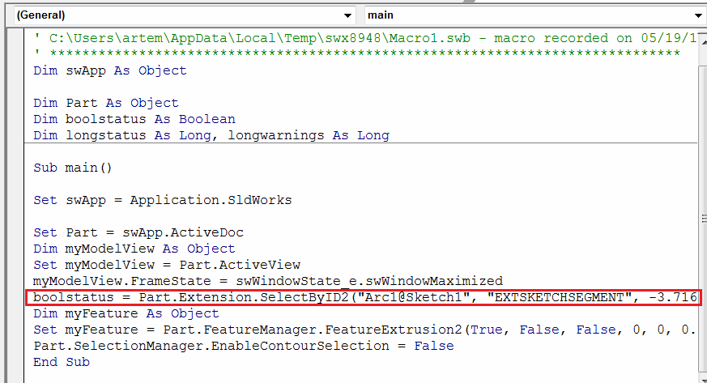

## 症状

使用[宏录制工具](https://help.solidworks.com/2012/english/solidworks/sldworks/c_recording_playing_macros.htm)录制的SOLIDWORKS宏需要进行一些选择（通常用于创建特征或配合）。运行宏时，选择可能失败或选择了不同的对象，导致宏的错误行为。

## 原因

通常，宏录制使用[SOLIDWORKS API](https://help.solidworks.com/2012/english/api/sldworksapi/solidworks.interop.sldworks~solidworks.interop.sldworks.imodeldocextension~selectbyid2.html)中的[IModelDocExtension::SelectByID2](https://help.solidworks.com/2012/english/api/sldworksapi/solidworks.interop.sldworks~solidworks.interop.sldworks.imodeldocextension~selectbyid2.html)方法来捕获选择。该方法可能使用临时名称（如草图段名称）或坐标进行选择，这些选择可能在不同的模型或视图方向上不一致。

{ width=500 }

## 解决方法

更新选择方法。详细指南请参阅[选择](/docs/codestack/solidworks-api/document/selection)文章。