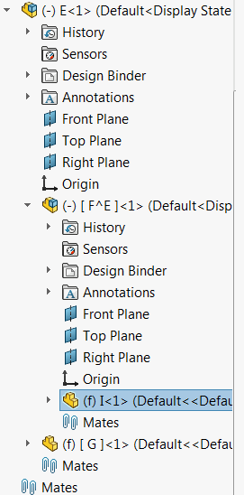
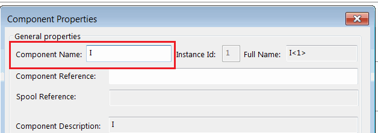

 Example demonstrates how to select component by full name at any level of the assembly in the feature manager tree
image: components-tree.png
labels: [select, component]
---
{ width=200 }

This example demonstrates the most performance efficient way to select a component on any level of the assembly by its full name using SOLIDWORKS API.

Name of the component is defined as a path where each level is separated by / symbol. Component instance id is specified with a - symbol (e.g. FirstLevelComp-1/SecondLevelComp-2/TargetComp-1)

Component name can be found in the following dialog:

{ width=250 }

Refer [Get Component By Name](/docs/codestack/solidworks-api/document/assembly/components/get-by-name) example for macro to retrieve the pointer to the component without the selection.

~~~ vb
Dim swApp As SldWorks.SldWorks

Sub main()

    Set swApp = Application.SldWorks
    
    Dim swAssy As SldWorks.AssemblyDoc
    
    Set swAssy = swApp.ActiveDoc

    Debug.Print SelectComponentByName(swAssy, "E-1/F^E-1/I-1")

End Sub

Function SelectComponentByName(assy As SldWorks.AssemblyDoc, name As String) As Boolean
    
    Dim rootName As String
    rootName = assy.GetTitle()
    
    Dim extPos As Long
    extPos = InStr(rootName, ".")
    If extPos <> -1 Then
        rootName = Left(rootName, extPos - 1)
    End If
    
    Dim selByIdStr As String
    selByIdStr = ConvertToSelectByIDString(rootName, name)
    
    SelectComponentByName = assy.Extension.SelectByID2(selByIdStr, "COMPONENT", 0, 0, 0, False, -1, Nothing, swSelectOption_e.swSelectOptionDefault)
    
End Function

Function ConvertToSelectByIDString(rootName As String, name As String) As String

    Dim vNameParts As Variant
    vNameParts = Split(name, "/")
    
    Dim prevParentName As String
    prevParentName = rootName
    
    Dim selByIdStr As String
    
    Dim i As Integer
    
    For i = 0 To UBound(vNameParts)
        
        Dim curPartName As String
        curPartName = vNameParts(i)
        
        If selByIdStr <> "" Then
            selByIdStr = selByIdStr & "/"
        End If
        
        selByIdStr = selByIdStr & curPartName & "@" & prevParentName
        
        prevParentName = Left(curPartName, InStrRev(curPartName, "-") - 1)
        
    Next
    
    ConvertToSelectByIDString = selByIdStr
    
End Function
~~~

