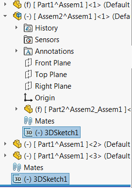

{ width=250 }

这个VBA宏使用SOLIDWORKS API选择活动模型（零件、装配或绘图）中的所有特征。对于绘图和装配，还会选择子组件中的特征。

与[获取特征类型名称](/docs/codestack/solidworks-api/document/features-manager/get-feature-type-name/)一起使用此宏，以获取用于过滤的所需特征类型名称。

## 配置

修改宏开头的常量

~~~ vb
Const APPEND_SELECTION As Boolean = False 'True to append selection False to clear existing selection
Const TYPE_NAME As String = "" 'Refer 'Get Features Type Name' macro to get the type name from the feature
~~~

此宏可与其他需要预先选择特征的宏一起使用。它还可以与SOLIDWORKS批量操作（如删除或抑制）一起使用。

~~~ vb
Const APPEND_SELECTION As Boolean = False
Const TYPE_NAME As String = "3DProfileFeature" '3DSketch

Dim swApp As SldWorks.SldWorks

Sub main()

    Set swApp = Application.SldWorks
    
    Dim swModel As SldWorks.ModelDoc2
    
    Set swModel = swApp.ActiveDoc
    
    If Not swModel Is Nothing Then
            
        Dim vFeats As Variant
        vFeats = GetAllFeaturesByType(swModel, TYPE_NAME)
        
        swModel.Extension.MultiSelect2 vFeats, False, Nothing
        
        'If swModel.Extension.MultiSelect2(vFeats, False, Nothing) = UBound(vFeats) + 1 Then
            'Err.Raise vbError, "", "Failed to select features"
        'End If
        
    Else
        MsgBox "请打开模型"
    End If
    
End Sub

Function GetAllFeaturesByType(model As SldWorks.ModelDoc2, typeName As String) As Variant
    
    Dim swFeatMgr As SldWorks.FeatureManager
        
    Set swFeatMgr = model.FeatureManager
    
    Dim swRootFeatNode As SldWorks.TreeControlItem
    
    Set swRootFeatNode = swFeatMgr.GetFeatureTreeRootItem2(swFeatMgrPane_e.swFeatMgrPaneBottom)
    
    If Not swRootFeatNode Is Nothing Then
        Dim swFeatsColl As Collection
        Set swFeatsColl = New Collection
        TraverseFeatureNode swRootFeatNode, typeName, swFeatsColl
    Else
        Err.Raise vbError, "", "无法获取根节点"
    End If
    
    If swFeatsColl.Count() > 0 Then
        
        Dim swFeats() As SldWorks.Feature
        ReDim swFeats(swFeatsColl.Count() - 1)
        
        Dim i As Integer
        
        For i = 0 To UBound(swFeats)
            Set swFeats(i) = swFeatsColl.item(i + 1)
        Next
        
        GetAllFeaturesByType = swFeats
        
    Else
        GetAllFeaturesByType = Empty
    End If
    
End Function

Sub TraverseFeatureNode(featNode As SldWorks.TreeControlItem, typeName As String, feats As Collection)
    
    If featNode.ObjectType = swTreeControlItemType_e.swFeatureManagerItem_Feature Then
        
        Dim swFeat As SldWorks.Feature
        Set swFeat = featNode.Object
        
        If swFeat.GetTypeName2() = "HistoryFolder" Then
            Exit Sub
        End If
        
        If LCase(swFeat.GetTypeName2) = LCase(typeName) Then
            If Not Contains(feats, swFeat) Then
                'swFeat.Select2 True, -1
                feats.Add swFeat
            End If
        End If
        
    End If
    
    Dim swChildFeatNode As SldWorks.TreeControlItem
    
    Set swChildFeatNode = featNode.GetFirstChild()
    
    While Not swChildFeatNode Is Nothing
        TraverseFeatureNode swChildFeatNode, typeName, feats
        Set swChildFeatNode = swChildFeatNode.GetNext
    Wend
    
End Sub

Function Contains(coll As Collection, item As Object) As Boolean
    
    Dim i As Integer
    
    For i = 1 To coll.Count
        If coll.item(i) Is item Then
            Contains = True
            Exit Function
        End If
    Next
    
    Contains = False
    
End Function
~~~