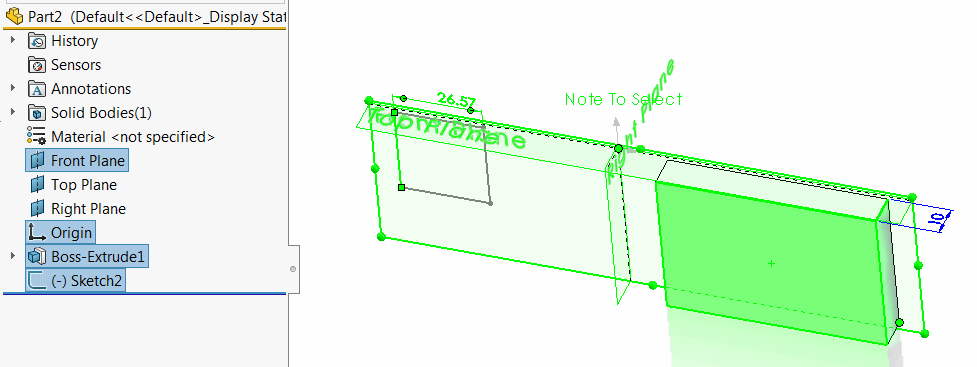
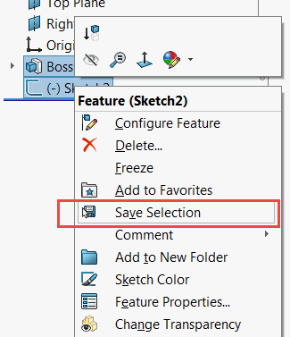

 Example demonstrates how to select any SOLIDWORKS objects (entities, features, annotations, etc.) in a batch mode
image: select-objects.png
labels: [selection, batch selection, dispatch]
---

This example demonstrates how to select any SOLIDWORKS objects (entities, features, annotations, etc.) in a batch mode.

This technique can be useful when the type of the object is not known in advance. It also gives performance benefits when selecting several objects at a time instead of selecting one-by-one using SOLIDWORKS API.

The following example provides similar functionality to SOLIDWORKS [Create Selection Set](https://help.solidworks.com/2015/english/whatsnew/t_creating_selection_sets.htm)

{ width=300 }

* Open any model and select any objects (this can be different types objects like features, entities, annotations etc.)
* Run the macro. Macro will collect the pointers of all selected object
* Macro clears the selection and stops the execution
* Continue the execution and all previously selected objects are reselected.

VBA Example

~~~ vb
Dim swApp As SldWorks.SldWorks

Sub main()

    Set swApp = Application.SldWorks
    
    Dim swModel As SldWorks.ModelDoc2

    Set swModel = swApp.ActiveDoc
    
    If Not swModel Is Nothing Then
        
        Dim vObjects As Variant
        vObjects = GetAllSelectedObjects(swModel)
        
        swModel.ClearSelection2 True
        
        Stop
        
        swModel.Extension.MultiSelect2 vObjects, False, Nothing
        
    Else
        MsgBox "Please open the document"
    End If
    
End Sub

Function GetAllSelectedObjects(model As SldWorks.ModelDoc2) As Variant
    
    Dim swSelMgr As SldWorks.SelectionMgr
    Dim swObjects() As Object
    
    Set swSelMgr = model.SelectionManager
    
    Dim i As Integer
    
    For i = 1 To swSelMgr.GetSelectedObjectCount2(-1)
        
        Dim swObj As Object
        Set swObj = swSelMgr.GetSelectedObject6(i, -1)
        
        ReDim Preserve swObjects(i - 1)
        Set swObjects(i - 1) = swObj
    Next
    
    GetAllSelectedObjects = swObjects
    
End Function
~~~

C# Example

~~~ cs
using System.Collections.Generic;
using SolidWorks.Interop.sldworks;
using System.Diagnostics;
using System.Runtime.InteropServices;

namespace CodeStack
{
    public partial class SolidWorksMacro
    {
        public void Main()
        {
            List<DispatchWrapper> swObjects = new List<DispatchWrapper>();

            IModelDoc2 model = swApp.IActiveDoc2;

            if (model != null)
            {
                ISelectionMgr selMgr = model.ISelectionManager;

                for (int i = 0; i < selMgr.GetSelectedObjectCount2(-1); i++)
                {
                    object swSelObj = selMgr.GetSelectedObject6(i + 1, -1);
                    swObjects.Add(new DispatchWrapper(swSelObj));//it is required to wrap dispatch pointers to allow selection of objects of different types (i.e. faces, annotations, components etc.) together
                }

                model.ClearSelection2(true);

                Debugger.Break();

                model.Extension.MultiSelect2(swObjects.ToArray(), false, null);
            }
            else
            {
                swApp.SendMsgToUser("Please open the model");
            }
        }

        public SldWorks swApp;
    }
}

~~~

