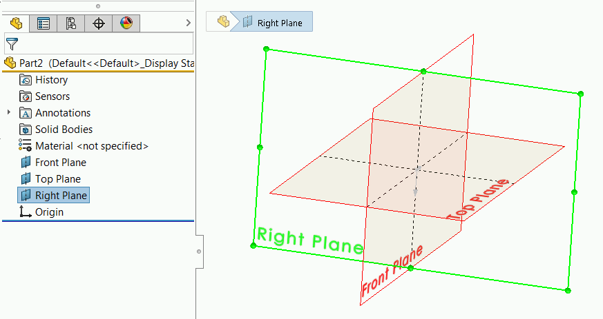
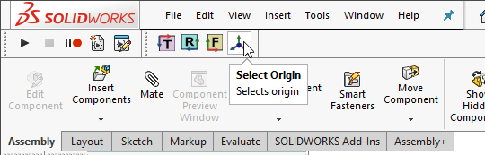

 Example demonstrates how to select standard plane (Top, Front or Right) and origin by specifying its type
image: plane.svg
labels: [selection, plane, origin]
group: Model
redirect-from:
  - /solidworks-api/document/selection/select-standard-plane/
---
{ width=400 }

This example demonstrates how to select standard plane (Top, Front or Right) or origin using SOLIDWORKS API by specifying its type so the selection will be consistent regardless of the plane name as it is not recommended to select the standard planes by their names as names are not consistent and may be changed in the template (e.g. different localization or standard).

This macro selects the primary planes or origin of root document. To select primary planes or origin of the specific component in the assembly, hover the mouse over any component's entity (you do not need to select it) and run the macro.

This macro works based on the fact that the default SOLIDWORKS planes are always ordered the same way, i.e. Front, Top and Right planes are the first planes in the model, positioned before the origin feature and cannot be reordered or removed.



## Configuration

### Target plane or origin

To configure the macro set the type of the plane to select in the **REF_GEOM** variable. Supported values: **Right**, **Top**, **Front**, **Origin**

~~~ vb
Dim REF_GEOM As swRefGeom_e
~~~

~~~ vb jagged
#Else
    REF_GEOM = swRefGeom_e.Right 
#End If
~~~

### Scrolling to selection

This macro allows to specify if the plane should be scrolled into view by setting **SCROLL** constant

~~~ vb
Const SCROLL As Boolean = False' scroll plane into view
~~~

> Note, this macro will ignore the **Feature Manager -> Scroll selected item into view** option and scroll based on the option above preserving the setting in SOLIDWORKS.

### Appending selection

Macro will append the selection if **ctrl** button is pressed unless the **APPEND_SEL** constant is set to true. In this case selection will alway be appended. This is useful when shortcut are used for the macro buttons as **ctrl** will conflict with shortcut.

~~~ vb
Const APPEND_SEL As Boolean = True
~~~

## CAD+

This macro is compatible with [Toolbar+](https://cadplus.xarial.com/toolbar/) and [Batch+](https://cadplus.xarial.com/batch/) tools so the buttons can be added to toolbar and assigned with shortcut for easier access or run in the batch mode.

In order to enable [macro arguments](https://cadplus.xarial.com/toolbar/configuration/arguments/) set the **ARGS** constant to true

~~~ vb
#Const ARGS = True
~~~

In this case it is not required to make copies of the macro to set individual [target plane or origin](#target-plane-or-origin). Instead use the **FRONT**, **TOP**, **RIGHT**, **ORIGIN** arguments for the corresponding target entity.

You can download the icons for each button: [front plane](front.svg), [top plane](top.svg), [right plane](right.svg), [origin](origin.svg) or use your own icons.

~~~ vb
#Const ARGS = False

Declare PtrSafe Function GetKeyState Lib "user32" (ByVal nVirtKey As Long) As Integer
Const VK_CONTROL As Long = &H11

Public Enum swRefGeom_e
    Origin = 4
    Front = 1
    Top = 2
    Right = 3
End Enum

Dim REF_GEOM As swRefGeom_e
Const SCROLL As Boolean = False
Const APPEND_SEL As Boolean = False

Dim swApp As SldWorks.SldWorks
    
Sub main()
    
    Set swApp = Application.SldWorks

    Dim swModel As SldWorks.ModelDoc2

    Set swModel = swApp.ActiveDoc

#If ARGS Then
    Dim macroRunner As Object
    Set macroRunner = CreateObject("CadPlus.MacroRunner.Sw")
    
    Dim param As Object
    Set param = macroRunner.PopParameter(swApp)
    
    Dim vArgs As Variant
    vArgs = param.Get("Args")
    
    Dim planeName As String
    planeName = CStr(vArgs(0))
    
    Select Case UCase(planeName)
        Case "ORIGIN"
            REF_GEOM = swRefGeom_e.Origin
        Case "TOP"
            REF_GEOM = swRefGeom_e.Top
        Case "FRONT"
            REF_GEOM = swRefGeom_e.Front
        Case "RIGHT"
            REF_GEOM = swRefGeom_e.Right
    End Select
#Else
    REF_GEOM = swRefGeom_e.Top
#End If
    
    If Not swModel Is Nothing Then
        
        If swModel.GetType() = swDocumentTypes_e.swDocASSEMBLY Or _
            swModel.GetType() = swDocumentTypes_e.swDocPART Then
            
            Dim swSelMgr As SldWorks.SelectionMgr
            Set swSelMgr = swModel.SelectionManager
                        
            Dim swComp As SldWorks.Component2
            Set swComp = swSelMgr.GetSelectedObjectsComponent3(-1, -1)
            
            If swComp Is Nothing Then
                SelectRefGeom swModel.FirstFeature(), REF_GEOM
            Else
                SelectRefGeom swComp.FirstFeature(), REF_GEOM
            End If
            
        Else
            MsgBox "Only assemblies and parts are supported"
        End If
    Else
        MsgBox "Please open part or assembly"
    End If
    
End Sub

Sub SelectRefGeom(firstFeat As SldWorks.Feature, refGeomType As swRefGeom_e)

    Dim refGeomIndex As Integer
    
    Dim swFeat As SldWorks.Feature
    
    Set swFeat = firstFeat

    Do While Not swFeat Is Nothing

        If swFeat.GetTypeName = "RefPlane" Or swFeat.GetTypeName2() = "OriginProfileFeature" Then

            refGeomIndex = refGeomIndex + 1
            
            If CInt(refGeomType) = refGeomIndex Then
                
                Dim defScrollState As Boolean
                defScrollState = swApp.GetUserPreferenceToggle(swUserPreferenceToggle_e.swFeatureManagerEnsureVisible)
                swApp.SetUserPreferenceToggle swUserPreferenceToggle_e.swFeatureManagerEnsureVisible, SCROLL
                
                Dim append As Boolean
                
                If APPEND_SEL Then
                    append = True
                Else
                    append = GetKeyState(VK_CONTROL) < 0
                End If
                
                If refGeomType = Origin Then
                    SelectOrigin swFeat, append
                Else
                    swFeat.Select2 append, -1
                End If
                
                swApp.SetUserPreferenceToggle swUserPreferenceToggle_e.swFeatureManagerEnsureVisible, defScrollState
                
                Exit Sub

            End If

        End If
    
        Set swFeat = swFeat.GetNextFeature

    Loop
    
End Sub

Sub SelectOrigin(origFeat As SldWorks.Feature, append As Boolean)
    
    Dim swSketch As SldWorks.Sketch
    Set swSketch = origFeat.GetSpecificFeature2
    
    Dim swSkPoint As SldWorks.SketchPoint
    Set swSkPoint = swSketch.GetSketchPoints2()(0)
    
    swSkPoint.Select4 append, Nothing
    
End Sub
~~~

