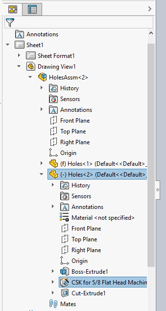

 VBA macro which selects the corresponding features of the feature in the model in all drawing views
image: selected-feature.png
---
{ width=250 }

This VBA macro demonstrates how to find the pointers for the input feature from the model space in each view in the drawing and select it.

* Open the model drawing views are created from (i.e. assembly or part)
* Select any feature
* Run macro. Macro stops an execution
* Activate drawing
* Continue the macro. All corresponding features are selected in each view

## Using the GetCorresponding method

This approach utilizes the [IView::GetCorresponding](https://help.solidworks.com/2018/English/api/sldworksapi/SolidWorks.Interop.sldworks~SolidWorks.Interop.sldworks.IView~GetCorresponding.html) API methdo by converting the pointer from the assembly context into the drawing view context. This API is only available in SOLIDWORKS 2018 or newer for an alternative approach use the [Using SelectById2 method](#using-selectbyid2-method)

~~~ vb
Dim swApp As SldWorks.SldWorks

Sub main()

    Set swApp = Application.SldWorks
    
    Dim swModel As SldWorks.ModelDoc2
    
    Set swModel = swApp.ActiveDoc
    
    Dim swFeat As SldWorks.Feature
    
    Dim swSelMgr As SldWorks.SelectionMgr
    
    Set swSelMgr = swModel.SelectionManager
    
    Set swFeat = swSelMgr.GetSelectedObject6(1, -1)
    
    'activate drawing
    Stop
    
    Dim swDraw As SldWorks.DrawingDoc
    
    Set swDraw = swApp.ActiveDoc
        
    Set swSelMgr = swDraw.SelectionManager
    
    Dim vViews As Variant
    
    vViews = swDraw.GetViews()(0)
    
    Dim i As Integer
    
    Dim swSelData As SldWorks.SelectData
    Set swSelData = swSelMgr.CreateSelectData
    
    swDraw.ClearSelection2 True
    
    For i = 0 To UBound(vViews)
        
        Dim swView As SldWorks.View
        
        Set swView = vViews(i)
        
        If swView.ReferencedDocument Is swModel Then
                    
            Dim swViewFeat As SldWorks.Entity
            Set swViewFeat = swFeat
            
            Set swViewFeat = swView.GetCorresponding(swFeat)
            
            swSelData.View = swView
            
            If Not swViewFeat Is Nothing Then
                Debug.Print swViewFeat.Select4(True, swSelData)
            Else
                Debug.Print "Failed to get corresponding feature"
            End If
            
        End If
        
    Next
    
End Sub
~~~

## Using SelectById2 method

This approach utilizes the [IModelDocExtension::SelectByID2](https://help.solidworks.com/2017/english/api/sldworksapi/solidworks.interop.sldworks~solidworks.interop.sldworks.imodeldocextension~selectbyid2.html) by composing the feature name to select.

~~~ vb
Dim swApp As SldWorks.SldWorks

Sub main()

    Set swApp = Application.SldWorks
    
    Dim swRefModel As SldWorks.ModelDoc2
    
    Set swRefModel = swApp.ActiveDoc
    
    Dim swFeat As SldWorks.Feature
    
    Set swFeat = swRefModel.SelectionManager.GetSelectedObject6(1, -1)
    
    Dim swSelMgr As SldWorks.SelectionMgr
    Set swSelMgr = swRefModel.SelectionManager
    
    Dim selName As String
    Dim selType As String
    selName = swFeat.GetNameForSelection(selType)
    
    Stop
    
    Dim swDraw As SldWorks.DrawingDoc
    Set swDraw = swApp.ActiveDoc
    
    Dim swView As SldWorks.View
    Set swView = swDraw.SelectionManager.GetSelectedObject6(1, -1)
    
    Dim drwSelPrefix As String
    drwSelPrefix = swFeat.Name & "@" & swView.RootDrawingComponent.Name & "@" & swView.Name
    
    selName = Right(selName, Len(selName) - InStr(selName, "@"))
    
    If False = swDraw.Extension.SelectByID2(drwSelPrefix & "/" & selName, selType, 0, 0, 0, False, 0, Nothing, 0) Then
        Err.Raise vbError, "", "Failed to select corresponding feature in the drawing view"
    End If

End Sub
~~~

