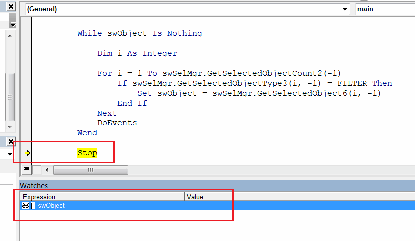
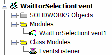
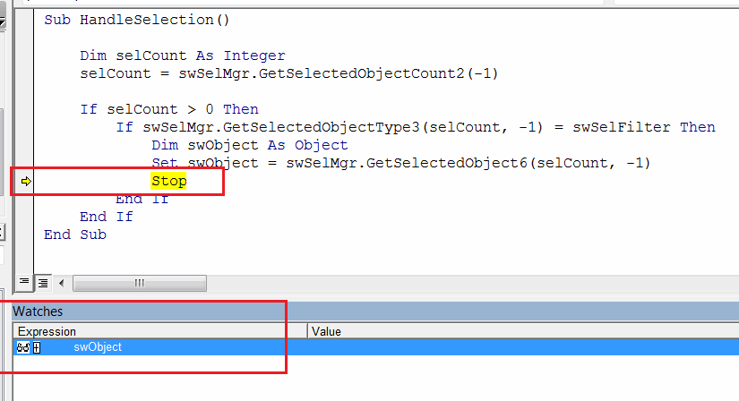

 2 approaches to wait for the object selected by the user in VBA macro using SOLIDWORKS API
image: selected-edge.png
labels: [selection,event,notification]
---
This article describes two approaches of waiting for the object selection in SOLIDWORKS document using SOLIDWORKS API in VBA macro.

For both approaches specify the filter to wait selection for at the beginning of the macro. Available filter values defined in the [swSelectType_e](https://help.solidworks.com/2014/english/api/swconst/SolidWorks.Interop.swconst~SolidWorks.Interop.swconst.swSelectType_e.html) enumeration

~~~ vb
Const FILTER As Integer = swSelectType_e.swSelEDGES
~~~

## Block the thread waiting for selection

This approach loops the selected objects and blocks the current thread until the required selection is done. *DoEvents* function is called in each iteration to continue message queue so SOLIDWORKS window is not locked

* Run the macro
* Select edge (or the object specified in the filter)

{ width=250 }

* Macro stops execution and the reference of *swObject* is set to the selected element

{ width=550 }

~~~ vb
Const FILTER As Integer = swSelectType_e.swSelEDGES

Dim swApp As SldWorks.SldWorks

Sub main()

    Set swApp = Application.SldWorks
    
    Dim swModel As SldWorks.ModelDoc2
    
    Set swModel = swApp.ActiveDoc
    
    If Not swModel Is Nothing Then
        
        swModel.ClearSelection2 True
        
        Dim swSelMgr As SldWorks.SelectionMgr
        
        Set swSelMgr = swModel.SelectionManager
        
        Dim swObject As Object
        
        While swObject Is Nothing
            
            Dim i As Integer
            
            For i = 1 To swSelMgr.GetSelectedObjectCount2(-1)
                If swSelMgr.GetSelectedObjectType3(i, -1) = FILTER Then
                    Set swObject = swSelMgr.GetSelectedObject6(i, -1)
                End If
            Next
            DoEvents
        Wend
        
        Stop
        
    Else
        MsgBox "Please open the model"
    End If
    
End Sub
~~~

## Handling the selection event

This approach uses the SOLIDWORKS notifications to handle the selection. This is more preferable option as it doesn't block the main thread, however this option requires adding of class module and additional synchronization (depending on the requirements) as events are handled asynchronously.

* Create macro module and class module as shown below

* Run macro and select edge (or the object specified in the filter)
* Similar to the previous approach code stops after the selection and the reference of *swObject* is set to the selected element

{ width=550 }

### Macro Module

~~~ vb
Const FILTER As Integer = swSelectType_e.swSelEDGES

Dim swApp As SldWorks.SldWorks
Dim swEventsListener As EventsListener

Sub main()

    Set swApp = Application.SldWorks
        
    Dim swModel As SldWorks.ModelDoc2
    
    Set swModel = swApp.ActiveDoc
    
    If Not swModel Is Nothing Then
        
        Set swEventsListener = New EventsListener
        swEventsListener.WaitForSelection swModel, FILTER
        
    Else
        MsgBox "Please open the model"
    End If
End Sub
~~~

### EventsListener Class Module

~~~ vb
Dim WithEvents swPart As SldWorks.PartDoc
Dim WithEvents swAssy As SldWorks.AssemblyDoc
Dim WithEvents swDraw As SldWorks.DrawingDoc

Dim swModel As SldWorks.ModelDoc2
Dim swSelMgr As SldWorks.SelectionMgr

Dim swSelFilter As Integer

Sub WaitForSelection(model As SldWorks.ModelDoc2, selFilter As Integer)
        
    Set swModel = model
    swSelFilter = selFilter
            
    Set swSelMgr = swModel.SelectionManager
            
    If TypeOf model Is SldWorks.PartDoc Then
        Set swPart = model
    ElseIf TypeOf model Is SldWorks.AssemblyDoc Then
        Set swAssy = model
    ElseIf TypeOf model Is SldWorks.DrawingDoc Then
        Set swDraw = model
    End If
    
End Sub

Private Function swPart_NewSelectionNotify() As Long
    HandleSelection
End Function

Private Function swAssy_NewSelectionNotify() As Long
    HandleSelection
End Function

Private Function swDraw_NewSelectionNotify() As Long
    HandleSelection
End Function

Sub HandleSelection()
    
    Dim selCount As Integer
    selCount = swSelMgr.GetSelectedObjectCount2(-1)
    
    If selCount > 0 Then
        If swSelMgr.GetSelectedObjectType3(selCount, -1) = swSelFilter Then
            Dim swObject As Object
            Set swObject = swSelMgr.GetSelectedObject6(selCount, -1)
            Stop
        End If
    End If
End Sub
~~~

