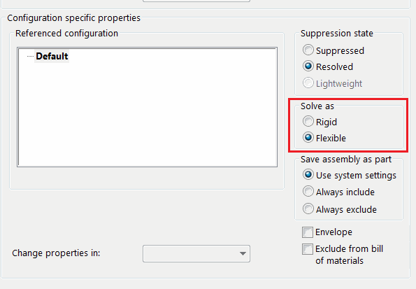

 使用SOLIDWORKS API批量设置装配中所选组件的刚性或柔性选项的VBA宏
image: batch-set-solving.png
labels: [批处理,求解,刚性,柔性]
group: 装配
---

用户可以使用组件选项页面或工具栏命令更改装配组件的求解选项（刚性或柔性）。然而，这仅限于一次只能更改一个组件。

这个VBA宏允许使用SOLIDWORKS API一次将所有选定的组件设置为刚性或柔性选项。

按照以下方式指定选项：

~~~ vb
Const SET_FLEXIBLE As Boolean = True 'True - 设置为柔性，False - 设置为刚性
~~~

~~~ vb
Const SET_FLEXIBLE As Boolean = True

Dim swApp As SldWorks.SldWorks
Dim swAssy As SldWorks.AssemblyDoc

Sub main()

    Set swApp = Application.SldWorks
    
    Set swAssy = swApp.ActiveDoc
    
    If Not swAssy Is Nothing Then
    
        Dim vComps As Variant
        vComps = GetSelectedAssemblyComponents
        
        If Not IsEmpty(vComps) Then
            
            Dim solveOpts As swComponentSolvingOption_e
            
            If SET_FLEXIBLE Then
                solveOpts = swComponentFlexibleSolving
            Else
                solveOpts = swComponentRigidSolving
            End If
            
            Dim i As Integer
            
            For i = 0 To UBound(vComps)
                
                Dim swComp As SldWorks.Component2
                Set swComp = vComps(i)
                
                SetSolvingFlag swComp, solveOpts
                
            Next
            
        Else
            MsgBox "请选择装配组件"
        End If
    
    Else
        MsgBox "请打开装配"
    End If
    
    
    
End Sub

Function GetSelectedAssemblyComponents() As Variant
    
    Dim swSelMgr As SldWorks.SelectionMgr
    Set swSelMgr = swAssy.SelectionManager
    
    Dim isInit As Boolean
    isInit = False
    
    Dim swComps() As SldWorks.Component2
    
    Dim i As Integer
    
    For i = 1 To swSelMgr.GetSelectedObjectCount2(-1)
        
        Dim swComp As SldWorks.Component2
        Set swComp = swSelMgr.GetSelectedObjectsComponent2(i)
        
        Const ASM_EXT As String = ".sldasm"
        
        Dim ext As String
        ext = Right(swComp.GetPathName(), Len(ASM_EXT))
        
        If LCase(ext) = LCase(ASM_EXT) Then
            
            If isInit Then
                ReDim Preserve swComps(UBound(swComps) + 1)
            Else
                ReDim swComps(0)
                isInit = True
            End If
            
            Set swComps(UBound(swComps)) = swComp
            
        End If
        
    Next
    
    If isInit Then
        GetSelectedAssemblyComponents = swComps
    Else
        GetSelectedAssemblyComponents = Empty
    End If
    
End Function

Sub SetSolvingFlag(comp As SldWorks.Component2, solveOpts As swComponentSolvingOption_e)
    
    comp.Select4 False, Nothing, False
    
    Dim suppOpts As Long
    Dim isVisible As Boolean
    Dim exlFromBom As Boolean
    Dim isEnv As Boolean
    Dim useNamedConf As Boolean
    Dim refConfName As String
    
    suppOpts = comp.GetSuppression()
    isVisible = comp.Visible
    exlFromBom = comp.ExcludeFromBOM
    isEnv = comp.IsEnvelope
    useNamedConf = False
    refConfName = ""
    
    swAssy.CompConfigProperties5 suppOpts, solveOpts, isVisible, useNamedConf, refConfName, exlFromBom, isEnv
    
End Sub
~~~