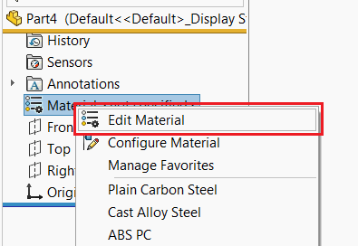

{ width=350 }

这个VBA宏使用SOLIDWORKS API和Windows API的组合来打开“编辑材料”对话框，以分配或更改活动SOLIDWORKS零件文档的材料。

~~~ vb
#If VBA7 Then
     Private Declare PtrSafe Function SendMessage Lib "User32" Alias "SendMessageA" (ByVal hWnd As Long, ByVal wMsg As Long, ByVal wParam As Long, lParam As Any) As Long
#Else
     Private Declare Function SendMessage Lib "User32" Alias "SendMessageA" (ByVal hWnd As Long, ByVal wMsg As Long, ByVal wParam As Long, lParam As Any) As Long
#End If

Dim swApp As SldWorks.SldWorks

Sub main()

    Set swApp = Application.SldWorks
    
    Dim swModel As SldWorks.ModelDoc2
    
    Set swModel = swApp.ActiveDoc
    
    If Not swModel Is Nothing Then
        
        If swModel.GetType() = swDocumentTypes_e.swDocPART Then
        
            Const WM_COMMAND As Long = &H111
            Const EDIT_MATERIAL As Long = 59526
            
            Dim swFrame As SldWorks.Frame
            
            Set swFrame = swApp.Frame
            
            SendMessage swFrame.GetHWnd(), WM_COMMAND, EDIT_MATERIAL, 0
        
        End If
        
    End If
    
End Sub
~~~