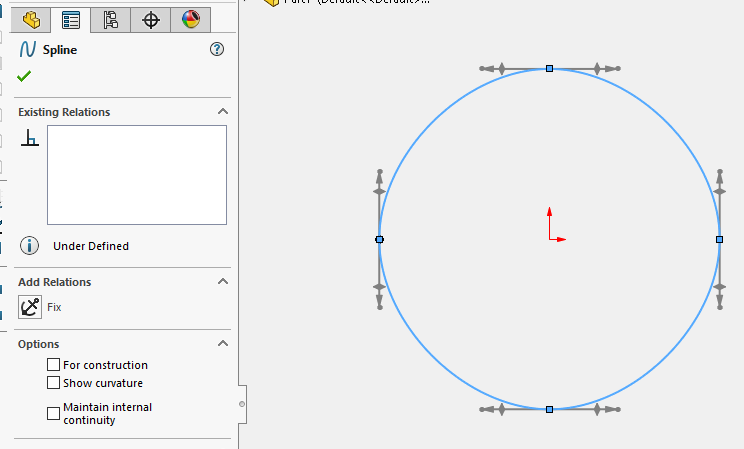

 使用SOLIDWORKS API从CSV文件中加载点数据，在活动草图中创建样条曲线的VBA宏
image: spline-pmpage.png
labels: [csv, sketch, spline]
---


这个VBA宏演示了如何通过从CSV文件中加载点数据，在活动草图中创建样条曲线。CSV文件应该包含3列用于样条节点的坐标（以米为单位）。[下载示例样条数据](spline-data.csv)

在**CSV_FILE_PATH**常量中指定该文件的完整路径。

``` vb
Const CSV_FILE_PATH As String = "D:\spline-data.csv"

Dim swApp As SldWorks.SldWorks

Sub main()

    Set swApp = Application.SldWorks

    Dim swModel As SldWorks.ModelDoc2
    Set swModel = swApp.ActiveDoc
    
    Dim swSkMgr As SldWorks.SketchManager
    Set swSkMgr = swModel.SketchManager
    
    If Not swSkMgr.ActiveSketch Is Nothing Then
        
        Dim vPts As Variant
        vPts = ReadCsvFile(CSV_FILE_PATH, True)
        
        DrawSpline swSkMgr, vPts
        
    Else
        Err.Raise vbError, "", "请激活草图"
    End If
    
End Sub

Sub DrawSpline(skMgr As SldWorks.SketchManager, vPoints As Variant)
    
    skMgr.AddToDB = True
    
    Dim dSplinePts() As Double
    ReDim dSplinePts((UBound(vPoints) + 1) * 3 - 1)
    
    Dim i As Integer
    
    For i = 0 To UBound(vPoints)
        
        Dim vPt As Variant
        vPt = vPoints(i)
        
        Dim x As Double
        Dim y As Double
        Dim z As Double
        
        If UBound(vPt) >= 0 Then
            x = vPt(0)
        End If
        
        If UBound(vPt) >= 1 Then
            y = vPt(1)
        End If
        
        If UBound(vPt) >= 2 Then
            z = vPt(2)
        End If
        
        dSplinePts(i * 3) = x
        dSplinePts(i * 3 + 1) = y
        dSplinePts(i * 3 + 2) = z
        
    Next
    
    Dim swSkSegment As SldWorks.SketchSegment
    
    Set swSkSegment = skMgr.CreateSpline2(dSplinePts, False)
    
    If swSkSegment Is Nothing Then
        Err.Raise vbError, "", "无法创建样条曲线"
    End If
    
    skMgr.AddToDB = False
    
End Sub

Function ReadCsvFile(filePath As String, firstRowHeader As Boolean) As Variant
    
    '行 x 列
    Dim vTable() As Variant
    
    Dim fileName As String
    Dim tableRow As String
    Dim fileNo As Integer

    fileNo = FreeFile
    
    Open filePath For Input As #fileNo
    
    Dim isFirstRow As Boolean
        
    isFirstRow = True
    isTableInit = False
    
    Do While Not EOF(fileNo)
        
        Line Input #fileNo, tableRow
            
        If Not isFirstRow Or Not firstRowHeader Then
            
            Dim vCells As Variant
            vCells = Split(tableRow, ",")
            
            Dim i As Integer
            
            Dim dCells() As Double
            ReDim dCells(UBound(vCells))
            
            For i = 0 To UBound(vCells)
                dCells(i) = CDbl(vCells(i))
            Next
                    
            If (Not vTable) = -1 Then
                ReDim vTable(0)
            Else
                ReDim Preserve vTable(UBound(vTable) + 1)
            End If
                    
            vTable(UBound(vTable)) = dCells
            
        End If
        
        If isFirstRow Then
            isFirstRow = False
        End If
    
    Loop
    
    Close #fileNo
    
    ReadCsvFile = vTable
    
End Function
```