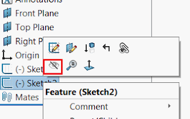

 使用SOLIDWORKS API，此宏将隐藏（空白）或显示（取消空白）活动文档中的所有草图（2D和3D）。
image: hidden-sketches.svg
labels: [空白草图, 隐藏草图, solidworks api, 实用工具]
group: 草图
redirect-from:
  - /2018/03/solidworks-api-sketch-hide-all-sketches.html
---

此宏将使用SOLIDWORKS API隐藏（空白）或显示（取消空白）活动文档中的所有草图（2D和3D）。

如果活动文档是装配体，则还将包括所有组件的草图。

{ width=320 }

## 配置

更改*HIDE_ALL_SKETCHES*选项以指定是否需要隐藏或显示草图。

## CAD+

此宏与[Toolbar+](https://cadplus.xarial.com/toolbar/)和[Batch+](https://cadplus.xarial.com/batch/)工具兼容，因此可以将按钮添加到工具栏并分配快捷键以便更轻松地访问或批处理运行。

要启用[宏参数](https://cadplus.xarial.com/toolbar/configuration/arguments/)，请将**ARGS**常量设置为true

~~~ vb
#Const ARGS = True
~~~

在这种情况下，不需要复制宏以设置单独的[隐藏和显示选项](#configuration)。而是使用**-hide**，**-show**参数相应地隐藏和显示草图。

您可以下载每个按钮的图标：[隐藏草图](hide-sketches.svg)，[显示草图](show-sketches.svg)或使用您自己的图标。

观看[视频演示](https://youtu.be/jsjN8zNRTuc?t=23)

~~~ vb
#Const ARGS = False 'True to use arguments from Toolbar+ or Batch+ instead of the constant

Dim swApp As SldWorks.SldWorks
Dim swModel As SldWorks.ModelDoc2

Const HIDE_ALL_SKETCHES As Boolean = False 'True to hide all sketches, False to show all sketches

Sub main()

    Set swApp = Application.SldWorks
    
    Dim hideAllSketches As Boolean
    
    #If ARGS Then
    
        Dim macroRunner As Object
        Set macroRunner = CreateObject("CadPlus.MacroRunner.Sw")
        
        Dim param As Object
        Set param = macroRunner.PopParameter(swApp)
        
        Dim vArgs As Variant
        vArgs = param.Get("Args")
        
        Dim operation As String
        operation = CStr(vArgs(0))
        
        Select Case LCase(operation)
            Case "-hide"
                hideAllSketches = True
            Case "-show"
                hideAllSketches = False
            Case Else
                Err.Raise vbError, "", "无效的参数。有效参数为-hide和-show"
        End Select
    #Else
        hideAllSketches = HIDE_ALL_SKETCHES
    #End If

    Set swModel = swApp.ActiveDoc
    Dim curScrollIntoView As Boolean
    curScrollIntoView = swApp.GetUserPreferenceToggle(swUserPreferenceToggle_e.swFeatureManagerEnsureVisible)
    swApp.SetUserPreferenceToggle swUserPreferenceToggle_e.swFeatureManagerEnsureVisible, False

try_:
    On Error GoTo catch_
    
    If Not swModel Is Nothing Then

        Dim swFeat As SldWorks.Feature
        Set swFeat = swModel.FirstFeature
        
        Dim swSketches() As SldWorks.Feature
        CollectAllSketchFeatures swFeat, swSketches, Not hideAllSketches
        
        If swModel.GetType() = swDocumentTypes_e.swDocASSEMBLY Then
            CollectAllComponentSketchFeatures swModel, swSketches, Not hideAllSketches
        End If
        
        If (Not swSketches) = -1 Then
            Err.Raise vbError, "", "未找到草图"
        End If
        
        If swModel.Extension.MultiSelect2(swSketches, False, Nothing) = UBound(swSketches) + 1 Then
            If hideAllSketches Then
                swModel.BlankSketch
            Else
                swModel.UnblankSketch
            End If
        Else
            Err.Raise vbError, "", "选择草图失败"
        End If
        
        GoTo finally_
    
    Else
        Err.Raise vbError, "", "请打开零件或装配体"
    End If

catch_:
    swApp.SendMsgToUser2 Err.Description, swMessageBoxIcon_e.swMbStop, swMessageBoxBtn_e.swMbOk
finally_:
    swApp.SetUserPreferenceToggle swUserPreferenceToggle_e.swFeatureManagerEnsureVisible, curScrollIntoView
    
End Sub

Sub CollectAllComponentSketchFeatures(assy As SldWorks.AssemblyDoc, feats() As SldWorks.Feature, isBlankFilter As Boolean)
    
    Dim vComps As Variant
    vComps = assy.GetComponents(False)
    
    Dim processedComps() As String
    
    Dim i As Integer
    
    For i = 0 To UBound(vComps)
        
        Dim swComp As SldWorks.Component2
        Set swComp = vComps(i)
        
        Dim key As String
        key = swComp.GetPathName() & ":" & swComp.ReferencedConfiguration
        
        If Not Contains(processedComps, key) Then
            
            If (Not processedComps) = -1 Then
                ReDim processedComps(0)
            Else
                ReDim Preserve processedComps(UBound(processedComps) + 1)
            End If
            
            processedComps(UBound(processedComps)) = key
            
            CollectAllSketchFeatures swComp.FirstFeature, feats, isBlankFilter
            
        End If
        
    Next
    
End Sub

Sub CollectAllSketchFeatures(firstFeat As SldWorks.Feature, feats() As SldWorks.Feature, isBlankFilter As Boolean)
    
    Const SKETCH_FEAT_TYPE_NAME As String = "ProfileFeature"
    Const SKETCH_3D_FEAT_TYPE_NAME As String = "3DProfileFeature"

    Dim swFeat As SldWorks.Feature
    Set swFeat = firstFeat
    
    While Not swFeat Is Nothing
    
        If swFeat.GetTypeName2 = SKETCH_FEAT_TYPE_NAME Or _
            swFeat.GetTypeName2 = SKETCH_3D_FEAT_TYPE_NAME Then
            
            Dim featVisible As swVisibilityState_e
            featVisible = swFeat.visible
            
            If featVisible = swVisibilityStateUnknown _
                Or (featVisible = swVisibilityStateHide And isBlankFilter) _
                Or (featVisible = swVisibilityStateShown And Not isBlankFilter) Then
            
                If (Not feats) = -1 Then
                    ReDim feats(0)
                Else
                    ReDim Preserve feats(UBound(feats) + 1)
                End If
                
                Set feats(UBound(feats)) = swFeat
            
            End If
            
        End If
        
        Set swFeat = swFeat.GetNextFeature
        
    Wend
    
End Sub

Function Contains(arr() As String, item As String) As Boolean
    
    If (Not arr) = -1 Then
        Contains = False
    Else
        Dim i As Integer
    
        For i = 0 To UBound(arr)
            If LCase(arr(i)) = LCase(item) Then
                Contains = True
                Exit Function
            End If
        Next
        
        Contains = False
    End If
    
End Function
~~~