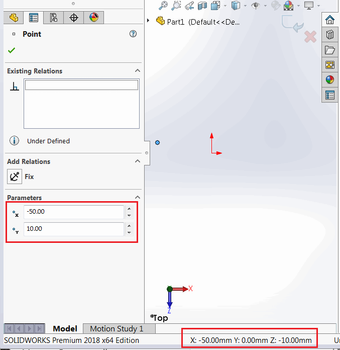
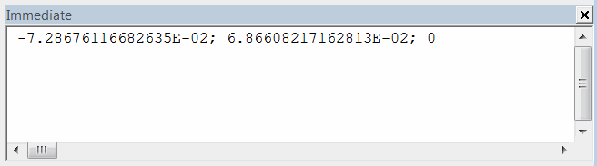

When working with sketch entities such as lines, arcs, etc., or points, it is important to consider that the coordinate values returned by the SOLIDWORKS API (e.g., the [ISketchPoint::X](https://help.solidworks.com/2017/English/api/sldworksapi/SolidWorks.Interop.sldworks~SolidWorks.Interop.sldworks.ISketchPoint~X.html) property) are relative to the local sketch coordinate system.

These values are the same for 3D sketches or 2D sketches created on the Front plane (if not moved), but differ in other cases.

As shown in the image below, for the local sketch coordinate system (on the Sketch Point PropertyManager page), the point's value is displayed as { -50, 10, 0 }, while for the global coordinate system (on the SOLIDWORKS status bar), the point's value is displayed as { -50, 0, -10 }. This difference is because the 2D sketch was created on the Top plane.

{ width=450 }

The local 2D sketch coordinate system is represented by red X and Y arrows when a sketch is active. The global coordinate system is represented by red, green, and blue axes in the bottom right corner of the SOLIDWORKS model window.

{ width=350 }

## Reading Local Coordinates from Sketch Points

The following macro will read the coordinates of the selected sketch point relative to the local sketch coordinate system and output them to the Immediate window in SOLIDWORKS.

{ width=350 }

* Create a sketch on the Front plane and create a sketch point
* Select this point
* Run the macro and compare the result with the global coordinate values (printed in meters)
* The values will match

{ width=350 }

* Create a new sketch on any plane other than the Front plane (e.g., Top plane)
* Repeat the above steps
* The coordinates will not match now

```vb
Dim swApp As SldWorks.SldWorks

Sub main()

    Set swApp = Application.SldWorks
    
    Dim swModel As SldWorks.ModelDoc2
    
    Set swModel = swApp.ActiveDoc
    
    Dim swSkPt As SldWorks.SketchPoint
    Set swSkPt = swModel.SelectionManager.GetSelectedObject6(1, -1)
    
    Debug.Print swSkPt.X & "; " & swSkPt.Y & "; " & swSkPt.Z
    
End Sub

```


## Retrieving Global Coordinates from Sketch Points

To find the coordinate values relative to the global coordinate system, the transformation matrix from sketch to model needs to be found using the [ISketch::ModelToSketchTransform](https://help.solidworks.com/2018/english/api/sldworksapi/SolidWorks.Interop.sldworks~SolidWorks.Interop.sldworks.ISketch~ModelToSketchTransform.html) property of the SOLIDWORKS API, and it needs to be applied to the coordinates of the point.

The following macro can be used to perform the steps mentioned in the previous section, but now the extracted coordinates will match the values in the global coordinate system.

```vb
Dim swApp As SldWorks.SldWorks

Sub main()

    Set swApp = Application.SldWorks
    
    Dim swModel As SldWorks.ModelDoc2
    
    Set swModel = swApp.ActiveDoc
    
    Dim swSkPt As SldWorks.SketchPoint
    Set swSkPt = swModel.SelectionManager.GetSelectedObject6(1, -1)
    
    Dim swSketch As SldWorks.Sketch
    Set swSketch = swSkPt.GetSketch
    
    ' Get the transformation from sketch to model (by inverting the model to sketch transformation)
    Dim swTransform As SldWorks.MathTransform
    Set swTransform = swSketch.ModelToSketchTransform.Inverse
        
    Dim swMathUtils As SldWorks.MathUtility
    Set swMathUtils = swApp.GetMathUtility
    
    Dim dPt(2) As Double
    dPt(0) = swSkPt.X
    dPt(1) = swSkPt.Y
    dPt(2) = swSkPt.Z
    
    ' Create a math point from the coordinates
    Dim swMathPt As SldWorks.MathPoint
    Set swMathPt = swMathUtils.CreatePoint(dPt)
    
    ' Move the point using the transformation
    Set swMathPt = swMathPt.MultiplyTransform(swTransform)
    
    ' Read the new coordinate values
    Dim vPt As Variant
    vPt = swMathPt.ArrayData
    
    Debug.Print vPt(0) & "; " & vPt(1) & "; " & vPt(2)
    
End Sub
```


## Creating Points in a Sketch Based on Global Coordinates

When there is a need to create a sketch point in a 2D sketch based on global coordinate values, the inverse transformation should be used. The following example inserts a sketch point in the active sketch based on XYZ values.

```vb
Dim swApp As SldWorks.SldWorks

Sub main()

    Set swApp = Application.SldWorks
    
    Dim swModel As SldWorks.ModelDoc2
    
    Set swModel = swApp.ActiveDoc
        
    Dim swSketch As SldWorks.Sketch
    Set swSketch = swModel.SketchManager.ActiveSketch
    
    ' Get the transformation from model to sketch
    Dim swTransform As SldWorks.MathTransform
    Set swTransform = swSketch.ModelToSketchTransform
        
    Dim swMathUtils As SldWorks.MathUtility
    Set swMathUtils = swApp.GetMathUtility
    
    Dim dPt(2) As Double
    dPt(0) = 0.025
    dPt(1) = 0
    dPt(2) = 0.1
    
    ' Create a math point from the coordinates
    Dim swMathPt As SldWorks.MathPoint
    Set swMathPt = swMathUtils.CreatePoint(dPt)
    
    ' Move the point using the transformation
    Set swMathPt = swMathPt.MultiplyTransform(swTransform)
    
    ' Read the new coordinate values
    Dim vPt As Variant
    vPt = swMathPt.ArrayData
    
    swModel.SketchManager.CreatePoint vPt(0), vPt(1), vPt(2)
    
End Sub
```