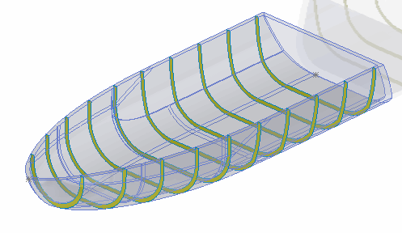

 该示例演示了如何使用SOLIDWORKS API将实体切片，并提取切片的截面数据。
image: sliced-sections.png
labels: [切片, 投影, 相交, 建模, 临时实体]
---

{ width=350 }

该示例演示了如何使用SOLIDWORKS API切片选定的实体，并计算切片的截面属性。

* 在*SLICES_COUNT*常量中指定所需切片的数量
~~~ vb
Const SLICES_COUNT As Integer = 100
~~~
* 在零件文档中选择实体
* 结果如下：
    * 实体在Y方向上被切片
    * 每个切片的面积将输出到VBA编辑器的即时窗口
    * 每个切片的预览将显示在图形区域中
* 继续运行宏以隐藏预览

## 算法

### 确定实体的起始点和最大长度

* 找到正方向和负方向上的两个极点，这些极点位于方向向量上（本示例中为Y向量）
* 将这些点投影到方向向量线上（向量可以固定在任何点上，在本示例中固定在0, 0, 0）
* 一旦投影完成，计算两点之间的距离 - 这将等于实体的最大长度
* 第一个极点是起始点

### 确定实体的最大半径
只需要找到足够大的半径以覆盖实体。该半径将用于创建一个平面实体进行相交。在本示例中，最大半径等于包围盒的对角线长度，这将确保平面截面将覆盖输入实体。

### 计算截面
* 计算截面的步长
* 对于每个截面，将起始点按步长移动。端点处的截面应该被跳过，因为它不会产生任何相交结果
* 在每个步长处创建一个临时截面平面（圆盘），并将其与实体相交
    * 相交的结果是截面位置处的片体（或片体）
    * 将截面的指针存储在集合中
    * 所有属性都可以从结果体中访问（例如表面积）

### 预览结果
* 将每个结果体显示为预览
* 停止宏的执行以验证结果
    * 可能需要隐藏或更改原始实体的透明度以查看显示的截面
* 继续宏的执行。这将清除预览

~~~ vb
Const SLICES_COUNT As Integer = 100

Dim swApp As SldWorks.SldWorks

Sub main()

    Set swApp = Application.SldWorks
    
    Dim swModel As SldWorks.ModelDoc2
    
    Set swModel = swApp.ActiveDoc
    
    If Not swModel Is Nothing Then
        
        Dim swBody As SldWorks.Body2
        Set swBody = swModel.SelectionManager.GetSelectedObject6(1, -1)
                        
        If Not swBody Is Nothing Then
            
            Dim startTime As Double
            startTime = Timer
            
            Dim swSliceBodies As Collection
            Set swSliceBodies = New Collection
            
            Dim maxRadius As Double
            maxRadius = GetMaxRadius(swBody)
            
            Dim i As Integer
            
            Dim dNorm(2) As Double
            Dim dRef(2) As Double
            
            dNorm(0) = 0: dNorm(1) = 1: dNorm(2) = 0
            dRef(0) = 1: dRef(1) = 0: dRef(2) = 0
            
            Dim vStartPt As Variant
            Dim length As Double
            vStartPt = GetStartPoint(swBody, dNorm, length)
            
            Dim step As Double
            step = length / (SLICES_COUNT + 1)
            
            For i = 1 To (SLICES_COUNT + 1) - 1
            
                Dim swCutPlane As SldWorks.Body2
                
                Dim vRoot As Variant
                vRoot = MovePoint(vStartPt, dNorm, step * i)
                                
                Set swCutPlane = CreatePlanarBody(vRoot, dNorm, dRef, maxRadius)
                
                Dim swTempBody As SldWorks.Body2
                Set swTempBody = swBody.Copy
        
                Dim bodyErr As Long
                Dim vRes As Variant
                vRes = swCutPlane.Operations2(swBodyOperationType_e.SWBODYINTERSECT, swTempBody, bodyErr)
                
                Dim j As Integer
                
                If Not IsEmpty(vRes) Then
                    For j = 0 To UBound(vRes)
                        Dim swResBody As SldWorks.Body2
                        Set swResBody = vRes(j)
                        Debug.Print "Area: " & swResBody.GetMassProperties(0)(4)
                        swSliceBodies.Add swResBody
                    Next
                Else
                    err.Raise vbError, , "Intersection failed"
                End If
                
            Next
            
            Debug.Print "Time: " & Round(Timer - startTime, 2)
            
            For i = 1 To swSliceBodies.Count
                swSliceBodies(i).Display3 swModel, RGB(255, 255, 0), swTempBodySelectOptions_e.swTempBodySelectOptionNone
            Next
            
            Stop
            
            For i = swSliceBodies.Count To 1 Step -1
                swSliceBodies.Remove i
            Next
                    
        Else
            MsgBox "Please select body"
        End If
        
    Else
        MsgBox "Please open model"
    End If
    
End Sub

Function GetMaxRadius(body As SldWorks.Body2) As Double
    
    Dim vBox As Variant
    vBox = body.GetBodyBox()
    
    GetMaxRadius = Sqrt((vBox(3) - vBox(0)) ^ 2 + (vBox(4) - vBox(1)) ^ 2 + (vBox(5) - vBox(2)) ^ 2)
    
End Function

Function GetStartPoint(body As SldWorks.Body2, vDir As Variant, ByRef length As Double) As Variant
    
    Dim x As Double
    Dim y As Double
    Dim z As Double
    
    body.GetExtremePoint CDbl(-vDir(0)), CDbl(-vDir(1)), CDbl(-vDir(2)), x, y, z
    
    Dim dPt(2) As Double
    dPt(0) = x: dPt(1) = y: dPt(2) = z
    
    GetStartPoint = dPt
    
    body.GetExtremePoint CDbl(vDir(0)), CDbl(vDir(1)), CDbl(vDir(2)), x, y, z
    
    dPt(0) = x: dPt(1) = y: dPt(2) = z
    
    Dim dVecPt(2) As Double
    
    Dim vPt1 As Variant
    Dim vPt2 As Variant
        
    vPt1 = ProjectPointOnVector(GetStartPoint, vDir, dVecPt)
    vPt2 = ProjectPointOnVector(dPt, vDir, dVecPt)
    
    length = Sqrt((vPt1(0) - vPt2(0)) ^ 2 + (vPt1(1) - vPt2(1)) ^ 2 + (vPt1(2) - vPt2(2)) ^ 2)
    
End Function

Function ProjectPointOnVector(vPt As Variant, vVec As Variant, vPtOnVec As Variant) As Variant
    
    Dim swMathUtils As SldWorks.MathUtility
    Set swMathUtils = swApp.GetMathUtility
    
    Dim swPt As SldWorks.MathPoint
    Dim swVec As SldWorks.MathVector
    Dim swPtOnVec As SldWorks.MathPoint
    
    Set swPt = swMathUtils.CreatePoint(vPt)
    Set swVec = swMathUtils.CreateVector(vVec)
    Set swPtOnVec = swMathUtils.CreatePoint(vPtOnVec)
    
    Dim swVec2 As SldWorks.MathVector
    Set swVec2 = swPtOnVec.Subtract(swPt)
    
    Dim magn As Double
    Dim prod As Double
    Dim dist As Double
    
    prod = swVec.Dot(swVec2)
    magn = swVec.GetLength() ^ 2
    dist = prod / magn
        
    Dim swDestPt As SldWorks.MathPoint
    Set swDestPt = swPtOnVec.AddVector(swVec.Scale(dist))
    
    ProjectPointOnVector = swDestPt.ArrayData
    
End Function

Function CreatePlanarBody(vRoot As Variant, vNorm As Variant, vRef As Variant, radius As Double) As SldWorks.Body2
    
    Dim swModeler As SldWorks.Modeler
        
    Set swModeler = swApp.GetModeler
        
    Dim swSurf As SldWorks.Surface
            
    Set swSurf = swModeler.CreatePlanarSurface2(vRoot, vNorm, vRef)
    
    Dim swTrimCurve(0) As SldWorks.Curve
    
    Dim vArcPt As Variant
    vArcPt = MovePoint(vRoot, vRef, radius)
    
    Set swTrimCurve(0) = swModeler.CreateArc(vRoot, vNorm, radius, vArcPt, vArcPt)
    
    Set CreatePlanarBody = swSurf.CreateTrimmedSheet4(swTrimCurve, True)
    
End Function

Function MovePoint(vPt As Variant, vDir As Variant, dist As Double) As Variant
    
    Dim swMathUtils As SldWorks.MathUtility
    
    Set swMathUtils = swApp.GetMathUtility
    
    Dim swPt As SldWorks.MathPoint
    Dim swDir As SldWorks.MathVector
    
    Set swPt = swMathUtils.CreatePoint(vPt)
    Set swDir = swMathUtils.CreateVector(vDir)
    
    Set swDir = swDir.Normalise()
    Set swDir = swDir.Scale(dist)
    
    Set swPt = swPt.AddVector(swDir)
    
    MovePoint = swPt.ArrayData
    
End Function

~~~