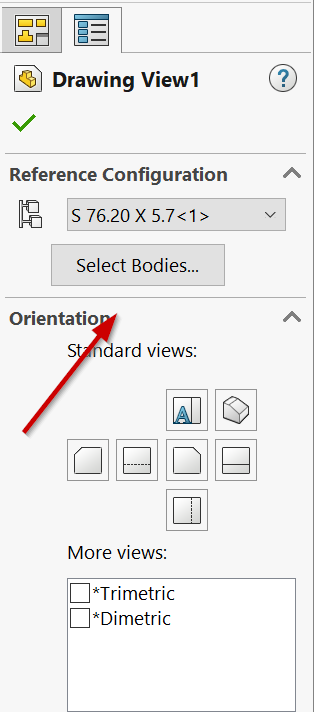

 VBA macro to create separate configurations for all cut list bodies (or unique bodies) in the active SOLIDWORKS part document for generating drawings
image: cut-list-to-configuration.svg
group: Cut List
---

This VBA macro creates separate configurations for all cut list bodies in the active part document.

This macro is useful when preparing drawings for multi-body cut list parts where a separate drawing is required for each unique body.

The macro creates the same number of configurations as the cut list features in the document and adds the corresponding **Delete Body** feature with the suppression set so that each configuration displays only the bodies of a single cut list.

The configurations are named after the cut list.

The macro displays a progress bar in the SOLIDWORKS icon:

## Configuration

The **KEEP_ALL_CUT_LIST_BODIES** constant allows controlling whether the macro isolates all cut list bodies or only keeps a single unique body.

~~~ vb
Const KEEP_ALL_CUT_LIST_BODIES As Boolean = True 'Keep all cut list bodies
~~~

If **KEEP_ALL_CUT_LIST_BODIES** is set to **False**, only the first body of each cut list is kept. This simplifies the process of creating drawings as only the appropriate reference configuration needs to be selected to display the bodies in the drawing. However, this will result in an incorrect quantity of cut list items if a BOM table is inserted (always equal to 1).

If **KEEP_ALL_CUT_LIST_BODIES** is set to **True**, all bodies of each cut list are kept. In this case, the user will also need to select the individual bodies to keep through the **Select Bodies** button in the drawing view. However, in this case, the bill of materials table will display the correct quantity.

~~~ vb
Const KEEP_ALL_CUT_LIST_BODIES As Boolean = True

Dim swApp As SldWorks.SldWorks

Sub main()

    Dim swProgressBar As SldWorks.UserProgressBar

try_:
    
    On Error GoTo catch_
    
    Set swApp = Application.SldWorks
    
    swApp.GetUserProgressBar swProgressBar
    
    Dim swModel As SldWorks.ModelDoc2
    
    Set swModel = swApp.ActiveDoc
    
    If Not swModel Is Nothing Then
        
        If swModel.GetType() = swDocumentTypes_e.swDocPART Then
            
            Dim vCutLists As Variant
            vCutLists = GetCutLists(swModel)
            
            swProgressBar.Start 0, UBound(vCutLists), "Creating configurations for cut lists"
            
            Dim i As Integer
            
            For i = 0 To UBound(vCutLists)
                
                Dim swCutList As SldWorks.Feature
                Set swCutList = vCutLists(i)
                
                Dim swCutListFolder As SldWorks.BodyFolder
                Set swCutListFolder = swCutList.GetSpecificFeature2
                
                Dim vCutListBodies As Variant
                vCutListBodies = swCutListFolder.GetBodies()
                
                If Not IsEmpty(vCutListBodies) Then
                
                    Dim vBodies As Variant
                    
                    If KEEP_ALL_CUT_LIST_BODIES Then
                        vBodies = vCutListBodies
                    Else
                        Dim swBody(0) As SldWorks.Body2
                        Set swBody(0) = vCutListBodies(0)
                        vBodies = swBody
                    End If
                    
                    Debug.Print "Creating configuration for " & swCutList.Name
                    
                    CreateConfigurationForBodies swModel, vBodies, swCutList.Name
                
                Else
                    Debug.Print swCutList.Name & " has no bodies"
                End If
                
                swProgressBar.UpdateProgress i + 1
                
            Next
            
        Else
            Err.Raise vbError, "", "Only part documents are supported"
        End If
    Else
        Err.Raise vbError, "", "Open a part document"
    End If
    
    GoTo finally_
    
catch_:
    MsgBox Err.Description, vbCritical
finally_:

    If Not swProgressBar Is Nothing Then
        swProgressBar.End
    End If
    
End Sub

Sub CreateConfigurationForBodies(model As SldWorks.ModelDoc2, vBodies As Variant, confName As String)

    If IsEmpty(vBodies) Then
        Err.Raise vbError, "", "No bodies specified"
    End If
    
    Dim activeConfName As String
    activeConfName = model.ConfigurationManager.ActiveConfiguration.Name

    Dim swBodyConf As SldWorks.Configuration
    Set swBodyConf = model.ConfigurationManager.AddConfiguration2(confName, "", "", swConfigurationOptions2_e.swConfigOption_DontActivate Or swConfigurationOptions2_e.swConfigOption_SuppressByDefault, activeConfName, "", False)
    
    If swBodyConf Is Nothing Then
        Err.Raise vbError, "", "Failed to create configuration for " & confName
    End If
    
    If model.Extension.MultiSelect2(vBodies, False, Nothing) = UBound(vBodies) + 1 Then
        
        Dim swBodyDeleteFeat As SldWorks.Feature
        Set swBodyDeleteFeat = model.FeatureManager.InsertDeleteBody2(True)
        
        If Not swBodyDeleteFeat Is Nothing Then
            
            swBodyDeleteFeat.Name = confName + "_Isolated"
            
            If False = swBodyDeleteFeat.SetSuppression2(swFeatureSuppressionAction_e.swSuppressFeature, swInConfigurationOpts_e.swThisConfiguration, Empty) Then
                Err.Raise vbError, "", "Failed to suppress delete body feature for " & confName
            End If
            
            Dim targetConf(0) As String
            targetConf(0) = swBodyConf.Name
            
            If False = swBodyDeleteFeat.SetSuppression2(swFeatureSuppressionAction_e.swUnSuppressFeature, swInConfigurationOpts_e.swSpecifyConfiguration, targetConf) Then
                Err.Raise vbError, "", "Failed to set suppression of delete body feature for " & confName & " in configuration"
            End If
        Else
            Err.Raise vbError, "", "Failed to create delete body feature for " & confName
        End If
        
    Else
        Err.Raise vbError, "", "Failed to select bodies for " & confName
    End If

End Sub

Function GetCutLists(model As SldWorks.ModelDoc2) As Variant

    Dim swFeat As SldWorks.Feature
    
    Dim swCutLists() As SldWorks.Feature
    
    Set swFeat = model.FirstFeature
    
    While Not swFeat Is Nothing
        
        If swFeat.GetTypeName2 <> "HistoryFolder" Then
        
            ProcessFeature swFeat, swCutLists
            
            TraverseSubFeatures swFeat, swCutLists
        
        End If
        
        Set swFeat = swFeat.GetNextFeature
        
    Wend
    
    GetCutLists = swCutLists
    
End Function

Sub TraverseSubFeatures(parentFeat As SldWorks.Feature, cutLists() As SldWorks.Feature)
    
    Dim swChildFeat As SldWorks.Feature
    Set swChildFeat = parentFeat.GetFirstSubFeature
    
    While Not swChildFeat Is Nothing
        ProcessFeature swChildFeat, cutLists
        Set swChildFeat = swChildFeat.GetNextSubFeature()
    Wend
    
End Sub

Sub ProcessFeature(feat As SldWorks.Feature, cutLists() As SldWorks.Feature)
    
    If feat.GetTypeName2() = "SolidBodyFolder" Then
        Dim swBodyFolder As SldWorks.BodyFolder
        Set swBodyFolder = feat.GetSpecificFeature2
        swBodyFolder.UpdateCutList
    ElseIf feat.GetTypeName2() = "CutListFolder" Then
        
        If Not Contains(cutLists, feat) Then
            If (Not cutLists) = -1 Then
                ReDim cutLists(0)
            Else
                ReDim Preserve cutLists(UBound(cutLists) + 1)
            End If
            
            Set cutLists(UBound(cutLists)) = feat
        End If
        
    End If
    
End Sub

Function Contains(arr As Variant, item As Object) As Boolean
    
    Dim i As Integer
    
    For i = 0 To UBound(arr)
        If arr(i) Is item Then
            Contains = True
            Exit Function
        End If
    Next
    
    Contains = False
    
End Function
~~~