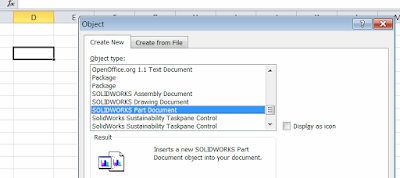

在本文中，我将讨论两种通用方法，用于从COM兼容的编程语言（如C＃，VB.NET，C ++，Visual Basic 6）连接到SOLIDWORKS实例，以利用SOLIDWORKS API。

这是关于这些方法的可选详细说明。
请点击下面的链接访问演示如何创建示例项目并连接到SOLIDWORKS实例的文章：

* [使用C＃](/docs/codestack/solidworks-api/getting-started/stand-alone/connect-csharp)
* [使用VB.NET](/docs/codestack/solidworks-api/getting-started/stand-alone/connect-vbnet)
* [使用C++](/docs/codestack/solidworks-api/getting-started/stand-alone/connect-cpp)

## 方法A - Activator和ProgId
### 通过创建一个通过**Prog**ram **Id**entified（progid）或全局唯一COM **Cl**a**s**s **Id**entifier（CLSID）的实例进行连接

SOLIDWORKS有两种类型的程序标识符：版本无关和版本特定。

程序标识符在Windows注册表中注册：

{ width=640 }

上面的示例中，**SldWorks.Application.23**的程序标识符对应于COM类标识符**{D66FBAAE-4150-402F-8581-75D1652D696A}**。

关于此对象的更多信息（例如类型库类标识符，COM服务器位置[即**sldworks.exe**的路径]）可以在与类标识符相关的注册表分支（即**HKEY_CLASSES_ROOT\CLSID\{D66FBAAE-4150-402F-8581-75D1652D696A}**）中找到。

{ width=640 }

版本无关的程序标识符对于所有版本的SOLIDWORKS都是相同的，并且等于**"SldWorks.Application"**。

如果使用版本特定的程序标识符，需要在程序标识符之后指定修订号，即**"SldWorks.Application.RevisionNumber"**。
请参考下表获取SOLIDWORKS版本及其修订号的列表：

版本|修订号
----|----
SOLIDWORKS 2005|13
SOLIDWORKS 2006|14
SOLIDWORKS 2007|15
SOLIDWORKS 2008|16
SOLIDWORKS 2009|17
SOLIDWORKS 2010|18
SOLIDWORKS 2011|19
SOLIDWORKS 2012|20
SOLIDWORKS 2013|21
SOLIDWORKS 2014|22
SOLIDWORKS 2015|23
SOLIDWORKS 2016|24
SOLIDWORKS 2017|25
SOLIDWORKS 2018|26
SOLIDWORKS 2019|27
SOLIDWORKS 2020|28
SOLIDWORKS 2021|29
SOLIDWORKS 2022|30

可以通过[ISldWorks::RevisionNumber](https://help.solidworks.com/2012/english/api/sldworksapi/solidworks.interop.sldworks~solidworks.interop.sldworks.isldworks~revisionnumber.html)方法获取SOLIDWORKS会话的修订号。
返回的值是一个格式为**25.1.0**的字符串，其中第一个数字是修订号。

使用此方法时有一些限制：

* 无法预测此方法是否会连接到已运行的SOLIDWORKS实例或创建新实例
* 无法指定要连接的正在运行的SOLIDWORKS会话（例如，当打开多个SOLIDWORKS会话时）
* 如果通过运行此方法创建了新会话，则此会话默认情况下是不可见的，并且以*/embed*标志启动。
这意味着会话以轻量级方式启动，并且不加载任何加载项。
这是为了允许将OLE对象嵌入第三方应用程序（如Microsoft Office）而设计的。

{ width=400 }

* 无法创建多个活动的SOLIDWORKS会话

## 方法B - 运行对象表（ROT）

### 通过从**R**unning **O**bject **T**able（ROT）查询COM实例进行连接

当COM服务器创建对象实例时，它会为该实例创建一个moniker，并将其注册到运行对象表（ROT）中。
ROT通过允许通过Windows API（[GetRunningObjectTable](https://msdn.microsoft.com/en-us/library/windows/desktop/ms684004(v=vs.85).aspx)）从运行的进程中查找对象，实现与第三方应用程序的进程间通信。

下面是一个具有多个注册的COM对象的运行对象表示例：

>!{00024505-0014-0000-C000-000000000046}

>!Microsoft Visual Studio Telemetry:11004

>!{31F45B04-7198-45ED-A13F-F224A4A1686A}

>SolidWorks_PID_15212

>!VisualStudio.DTE.14.0:16144

* 使用此方法可以从其进程ID连接到任何SOLIDWORKS会话
* 可以通过使用shell或启动进程API启动新的SOLIDWORKS实例来创建所需的任意数量的会话

> 如果SOLIDWORKS应用程序和独立应用程序以不同的权限级别运行（例如，一个以管理员身份运行，而另一个不是），则可能无法成功从ROT中检索对象。请以相同的用户身份运行它们以启用通信。

请点击文章开头的链接，查看连接到SOLIDWORKS实例的详细指南和带有代码示例的文章。