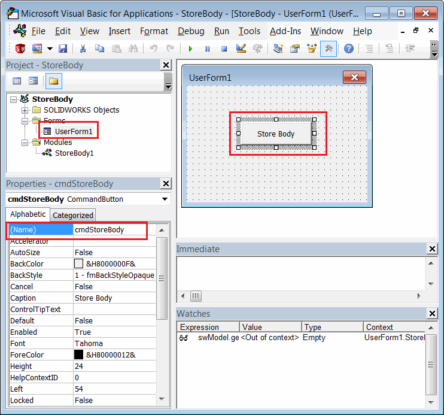

这个VBA示例演示了如何将选定的实体副本存储在新文档的流中，并在模型打开时恢复和显示实体。

实体是通过[第三方存储](/docs/codestack/solidworks-api/data-storage/third-party/)进行序列化和反序列化的。

* 创建新的宏并添加新的窗体。将其命名为*UserForm1*（默认名称）。
* 添加按钮。如下图所示，指定标题为*Store Body*，名称为*cmdStoreBody*。

{ width=450 }

* 将以下内容粘贴到用户窗体的代码后面：

```vb
Const BODY_STREAM_NAME = "_CodeStackBody_"

Dim WithEvents swApp As SldWorks.SldWorks
Dim swModeler As SldWorks.Modeler
Dim WithEvents swCurPart As SldWorks.PartDoc
Dim swCurBody As SldWorks.Body2

Private Sub UserForm_Initialize()
    
    Set swApp = Application.SldWorks
    Set swModeler = swApp.GetModeler
    
End Sub

Private Function swApp_DocumentLoadNotify(ByVal docTitle As String, ByVal docPath As String) As Long
    
    If docPath <> "" Then
    
        Dim swModel As SldWorks.ModelDoc2
        Set swModel = swApp.GetOpenDocumentByName(docPath)
        
        If TypeOf swModel Is SldWorks.PartDoc Then
            Set swCurPart = swModel
        End If
        
    End If
    
End Function

Private Function swCurPart_LoadFromStorageNotify() As Long
    DisplayBodyFromStream
    swCurPart_LoadFromStorageNotify = 0
End Function

Private Function swCurPart_SaveToStorageNotify() As Long

    If Not swCurBody Is Nothing Then
        StoreBodyToStream
        MsgBox "实体已存储到模型流。关闭并重新打开模型以恢复实体。"
    End If
    
    swCurPart_SaveToStorageNotify = 0
    
End Function

Private Sub cmdStoreBody_Click()
    
    Dim swModel As SldWorks.ModelDoc2
    Set swModel = swApp.ActiveDoc
    
    Dim swSelMgr As SldWorks.SelectionMgr
    Set swSelMgr = swModel.SelectionManager
    
    Set swCurBody = swSelMgr.GetSelectedObject6(1, -1)
    
    If Not swCurBody Is Nothing Then
        Set swCurBody = swCurBody.Copy
        Dim partTemplate As String
        partTemplate = swApp.GetUserPreferenceStringValue(swUserPreferenceStringValue_e.swDefaultTemplatePart)
        Set swCurPart = swApp.NewDocument(partTemplate, swDwgPaperSizes_e.swDwgPapersUserDefined, 0, 0)
        MsgBox "保存此文档以将实体存储在其流中。"
    Else
        MsgBox "请选择实体。"
    End If
    
End Sub

Sub DisplayBodyFromStream()
    
    Dim swModel As SldWorks.ModelDoc2
    Set swModel = swCurPart
    
    Dim swStream As Variant
    Set swStream = swModel.IGet3rdPartyStorage(BODY_STREAM_NAME, False)
    
    If Not swStream Is Nothing Then
        
        Set swCurBody = swModeler.Restore(swStream)
        swModel.IRelease3rdPartyStorage BODY_STREAM_NAME
        swCurBody.Display3 swModel, RGB(255, 255, 0), swTempBodySelectOptions_e.swTempBodySelectable
        
    End If
    
End Sub

Sub StoreBodyToStream()
    
    Dim swModel As SldWorks.ModelDoc2
    Set swModel = swCurPart
    Dim swStream As Variant
    Set swStream = swModel.IGet3rdPartyStorage(BODY_STREAM_NAME, True)
    swCurBody.Save swStream
    swModel.IRelease3rdPartyStorage BODY_STREAM_NAME
    
End Sub
```


* 将以下代码插入到宏的主模块中：

```vb
Sub main()

    UserForm1.Show vbModeless
    
End Sub
```


## 运行宏

* 从主模块启动宏。注意，如果在宏编辑器中激活窗体时运行宏，窗体将显示为模态窗口，会阻止选择和保存操作。
* 打开任何具有任意几何体的零件文档。
* 从树中选择实体并单击用户窗体中的*Store Body*按钮。
* 创建新的零件文档，并显示以下消息：“保存此文档以将实体存储在其流中”。
* 保存此文件。保存文件时，来自不同零件的实体被序列化到新文档的流中，并且不再与原始实体相关联。
* 完成后，显示以下消息：“实体已存储到模型流。关闭并重新打开模型以恢复实体”。
* 现在，关闭所有文档并重新打开最后保存的文件。实体被反序列化并显示。请注意，模型中没有特征树。

{ width=350 }

* 您可以关闭SOLIDWORKS会话并重新打开模型。实体仍将被加载。请注意，您需要在打开模型之前运行宏。