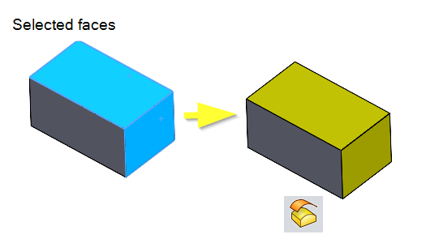

作者：[Eddy Alleman](https://www.linkedin.com/in/eddyalleman/)

{ width=525 }

这个VBA宏在零件文件中从选定的面创建一个新的曲面特征。从而复制选定的曲面并给它一个预定义的颜色。
如果您想重用现有的曲面并且不想合并现有的曲面，这可能会很有用。

操作步骤

* 必须有一个零件文件作为活动文档。
* 您必须至少选择一个面。
* 如果选择其他类型的实体，它们将被过滤掉。
* 运行宏。结果是创建了一个距离为0的曲面偏移。
* 默认情况下，该特征将以黄色显示，但您可以更改RGB颜色以设置其他颜色。

作者：[Eddy Alleman](https://www.linkedin.com/in/eddyalleman/) ([EDAL Solutions](https://www.edalsolutions.be/index.php/en/))

~~~ vb
Option Explicit

' INPUT 您可以在此处更改为另一种RGB颜色（此示例使用黄色）
Const RED = 255
Const GREEN = 255
Const BLUE = 0

Dim swxApp As SldWorks.SldWorks
Dim swModel As SldWorks.ModelDoc2
Dim selMgr As SldWorks.SelectionMgr

Sub main()

try_:
    On Error GoTo catch_

    Set swxApp = Application.SldWorks
    
    Set swModel = swxApp.ActiveDoc

    '检查活动文档是否为零件文件
    Select Case True
    
           Case swModel Is Nothing, swModel.GetType <> swDocPART
              Call swxApp.SendMsgToUser2("请打开一个零件文件", swMbInformation, swMbOk)
              
           Case Else
               Call ProcessSelectedFaces
               
    End Select

    GoTo finally_:
    
catch_:

    MsgBox Err.Description
    
finally_:
    
End Sub

Private Function ProcessSelectedFaces() As Boolean

    EnableUpdates False
                  
        Set selMgr = swModel.SelectionManager
        
        '获取选择数量
        Dim nSelections As Integer
        nSelections = selMgr.GetSelectedObjectCount2(-1)
               
        '只有在有选择内容时才进行处理
        If nSelections > 0 Then
         
              Call RemoveNonFacesFromSelection

              '获取选定面的数量
              Dim nFaces As Integer
              nFaces = selMgr.GetSelectedObjectCount2(-1)
        
              If nFaces > 0 Then
              
                  '偏移选定的面
                  swModel.InsertOffsetSurface 0#, False
                  
                  '给新创建的偏移特征命名
                  Dim featOffset As Feature
                  Set featOffset = swModel.Extension.GetLastFeatureAdded
                    
                  featOffset.Name = featOffset.Name & " Offsets " & nFaces & " Faces"
                  
                  '给偏移特征设置颜色
                  Call SetColor(featOffset)
                     
                  '取消选择面以查看新颜色
                  swModel.ClearSelection2 True

              End If 'nFaces > 0
      
         End If 'nSelections > 0
        
    EnableUpdates True
    
End Function

Private Function EnableUpdates(update As Boolean)
    With swModel
        .FeatureManager.EnableFeatureTree = update
        .ActiveView.EnableGraphicsUpdate = update
    End With
End Function

'从选择管理器中删除非面实体
Private Function RemoveNonFacesFromSelection()

        '获取选择数量
        Dim nSelections As Integer
        nSelections = selMgr.GetSelectedObjectCount2(-1)
                
        Dim i As Integer
        For i = 0 To nSelections
           
           Dim ObjectType As Long
           ObjectType = selMgr.GetSelectedObjectType3(i, -1)

           If ObjectType <> swSelectType_e.swSelFACES Then
               Dim res As Boolean
               res = selMgr.DeSelect2(i, -1)
           End If
                  
        Next
              
End Function

'设置特征的输入颜色
Private Function SetColor(ByRef Feat As Feature) As Boolean

      '从模型获取材料属性
      Dim MatProp As Variant
      MatProp = swModel.MaterialPropertyValues
                  
      '设置颜色，例如RGB(225, 255 , 0)，但我们需要将其范围设置为0到1
      MatProp(0) = RED / 255
      MatProp(1) = GREEN / 255
      MatProp(2) = BLUE / 255
            
      SetColor = Feat.SetMaterialPropertyValues(MatProp)
                  
End Function
~~~