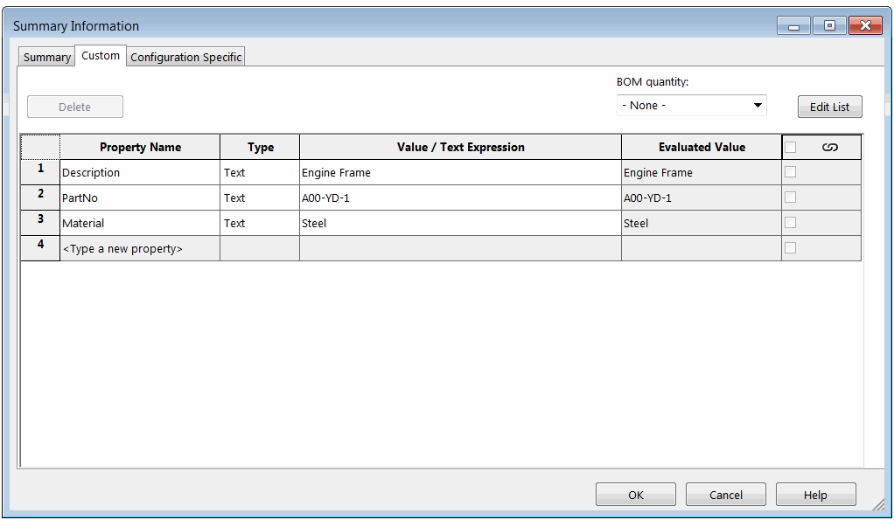
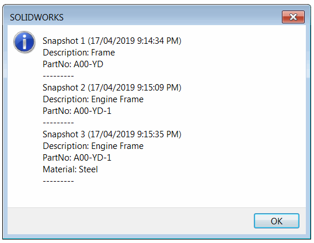

{ width=450 }

This example demonstrates how to utilize 3rd party storage store to save file custom properties revisions using SOLIDWORKS API.

This add-in is built using the [SwEx.AddIn](/docs/codestack/labs/solidworks/swex/add-in/) framework but it could work with any other methods of creating the add-ins.

Add-in adds two buttons in the menu and toolbar and provides two handlers correspondingly: 

* TakeCustomPropertiesSnapshot - reads current state of custom properties and serializes it to the 3rd party storage
* LoadSnapshots - loads all revisions and displays the message box

The snapshot of each revision is stored within the storages (streams) in 3rd party sub store, while information about all available snapshots is saved into the sub stream of 3rd party storage.

## Usage Instructions

* Open any existing SOLIDWORKS models (part, assembly or drawing)
* Add some custom properties into *Custom* tab
* Click *TakeCustomPropertiesSnapshot* from the *Tools\Custom Properties Revisions* menu
* Modify properties and click *TakeCustomPropertiesSnapshot* again. Repeat if needed
* You can close and reopen the model and SOLIDWORKS. Click *LoadSnapshots* command. All properties revisions are displayed in the message box

{ width=450 }

### PropertiesSnapshot.cs

Structures to serialize properties and info

~~~ cs
using System;
using System.Collections.Generic;
using System.Runtime.Serialization;

namespace CodeStack
{
    [DataContract]
    public class SnapshotInfo
    {
        [DataMember]
        public int Revision { get; set; }
        
        [DataMember]
        public DateTime TimeStamp { get; set; }
    }

    [DataContract]
    public class PropertiesSnapshot
    {
        [DataMember]
        public Dictionary<string, string> Properties { get; set; }
    }
}

~~~

### CustomPropertiesRevisionsAddIn.cs

Add-in class which is handling the menu commands and reads and outputs the data

~~~ cs
using CodeStack.SwEx.AddIn;
using CodeStack.SwEx.AddIn.Attributes;
using SolidWorks.Interop.sldworks;
using SolidWorks.Interop.swconst;
using System;
using System.Collections.Generic;
using System.Linq;
using System.Runtime.InteropServices;
using System.Text;
using System.Threading.Tasks;

namespace CodeStack
{
    [ComVisible(true), Guid("46919A47-EE80-445B-A87D-0C831B4B7E44")]
    [AutoRegister("Custom Properties Revisions", "Sample Demonstrating use of 3rd party storage store")]
    public partial class CustomPropertiesRevisions : SwAddInEx
    {
        private const string STORAGE_NAME = "CustPrpRevisions";
        private const string SNAPSHOT_INFO_STREAM_NAME = "SnapshotInfos";
        private const string SNAPSHOT_STREAM_NAME_TEMPLATE = "Snapshots\\{0}";

        [SwEx.Common.Attributes.Title("Custom Properties Revisions")]
        public enum Commands_e
        {
            TakeCustomPropertiesSnapshot,
            LoadSnapshots
        }

        public override bool OnConnect()
        {
            AddCommandGroup<Commands_e>(OnButtonClick);

            return true;
        }

        private async void OnButtonClick(Commands_e cmd)
        {
            switch (cmd)
            {
                case Commands_e.TakeCustomPropertiesSnapshot:
                    await TakeCustomPropertiesSnapshot();
                    break;

                case Commands_e.LoadSnapshots:
                    LoadSnapshots();
                    break;
            }
        }

        private async Task TakeCustomPropertiesSnapshot()
        {
            try
            {
                var snapshot = GetSnapshot(App.IActiveDoc2);
                
                await SaveSnapshotToDocument(App.IActiveDoc2, snapshot);

                App.SendMsgToUser2("Snapshot is saved",
                    (int)swMessageBoxIcon_e.swMbInformation,
                    (int)swMessageBoxBtn_e.swMbOk);
            }
            catch (Exception ex)
            {
                App.SendMsgToUser2(ex.Message,
                    (int)swMessageBoxIcon_e.swMbStop,
                    (int)swMessageBoxBtn_e.swMbOk);
            }
        }
        
        private void LoadSnapshots()
        {
            try
            {
                var snapshotsInfo = GetSnapshotInfos(App.IActiveDoc2);

                var msg = new StringBuilder();

                foreach (var snapshotInfo in snapshotsInfo)
                {   
                    var snapshot = ReadSnapshotFromDocument(App.IActiveDoc2,
                        string.Format(SNAPSHOT_STREAM_NAME_TEMPLATE, snapshotInfo.Revision));

                    msg.AppendLine($"Snapshot {snapshotInfo.Revision} ({snapshotInfo.TimeStamp})");
                    msg.AppendLine(string.Join(System.Environment.NewLine, snapshot.Properties.Select(p => $"{p.Key}: {p.Value}").ToArray()));
                    msg.AppendLine("---------");
                }

                App.SendMsgToUser2(msg.ToString(),
                    (int)swMessageBoxIcon_e.swMbInformation,
                    (int)swMessageBoxBtn_e.swMbOk);
            }
            catch (Exception ex)
            {
                App.SendMsgToUser2(ex.Message,
                    (int)swMessageBoxIcon_e.swMbStop,
                    (int)swMessageBoxBtn_e.swMbOk);
            }
        }

        private PropertiesSnapshot GetSnapshot(IModelDoc2 model)
        {
            var snaphot = new PropertiesSnapshot()
            {
                Properties = new Dictionary<string, string>()
            };

            var prpMgr = model.Extension.CustomPropertyManager[""];

            var prpNames = prpMgr.GetNames() as string[];

            if (prpNames != null)
            {
                foreach (var prpName in prpNames)
                {
                    string val;
                    string resVal;
                    bool wasRes;
                    prpMgr.Get5(prpName, false, out val, out resVal, out wasRes);
                    snaphot.Properties.Add(prpName, resVal);
                }
            }

            return snaphot;
        }
    }
}

~~~

### CustomPropertiesRevisions.cs

Functions to access storage and store to serialize and deserialize the data

~~~ cs
using SolidWorks.Interop.sldworks;
using SolidWorks.Interop.swconst;
using System;
using System.Collections.Generic;
using System.Linq;
using System.Runtime.InteropServices.ComTypes;
using System.Runtime.Serialization;
using System.Text;
using System.Threading.Tasks;
using System.Xml.Serialization;
using ThirdPartyStorage;

namespace CodeStack
{
    public partial class CustomPropertiesRevisions
    {
        public class ThirdPartyStoreNotFoundException : Exception
        {
        }

        private async Task SaveSnapshotToDocument(IModelDoc2 model, PropertiesSnapshot data)
        {
            int err = -1;
            int warn = -1;

            model.SetSaveFlag();

            const int S_OK = 0;

            bool? result = null; ;

            var onSaveToStorageStoreNotifyFunc = new Func<int>(() =>
            {
                try
                {
                    StoreData(model, data, STORAGE_NAME, storage =>
                    {
                        string snapshotName = "";

                        AccessStreamFromPath(storage, SNAPSHOT_INFO_STREAM_NAME, true, true, stream =>
                        {
                            var ser = new DataContractSerializer(typeof(List<SnapshotInfo>));

                            List<SnapshotInfo> snapshotInfos = null;

                            if (stream.Length > 0)
                            {
                                snapshotInfos = ser.ReadObject(stream) as List<SnapshotInfo>;
                            }
                            else
                            {
                                snapshotInfos = new List<SnapshotInfo>();
                            }

                            var info = new SnapshotInfo()
                            {
                                Revision = snapshotInfos.Count + 1,
                                TimeStamp = DateTime.Now
                            };

                            snapshotInfos.Add(info);

                            snapshotName = string.Format(SNAPSHOT_STREAM_NAME_TEMPLATE, info.Revision);

                            stream.Seek(0, System.IO.SeekOrigin.Begin);

                            ser.WriteObject(stream, snapshotInfos);
                        }, STGM.STGM_READWRITE | STGM.STGM_SHARE_EXCLUSIVE);

                        AccessStreamFromPath(storage, snapshotName, true, true, stream =>
                        {
                            var ser = new DataContractSerializer(typeof(PropertiesSnapshot));
                            ser.WriteObject(stream, data);
                        }, STGM.STGM_READWRITE | STGM.STGM_SHARE_EXCLUSIVE);

                        result = true;
                    });
                }
                catch
                {
                    result = false;
                }
                return S_OK;
            });

            var partSaveToStorageNotify = new DPartDocEvents_SaveToStorageStoreNotifyEventHandler(onSaveToStorageStoreNotifyFunc);
            var assmSaveToStorageNotify = new DAssemblyDocEvents_SaveToStorageStoreNotifyEventHandler(onSaveToStorageStoreNotifyFunc);
            var drwSaveToStorageNotify = new DDrawingDocEvents_SaveToStorageStoreNotifyEventHandler(onSaveToStorageStoreNotifyFunc);

            #region Attach Event Handlers

            switch ((swDocumentTypes_e)model.GetType())
            {
                case swDocumentTypes_e.swDocPART:
                    (model as PartDoc).SaveToStorageStoreNotify += partSaveToStorageNotify;
                    break;

                case swDocumentTypes_e.swDocASSEMBLY:
                    (model as AssemblyDoc).SaveToStorageStoreNotify += assmSaveToStorageNotify;
                    break;

                case swDocumentTypes_e.swDocDRAWING:
                    (model as DrawingDoc).SaveToStorageStoreNotify += drwSaveToStorageNotify;
                    break;
            }

            #endregion

            if (!model.Save3((int)swSaveAsOptions_e.swSaveAsOptions_Silent, ref err, ref warn))
            {
                throw new InvalidOperationException($"Failed to save the model: {(swFileSaveError_e)err}");
            }

            await Task.Run(() =>
            {
                while (!result.HasValue)
                {
                    System.Threading.Thread.Sleep(10);
                }
            });

            #region Detach Event Handlers

            switch ((swDocumentTypes_e)model.GetType())
            {
                case swDocumentTypes_e.swDocPART:
                    (model as PartDoc).SaveToStorageStoreNotify -= partSaveToStorageNotify;
                    break;

                case swDocumentTypes_e.swDocASSEMBLY:
                    (model as AssemblyDoc).SaveToStorageStoreNotify -= assmSaveToStorageNotify;
                    break;

                case swDocumentTypes_e.swDocDRAWING:
                    (model as DrawingDoc).SaveToStorageStoreNotify -= drwSaveToStorageNotify;
                    break;
            }

            #endregion

            if (!result.Value)
            {
                throw new Exception("Failed to store the data");
            }
        }

        private PropertiesSnapshot ReadSnapshotFromDocument(IModelDoc2 model, string revName)
        {
            return ReadData<PropertiesSnapshot>(model, STORAGE_NAME, revName);
        }

        private SnapshotInfo[] GetSnapshotInfos(IModelDoc2 model)
        {
            return ReadData<SnapshotInfo[]>(model, STORAGE_NAME, SNAPSHOT_INFO_STREAM_NAME);
        }

        private void StoreData<T>(IModelDoc2 model, T data, string storageName, Action<ComStorage> action)
        {
            try
            {
                var storage = model.Extension.IGet3rdPartyStorageStore(storageName, true) as IStorage;

                using (var comStorage = new ComStorage(storage, true))
                {
                    action.Invoke(comStorage);
                }
            }
            catch
            {
                throw;
            }
            finally
            {
                model.Extension.IRelease3rdPartyStorageStore(storageName);
            }
        }

        private T ReadData<T>(IModelDoc2 model, string storageName, string streamName)
        {
            T data = default(T);

            ReadStorage(model, storageName, storage => 
            {
                AccessStreamFromPath(storage, streamName, false, false, stream=> 
                {
                    var ser = new DataContractSerializer(typeof(T));
                    data = (T)ser.ReadObject(stream);
                });
            });

            return data;
        }

        private void AccessStreamFromPath(ComStorage storage, string path, bool writable,
            bool createIfNotExist, Action<ComStream> action, STGM mode = STGM.STGM_SHARE_EXCLUSIVE)
        {
            var parentIndex = path.IndexOf('\\');

            if (parentIndex == -1)
            {
                IStream stream = null;

                try
                {
                    stream = storage.OpenStream(path, mode);
                }
                catch
                {
                    if (createIfNotExist)
                    {
                        stream = storage.CreateStream(path);
                    }
                    else
                    {
                        throw;
                    }
                }

                using (var comStream = new ComStream(stream, writable))
                {
                    action.Invoke(comStream);
                }
            }
            else
            {
                var subStorageName = path.Substring(0, parentIndex);

                IStorage subStorage;

                try
                {
                    subStorage = storage.OpenStorage(subStorageName, mode);
                }
                catch
                {
                    if (createIfNotExist)
                    {
                        subStorage = storage.CreateStorage(subStorageName);
                    }
                    else
                    {
                        throw;
                    }
                }
                
                using (var subComStorage = new ComStorage(subStorage, false))
                {
                    var nextLevelPath = path.Substring(parentIndex + 1);
                    AccessStreamFromPath(subComStorage, nextLevelPath, writable, createIfNotExist, action);
                }
            }
        }

        private void ReadStorage(IModelDoc2 model, string storageName, Action<ComStorage> action)
        {
            try
            {
                var storage = model.Extension.IGet3rdPartyStorageStore(storageName, false) as IStorage;

                if (storage != null)
                {
                    using (var comStorage = new ComStorage(storage, false))
                    {
                        action.Invoke(comStorage);
                    }
                }
                else
                {
                    throw new ThirdPartyStoreNotFoundException();
                }
            }
            catch
            {
                throw;
            }
            finally
            {
                model.Extension.IRelease3rdPartyStorageStore(storageName);
            }
        }
    }
}

~~~

### ComStorage.cs

Wrapper around [IStorage](https://docs.microsoft.com/en-us/windows/desktop/api/objidl/nn-objidl-istorage) interface which simplifies the access from .NET language

~~~ cs
using System;
using System.Collections.Generic;
using System.Runtime.InteropServices;
using System.Diagnostics;
using System.IO;
using System.Runtime.InteropServices.ComTypes;

namespace ThirdPartyStorage
{
    #region WinAPI

    [Flags]
    public enum STGM : int
    {
        STGM_READ = 0x0,
        STGM_WRITE = 0x1,
        STGM_READWRITE = 0x2,
        STGM_SHARE_DENY_NONE = 0x40,
        STGM_SHARE_DENY_READ = 0x30,
        STGM_SHARE_DENY_WRITE = 0x20,
        STGM_SHARE_EXCLUSIVE = 0x10,
        STGM_PRIORITY = 0x40000,
        STGM_CREATE = 0x1000,
        STGM_CONVERT = 0x20000,
        STGM_FAILIFTHERE = 0x0,
        STGM_DIRECT = 0x0,
        STGM_TRANSACTED = 0x10000,
        STGM_NOSCRATCH = 0x100000,
        STGM_NOSNAPSHOT = 0x200000,
        STGM_SIMPLE = 0x8000000,
        STGM_DIRECT_SWMR = 0x400000,
        STGM_DELETEONRELEASE = 0x4000000
    }

    public enum STGTY : int
    {
        STGTY_STORAGE = 1,
        STGTY_STREAM = 2,
        STGTY_LOCKBYTES = 3,
        STGTY_PROPERTY = 4
    };

    [ComImport]
    [Guid("0000000d-0000-0000-C000-000000000046")]
    [InterfaceType(ComInterfaceType.InterfaceIsIUnknown)]
    public interface IEnumSTATSTG
    {
        [PreserveSig]
        uint Next(uint celt,
        [MarshalAs(UnmanagedType.LPArray), Out]
        System.Runtime.InteropServices.ComTypes.STATSTG[] rgelt,
        out uint pceltFetched
        );

        void Skip(uint celt);

        void Reset();

        [return: MarshalAs(UnmanagedType.Interface)]
        IEnumSTATSTG Clone();
    }

    [ComImport]
    [Guid("0000000b-0000-0000-C000-000000000046")]
    [InterfaceType(ComInterfaceType.InterfaceIsIUnknown)]
    public interface IStorage
    {
        void CreateStream(string pwcsName, uint grfMode, uint reserved1, uint reserved2, out IStream ppstm);
        void OpenStream(string pwcsName, IntPtr reserved1, uint grfMode, uint reserved2, out IStream ppstm);
        void CreateStorage(string pwcsName, uint grfMode, uint reserved1, uint reserved2, out IStorage ppstg);
        void OpenStorage(string pwcsName, IStorage pstgPriority, uint grfMode, IntPtr snbExclude, uint reserved, out IStorage ppstg);
        void CopyTo(uint ciidExclude, Guid rgiidExclude, IntPtr snbExclude, IStorage pstgDest);
        void MoveElementTo(string pwcsName, IStorage pstgDest, string pwcsNewName, uint grfFlags);
        void Commit(uint grfCommitFlags);
        void Revert();
        void EnumElements(uint reserved1, IntPtr reserved2, uint reserved3, out IEnumSTATSTG ppenum);
        void DestroyElement(string pwcsName);
        void RenameElement(string pwcsOldName, string pwcsNewName);
        void SetElementTimes(string pwcsName, System.Runtime.InteropServices.ComTypes.FILETIME pctime, System.Runtime.InteropServices.ComTypes.FILETIME patime, System.Runtime.InteropServices.ComTypes.FILETIME pmtime);
        void SetClass(Guid clsid);
        void SetStateBits(uint grfStateBits, uint grfMask);
        void Stat(out System.Runtime.InteropServices.ComTypes.STATSTG pstatstg, uint grfStatFlag);
    }

    #endregion

    public class ComStorage : IDisposable
    {
        [DllImport("ole32.dll")]
        public static extern int StgOpenStorage(
            [MarshalAs(UnmanagedType.LPWStr)] string pwcsName,
            IStorage pstgPriority,
            int grfMode,
            IntPtr snbExclude,
            uint reserved,
            out IStorage ppstgOpen);

        private IStorage m_Storage;
        private bool m_IsWritable;

        public ComStorage(IStorage storage, bool writable)
        {
            if (storage == null)
            {
                throw new ArgumentNullException(nameof(storage));
            }

            m_IsWritable = writable;
            m_Storage = storage;
        }

        public IStorage OpenStorage(string storageName, STGM mode = STGM.STGM_SHARE_EXCLUSIVE)
        {
            IStorage storage;

            m_Storage.OpenStorage(storageName, null,
                (uint)mode, IntPtr.Zero, 0, out storage);

            return storage;
        }

        public IStream OpenStream(string streamName, STGM mode = STGM.STGM_SHARE_EXCLUSIVE)
        {
            IStream stream = null;

            m_Storage.OpenStream(streamName,
                IntPtr.Zero, (uint)mode, 0, out stream);

            return stream;
        }

        public IStream CreateStream(string streamName)
        {
            IStream stream = null;

            m_Storage.CreateStream(streamName,
                (uint)STGM.STGM_CREATE | (uint)STGM.STGM_SHARE_EXCLUSIVE | (uint)STGM.STGM_WRITE,
                0, 0, out stream);

            return stream;
        }

        public IStorage CreateStorage(string streamName)
        {
            IStorage storage = null;

            m_Storage.CreateStorage(streamName,
                (uint)STGM.STGM_CREATE | (uint)STGM.STGM_SHARE_EXCLUSIVE | (uint)STGM.STGM_WRITE,
                0, 0, out storage);

            return storage;
        }

        public IEnumerable<System.Runtime.InteropServices.ComTypes.STATSTG> EnumElements()
        {
            IEnumSTATSTG ssenum = null;

            m_Storage.EnumElements(0, IntPtr.Zero, 0, out ssenum);

            var ssstruct = new System.Runtime.InteropServices.ComTypes.STATSTG[1];

            uint numReturned;

            do
            {
                ssenum.Next(1, ssstruct, out numReturned);

                if (numReturned != 0)
                {
                    yield return ssstruct[0];
                }
            } while (numReturned > 0);
        }

        public void Close()
        {
            if (m_Storage != null)
            {
                if (m_IsWritable)
                {
                    m_Storage.Commit(0);
                }

                Marshal.ReleaseComObject(m_Storage);
                m_Storage = null;
                GC.SuppressFinalize(this);
            }
        }

        public void Dispose()
        {
            Close();
        }
    }
}

~~~

### ComStream.cs

Wrapper around [IStream](https://docs.microsoft.com/en-us/windows/desktop/api/objidl/nn-objidl-istream) interface which simplifies the access from .NET language

~~~ cs
using System;
using System.IO;
using System.Runtime.InteropServices.ComTypes;

namespace ThirdPartyStorage
{
    public class ComStream : Stream
    {
        private readonly IStream m_ComStream;
        private readonly bool m_Commit;

        private bool m_IsWritable;

        public override bool CanRead
        {
            get
            {
                return true;
            }
        }

        public override bool CanSeek
        {
            get
            {
                return true;
            }
        }

        public override bool CanWrite
        {
            get
            {
                return m_IsWritable;
            }
        }

        public override long Length
        {
            get
            {
                const int STATSFLAG_NONAME = 1;

                STATSTG statstg;

                m_ComStream.Stat(out statstg, STATSFLAG_NONAME);

                return statstg.cbSize;
            }
        }

        public override long Position
        {
            get
            {
                return Seek(0, SeekOrigin.Current);
            }
            set
            {
                Seek(value, SeekOrigin.Begin);
            }
        }

        public ComStream(IStream comStream, bool writable, bool commit = true)
        {
            if (comStream == null)
            {
                throw new ArgumentNullException(nameof(comStream));
            }
            
            m_ComStream = comStream;
            m_Commit = commit;
            m_IsWritable = writable;
        }

        public override void Flush()
        {
            if (m_Commit)
            {
                const int STGC_DEFAULT = 0;

                m_ComStream.Commit(STGC_DEFAULT);
            }
        }

        public unsafe override int Read(byte[] buffer, int offset, int count)
        {
            if (offset != 0)
            {
                throw new NotSupportedException("Offset is not supported");
            }

            int bytesRead;

            var address = new IntPtr(&bytesRead);

            m_ComStream.Read(buffer, count, address);

            return bytesRead;
        }

        public unsafe override long Seek(long offset, SeekOrigin origin)
        {
            long position = 0;

            var address = new IntPtr(&position);

            m_ComStream.Seek(offset, (int)origin, address);

            return position;
        }

        public override void SetLength(long value)
        {
            m_ComStream.SetSize(value);
        }
        
        public override void Write(byte[] buffer, int offset, int count)
        {
            if (offset != 0)
            {
                throw new NotSupportedException("Offset is not supported");
            }

            m_ComStream.Write(buffer, count, IntPtr.Zero);
        }

        protected override void Dispose(bool disposing)
        {
            try
            {
                if (disposing)
                {
                    m_IsWritable = false;
                }
            }
            finally
            {
                base.Dispose(disposing);
            }
        }

        ~ComStream()
        {
            Dispose(false);
        }
    }
}

~~~

