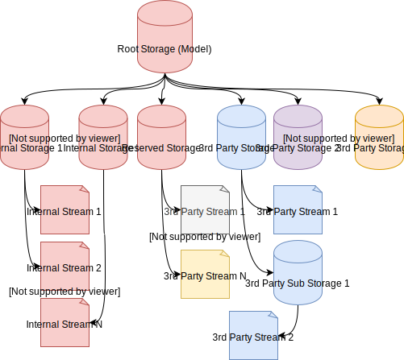

第三方存储和第三方存储是外部应用程序（插件、宏、独立应用程序）存储数据的容器，可以直接在模型流中进行序列化。

这种技术允许存储复杂的数据，并提供了读写大量数据的最佳性能选项。

SOLIDWORKS 可以将数据存储在两个不同的容器中：

* 存储（流）
* 存储存储

如果将文件系统作为类比，存储将对应文件，而存储存储将对应文件夹。存储存储可以有子流或子存储。

下图解释了 SOLIDWORKS 模型存储的结构。红色元素表示由 SOLIDWORKS 直接管理的容器，而其他元素表示由第三方管理的容器。

{ width=550 }

## 第三方存储

这是一个通过 [IStream](https://docs.microsoft.com/en-us/windows/desktop/api/objidl/nn-objidl-istream) 接口管理的容器。当应用程序只需要存储单个数据结构（例如 XML 树、文本、图像、二进制数据）时，可以使用此选项。

为了获取流的指针（用于读取或写入），需要调用 [IModelDoc2::IGet3rdPartyStorage](https://help.solidworks.com/2015/english/api/sldworksapi/SOLIDWORKS.Interop.sldworks~SOLIDWORKS.Interop.sldworks.IModelDoc2~IGet3rdPartyStorage.html) SOLIDWORKS API 方法并传递相应的标志。

### 注意事项

* 如果流以前从未被写入过，则 [IModelDoc2::IGet3rdPartyStorage](https://help.solidworks.com/2015/english/api/sldworksapi/SOLIDWORKS.Interop.sldworks~SOLIDWORKS.Interop.sldworks.IModelDoc2~IGet3rdPartyStorage.html) 方法返回 null。
* 在调用获取方法后，无论获取方法是否返回 null（即流以前未存储），都应始终释放流，方法是通过 [IModelDoc2::IRelease3rdPartyStorage](https://help.solidworks.com/2015/english/api/sldworksapi/SOLIDWORKS.Interop.sldworks~SOLIDWORKS.Interop.sldworks.IModelDoc2~IRelease3rdPartyStorage.html) 进行释放。
* 存储数据时不应调用 [IStream::Commit](https://docs.microsoft.com/en-us/windows/desktop/api/objidl/nf-objidl-istream-commit) 方法，否则将引发“方法未实现”异常。

### 生命周期

存储在 [LoadFromStorage](https://help.solidworks.com/2015/english/api/sldworksapi/solidworks.interop.sldworks~solidworks.interop.sldworks.dpartdocevents_loadfromstoragenotifyeventhandler.html) 通知和模型销毁之间可供读取。LoadFromStorageStore 可用于 [part](https://help.solidworks.com/2015/english/api/sldworksapi/solidworks.interop.sldworks~solidworks.interop.sldworks.dpartdocevents_loadfromstoragenotifyeventhandler.html)、[assembly](https://help.solidworks.com/2015/english/api/sldworksapi/solidworks.interop.sldworks~solidworks.interop.sldworks.dassemblydocevents_loadfromstoragenotifyeventhandler.html) 和 [drawing](https://help.solidworks.com/2015/english/api/sldworksapi/solidworks.interop.sldworks~solidworks.interop.sldworks.ddrawingdocevents_loadfromstoragenotifyeventhandler.html)。

只有在 [SaveToStorage](https://help.solidworks.com/2015/english/api/sldworksapi/solidworks.interop.sldworks~solidworks.interop.sldworks.dpartdocevents_savetostoragenotifyeventhandler.html) 通知中，对于 [part](https://help.solidworks.com/2015/english/api/sldworksapi/solidworks.interop.sldworks~solidworks.interop.sldworks.dpartdocevents_savetostoragenotifyeventhandler.html)、[assembly](https://help.solidworks.com/2015/english/api/sldworksapi/solidworks.interop.sldworks~solidworks.interop.sldworks.dassemblydocevents_savetostoragenotifyeventhandler.html) 和 [drawing](https://help.solidworks.com/2015/english/api/sldworksapi/solidworks.interop.sldworks~solidworks.interop.sldworks.ddrawingdocevents_savetostoragenotifyeventhandler.html)，才能进行写入。

## 第三方存储存储

这是一个通过 [IStorage](https://docs.microsoft.com/en-us/windows/desktop/api/objidl/nn-objidl-istorage) 接口管理的容器。当应用程序管理复杂的数据集并需要在特定时间访问某些部分时，可以使用此选项。存储容器允许创建子流和子存储以管理数据，并且只有在需要时才能访问特定的流，避免了将整个结构加载到内存中的需要。

要获取存储的指针，需要调用 [IModelDocExtension::IGet3rdPartyStorageStore](https://help.solidworks.com/2015/english/api/sldworksapi/SolidWorks.Interop.sldworks~SolidWorks.Interop.sldworks.IModelDocExtension~IGet3rdPartyStorageStore.html) SOLIDWORKS API 方法。

### 注意事项

* 对于以前从未写入过的存储，[IModelDocExtension::IGet3rdPartyStorageStore](https://help.solidworks.com/2015/english/api/sldworksapi/SolidWorks.Interop.sldworks~SolidWorks.Interop.sldworks.IModelDocExtension~IGet3rdPartyStorageStore.html) 返回 null。
* 与流类似，存储始终需要通过 [IModelDocExtension::IRelease3rdPartyStorageStore](https://help.solidworks.com/2015/english/api/sldworksapi/SolidWorks.Interop.sldworks~SolidWorks.Interop.sldworks.IModelDocExtension~IRelease3rdPartyStorageStore.html) 方法释放。
* 使用 [IStorage](https://docs.microsoft.com/en-us/windows/desktop/api/objidl/nn-objidl-istorage) 接口的方法创建子流和存储。

### 生命周期

存储在 [LoadFromStorageStore](https://help.solidworks.com/2015/english/api/sldworksapi/solidworks.interop.sldworks~solidworks.interop.sldworks.dpartdocevents_loadfromstoragestorenotifyeventhandler.html) 通知和模型销毁之间可供读取。LoadFromStorageStore 可用于 [part](https://help.solidworks.com/2015/english/api/sldworksapi/solidworks.interop.sldworks~solidworks.interop.sldworks.dpartdocevents_loadfromstoragestorenotifyeventhandler.html)、[assembly](https://help.solidworks.com/2015/english/api/sldworksapi/solidworks.interop.sldworks~solidworks.interop.sldworks.dassemblydocevents_loadfromstoragestorenotifyeventhandler.html) 和 [drawing](https://help.solidworks.com/2015/english/api/sldworksapi/solidworks.interop.sldworks~solidworks.interop.sldworks.ddrawingdocevents_loadfromstoragestorenotifyeventhandler.html)。

只有在 [SaveToStorageStore](https://help.solidworks.com/2015/english/api/sldworksapi/solidworks.interop.sldworks~solidworks.interop.sldworks.dpartdocevents_savetostoragestorenotifyeventhandler.html) 通知中，对于 [part](https://help.solidworks.com/2015/english/api/sldworksapi/solidworks.interop.sldworks~solidworks.interop.sldworks.dpartdocevents_savetostoragestorenotifyeventhandler.html)、[assembly](https://help.solidworks.com/2015/english/api/sldworksapi/solidworks.interop.sldworks~solidworks.interop.sldworks.dassemblydocevents_savetostoragestorenotifyeventhandler.html) 和 [drawing](https://help.solidworks.com/2015/english/api/sldworksapi/solidworks.interop.sldworks~solidworks.interop.sldworks.ddrawingdocevents_savetostoragestorenotifyeventhandler.html)，才能进行写入。

## 用法

通常，在插件中使用第三方容器（存储和存储）时，模型会与其他功能（例如电气数据、PDM、安全性等）一起补充。在这种情况下，此附加信息通常显示在特征树、任务窗格等中，并在打开模型时加载，并与模型一起保存，使此方法成为完全集成的解决方案。

*SOLIDWORKS API* 通知 *SaveToStorage* 和 *SaveToStorageStore* 在文件保存通知之后直接触发，这意味着无需实现自定义数据保存，因为它将通过用户保存自动触发。

最佳的附加保存和加载事件的位置应该在 [DocumentLoadNotify](https://help.solidworks.com/2015/english/api/sldworksapi/solidworks.interop.sldworks~solidworks.interop.sldworks.dsldworksevents_documentloadnotify2eventhandler.html) 事件中。

当第三方数据被修改时（例如用户在第三方树中添加了新节点），建议通过 [IModelDoc2::SetSaveFlag](https://help.solidworks.com/2015/english/api/sldworksapi/SOLIDWORKS.Interop.sldworks~SOLIDWORKS.Interop.sldworks.IModelDoc2~SetSaveFlag.html) 将模型标记为脏，以指示需要用户保存模型。

## 存储和流命名冲突

存储和存储通过相应的名称访问。不同的开发人员可能对存储或存储使用相同的名称，这可能会导致冲突。在使用第三方容器时，建议通过 SOLIDWORKS API Support 注册存储或存储名称，并保留此名称。

有关如何使用 SwEx.AddIn 框架访问第三方容器的信息，请参阅 [在 SOLIDWORKS 模型中使用 SwEx.AddIn 框架存储第三方数据](/docs/codestack/labs/solidworks/swex/add-in/third-party-data-storage/) 文章。