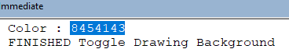

 VBA macro to toggle a white background with another color of your choice in drawings using system settings
image: ToggleWhiteBackground-icon.svg
labels: [Drawings, options, background, capture]
group: Options 
---
Author: [Eddy Alleman](https://www.linkedin.com/in/eddyalleman/) ([EDAL Solutions](https://www.edalsolutions.be/index.php/en/))

{ width=450 }

Introduction
On the SolidWorks forum someone asked how to make a macro that toggles between the default drawing background color and a white color.
The goal was to make it easier to capture images where a white background was required.

Here is a simple macro that does exactly that. I will also explain the basic buttons/shortcuts/menus you need.

If you want to toggle between other colors, you can change that in the Color1 and Color2 constants below. 

## But how do we get that number that corresponds to the color we want?
Just change it to your favorite color manually in SolidWorks options (in the image above I choose for a more distinct yellow color)
Then open the macro with the macro editor (Menu Tools > Macro > Edit or use the Macros toolbar). 
Open the immediate window if it is not already visible (CTRL + G)
Run the macro (F5 or green arrow button) and in the immediate window you should see the color you choose represented by a number:

Adapt the number in the code (Color2) and when you run the macro the background color will switch between white and your favorite color.

~~~ vb
'This macro toggles between 2 colors for the background of drawings.
'It uses a system option, so every drawing you open will get the choosen color
'This can be usefull if you want to make screen captures on a white background.

'Here you can set the 2 colors you want to toggle between
Const Color1 As Variant = 16777215 'color white
Const Color2 As Variant = 14411494 'color grey (default color for drawing background)

Sub main()

try_:

    On Error GoTo catch_

    Dim swApp As Object
    Set swApp = Application.SldWorks
    
    Dim swModel As ModelDoc2
    Set swModel = swApp.ActiveDoc
    
    'Get the color on first use (look in Immediate window CTRL + G)
    Dim Color As Variant
    Color = swApp.GetUserPreferenceIntegerValue(swUserPreferenceIntegerValue_e.swSystemColorsDrawingsPaper)
    Debug.Print "Color : " + CStr(Color)
    
     
    If Color <> Color1 Then
       Color = swApp.SetUserPreferenceIntegerValue(swUserPreferenceIntegerValue_e.swSystemColorsDrawingsPaper, Color1)
    Else
       Color = swApp.SetUserPreferenceIntegerValue(swUserPreferenceIntegerValue_e.swSystemColorsDrawingsPaper, Color2)
    End If
    
    swModel.ForceRebuild
 
GoTo finally_:
    
catch_:

    Debug.Print "Error: " & Err.Number & ":" & Err.Source & ":" & Err.Description
    
finally_:

    Debug.Print "FINISHED Toggle Drawing Background"
    
End Sub

~~~

