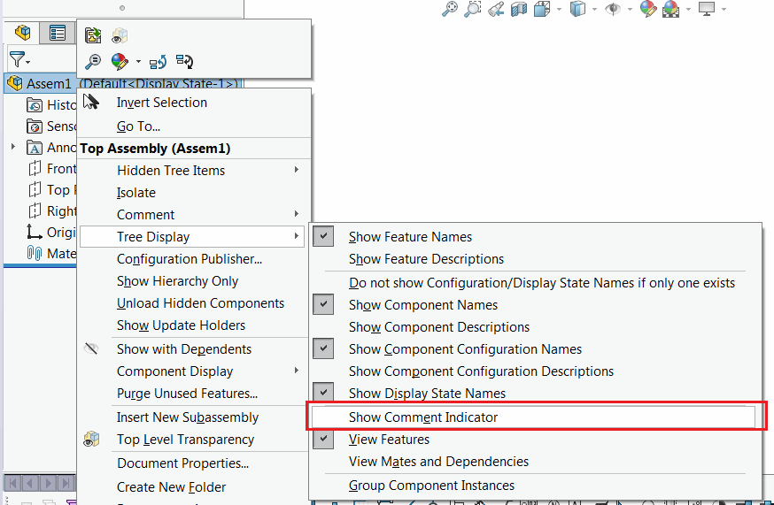

{ width=350 }

This VBA macro uses the combination of SOLIDWORKS API and Windows API to toggle the 'Show Comment Indicator' option in Feature Manager tree which is currently not available in SOLIDWORKS API.

~~~ vb
#If VBA7 Then
     Private Declare PtrSafe Function SendMessage Lib "User32" Alias "SendMessageA" (ByVal hWnd As Long, ByVal wMsg As Long, ByVal wParam As Long, lParam As Any) As Long
#Else
     Private Declare Function SendMessage Lib "User32" Alias "SendMessageA" (ByVal hWnd As Long, ByVal wMsg As Long, ByVal wParam As Long, lParam As Any) As Long
#End If

Dim swApp As SldWorks.SldWorks

Sub main()

    Const WM_COMMAND As Long = &H111
    Const SHOW_COMMENT_INDICATOR As Long = 56000
    
    Set swApp = Application.SldWorks
        
    Dim swFrame As SldWorks.Frame
    
    Set swFrame = swApp.Frame
    
    SendMessage swFrame.GetHWnd(), WM_COMMAND, SHOW_COMMENT_INDICATOR, 0
    
End Sub
~~~

