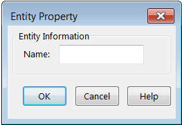

{ width=300 }

Some SOLIDWORKS objects in models can have user names assigned to them. The names are unique identification of the object in the model and it is persistent across rebuild operations or sessions. Names available for viewing and editing from the GUI.

The following object types have names assigned to them

* Component
* Configuration
* Feature
* Layer
* Body
* Sheet
* Dimensions
* Entity (Face, Edge, Vertex)
* Sketch Segment (Line, Arc, Spline, Ellipse)
* Drawing View

### Entity Names

By default names of entities (faces, edges, vertices) are not assigned.

Entity name can be changed from the **Entity Property** dialog. Refer [Displaying Entity Properties](https://help.solidworks.com/2017/english/solidworks/sldworks/hidd_ent_property.htm)

### Notes and Limitations

* Sketch segment names cannot be changed neither from GUI nor from API

* Names displayed in the selection boxes are not the real names of entities. These are just temporarily assigned names for differentiation the selection in the currently opened property manager page. Those names should not be used as the reference.

* While changing the name of the component it is required to consider several factors. Refer [Renaming Components](/docs/codestack/solidworks-api/document/assembly/components/rename/) for more information

The following example allows to rename the selected object with the specified name using SOLIDWORKS API.

~~~ vb
Enum ElementType_e
    Component
    Configuration
    Feature
    Layer
    Body
    Sheet
    Entity 'Face, Edge, Vertex
    SketchSegment
    View
End Enum

Dim swApp As SldWorks.SldWorks

Sub main()

    Set swApp = Application.SldWorks
    
    Dim swModel As SldWorks.ModelDoc2

    Set swModel = swApp.ActiveDoc
    
    If Not swModel Is Nothing Then
        
        Dim swSelMgr As SldWorks.SelectionMgr
        Set swSelMgr = swModel.SelectionManager
        
        Dim swObj As Object
        Set swObj = swSelMgr.GetSelectedObject6(1, -1)
        
        If Not swObj Is Nothing Then
            
            Dim elementType As ElementType_e
            
            Dim name As String
            name = InputBox("Specify new name name")
            
            SetObjectName swObj, swModel, name, elementType
            
            Dim newName As String
            newName = GetObjectName(swObj, swModel, elementType)
            
            Debug.Assert name = newName
            
        Else
            MsgBox "Please select object"
        End If
        
    Else
        MsgBox "Please open the model"
    End If
        
End Sub

Function GetObjectName(obj As Object, model As SldWorks.ModelDoc2, ByRef elementType As ElementType_e) As String
    
    Dim name As String
    
    If TypeOf obj Is SldWorks.Component2 Then
        
        Dim swComp As SldWorks.Component2
        Set swComp = obj
        elementType = ElementType_e.Component
        name = swComp.Name2
        
    ElseIf TypeOf obj Is SldWorks.Configuration Then
        
        Dim swConf As SldWorks.Configuration
        Set swConf = obj
        elementType = ElementType_e.Configuration
        name = swConf.name
        
    ElseIf TypeOf obj Is SldWorks.Feature Then
        
        Dim swFeat As SldWorks.Feature
        Set swFeat = obj
        elementType = ElementType_e.Feature
        name = swFeat.name
        
    ElseIf TypeOf obj Is SldWorks.Layer Then
        
        Dim swLayer As SldWorks.Layer
        Set swLayer = obj
        elementType = ElementType_e.Layer
        name = swLayer.name
        
    ElseIf TypeOf obj Is SldWorks.Body2 Then
        
        Dim swBody As SldWorks.Body2
        Set swBody = obj
        elementType = ElementType_e.Body
        name = swBody.name
        
    ElseIf TypeOf obj Is SldWorks.Sheet Then
        
        Dim swSheet As SldWorks.Sheet
        Set swSheet = obj
        elementType = ElementType_e.Sheet
        name = swSheet.GetName
        
    ElseIf TypeOf obj Is SldWorks.Face2 _
        Or TypeOf obj Is SldWorks.Edge _
        Or TypeOf obj Is SldWorks.Vertex _
        Or TypeOf obj Is SldWorks.Entity Then
        
        Dim swEnt As SldWorks.Entity
        Set swEnt = obj
        elementType = ElementType_e.Entity
        name = model.GetEntityName(swEnt)
        
    ElseIf TypeOf obj Is SldWorks.View Then
        
        Dim swView As SldWorks.View
        Set swView = obj
        elementType = ElementType_e.View
        name = swView.name
        
    ElseIf TypeOf obj Is SldWorks.SketchSegment Then
        
        Dim swSkSeg As SldWorks.SketchSegment
        Set swSkSeg = obj
        elementType = ElementType_e.SketchSegment
        name = swSkSeg.GetName
        
    Else
        Err.Raise vbObjectError, , "Object doesn't have name"
    End If
    
    GetObjectName = name
    
End Function

Sub SetObjectName(obj As Object, model As SldWorks.ModelDoc2, name As String, ByRef elementType As ElementType_e)
    
    If TypeOf obj Is SldWorks.Component2 Then
        
        Dim swComp As SldWorks.Component2
        Set swComp = obj
        elementType = ElementType_e.Component
        swComp.Name2 = name
        
    ElseIf TypeOf obj Is SldWorks.Configuration Then
        
        Dim swConf As SldWorks.Configuration
        Set swConf = obj
        elementType = ElementType_e.Configuration
        swConf.name = name
        
    ElseIf TypeOf obj Is SldWorks.Feature Then
        
        Dim swFeat As SldWorks.Feature
        Set swFeat = obj
        elementType = ElementType_e.Feature
        swFeat.name = name
        
    ElseIf TypeOf obj Is SldWorks.Layer Then
        
        Dim swLayer As SldWorks.Layer
        Set swLayer = obj
        elementType = ElementType_e.Layer
        swLayer.name = name
        
    ElseIf TypeOf obj Is SldWorks.Body2 Then
        
        Dim swBody As SldWorks.Body2
        Set swBody = obj
        elementType = ElementType_e.Body
        swBody.name = name
        
    ElseIf TypeOf obj Is SldWorks.Sheet Then
        
        Dim swSheet As SldWorks.Sheet
        Set swSheet = obj
        elementType = ElementType_e.Sheet
        swSheet.SetName name
        
    ElseIf TypeOf obj Is SldWorks.Face2 _
        Or TypeOf obj Is SldWorks.Edge _
        Or TypeOf obj Is SldWorks.Vertex _
        Or TypeOf obj Is SldWorks.Entity Then
        
        Dim swEnt As SldWorks.Entity
        Set swEnt = obj
        elementType = ElementType_e.Entity
        
        If model.GetType() = swDocumentTypes_e.swDocPART Then
            Dim swPart As SldWorks.PartDoc
            Set swPart = model
            swPart.DeleteEntityName swEnt 'it is required to clear the name if already exists
            swPart.SetEntityName swEnt, name
        Else
            Err.Raise vbObjectError, , "Entity name can only be changed in part documents"
        End If
        
    ElseIf TypeOf obj Is SldWorks.View Then
        
        Dim swView As SldWorks.View
        Set swView = obj
        elementType = ElementType_e.View
        swView.SetName2 name
        
    ElseIf TypeOf obj Is SldWorks.SketchSegment Then
        
        Err.Raise vbObjectError, , "Name of sketch segment cannot be changed"
        
    Else
        Err.Raise vbObjectError, , "Object doesn't have name"
    End If
    
End Sub
~~~

