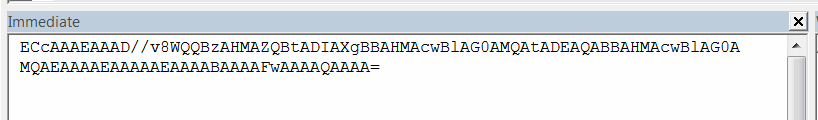

 本文介绍了使用持久参考ID在SOLIDWORKS会话中跟踪可选择的实体的方法
image: persist-id-array.png
labels: [持久, 参考, 跟踪]
---

SOLIDWORKS API中提供的持久参考ID允许检索SOLIDWORKS中任何可选择对象的持久链接。持久参考的主要优点是其生命周期，因为参考在重建操作、SOLIDWORKS会话甚至SOLIDWORKS版本之间保持有效。

持久参考ID是一个字节数组。对于相同的参考，该数组可能会发生变化，因此无法通过比较两个数组来确定参考是否相同。使用[IModelDocExtension::IsSamePersistentID方法](https://help.solidworks.com/2017/english/api/sldworksapi/solidworks.interop.sldworks~solidworks.interop.sldworks.imodeldocextension~issamepersistentid.html)来确定两个持久参考是否相同。

{ width=350 }

即使对于相同的实体，数组可能会发生变化，仍然可以通过[SOLIDWORKS API方法IModelDocExtension::GetPersistReference3](https://help.solidworks.com/2017/english/api/sldworksapi/solidworks.interop.sldworks~solidworks.interop.sldworks.imodeldocextension~getpersistreference3.html)检索到实体的有效指针。

以下示例将任何选定实体的持久ID以base64字符串的格式输出到即时窗口中：



使用此示例来读取实体的ID。

> 输出到即时窗口的ID可能包含换行符。应该从ID中删除换行符，并将其视为单行字符串。

```vb
Dim swApp As SldWorks.SldWorks

Sub main()

    Set swApp = Application.SldWorks
    
    Dim swModel As SldWorks.ModelDoc2
    
    Set swModel = swApp.ActiveDoc
    
    If Not swModel Is Nothing Then
        
        Dim swSelMgr As SldWorks.SelectionMgr
        Set swSelMgr = swModel.SelectionManager
        
        Dim swObj As Object
        Set swObj = swSelMgr.GetSelectedObject6(1, -1)
        
        If Not swObj Is Nothing Then
            Dim vId As Variant
            vId = swModel.Extension.GetPersistReference3(swObj)
            Debug.Print ConvertToBase64String(vId)
        Else
            MsgBox "请先选择要获取其持久ID的对象"
        End If
        
    Else
        MsgBox "请先打开模型"
    End If
    
End Sub

Function ConvertToBase64String(vArr As Variant) As String
    
    Dim xmlDoc As Object
    Dim xmlNode As Object
    
    Set xmlDoc = CreateObject("MSXML2.DOMDocument")
    
    Set xmlNode = xmlDoc.createElement("b64")
    
    xmlNode.DataType = "bin.base64"
    xmlNode.nodeTypedValue = vArr
    
    ConvertToBase64String = xmlNode.Text
    
End Function
```


以下示例允许通过从持久ID中检索其指针来选择对象。

* 复制前一个宏中的ID
* 关闭示例模型
* 重新打开模型并运行示例。
* 将复制的ID输入到框中
* 重新选择前一个示例中选择的实体

```vb
Dim swApp As SldWorks.SldWorks

Sub main()

    Set swApp = Application.SldWorks
    
    Dim swModel As SldWorks.ModelDoc2
    
    Set swModel = swApp.ActiveDoc
    
    If Not swModel Is Nothing Then
        
        Dim id As String
        id = InputBox("请输入以base64格式编码的持久ID")
        
        If id <> "" Then
            
            Dim vId As Variant
            vId = Base64ToArray(id)
            
            Dim swObj As Object
            Dim err As Long
            
            Set swObj = swModel.Extension.GetObjectByPersistReference3(vId, err)
            
            If Not swObj Is Nothing Then
                Dim swSelObj(0) As Object
                Set swSelObj(0) = swObj
                swModel.Extension.MultiSelect2 swSelObj, False, Nothing
            Else
                MsgBox "无法通过持久参考获取对象。错误代码为 " & err & "，定义在swPersistReferencedObjectStates_e中"
            End If
            
        End If
        
    Else
        MsgBox "请先打开模型"
    End If
    
End Sub

Private Function Base64ToArray(base64 As String) As Variant
    
    Dim xmlDoc As Object
    Dim xmlNode As Object
    
    Set xmlDoc = CreateObject("MSXML2.DOMDocument")
    Set xmlNode = xmlDoc.createElement("b64")
    
    xmlNode.DataType = "bin.base64"
    xmlNode.Text = base64
    
    Base64ToArray = xmlNode.nodeTypedValue
  
End Function
```