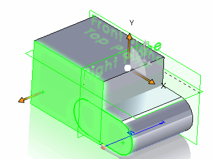

跟踪ID用于在使用SOLIDWORKS API开发宏和应用程序时，跟踪映射（跟踪）几何操作（如合并、相减、复制、拆分、模式）中的实体。

跟踪ID可以应用于面、边、环、顶点和实体。

跟踪ID在模型重建之前被临时分配。

主要用于临时实体的操作，当需要在实体发生变化时跟踪特定元素。通常在宏特征中需要这样做。

以下示例演示了如何使用SOLIDWORKS API中的跟踪ID来跟踪和映射用户选择的面到复制的合并实体。

* 下载[示例文件](tracking-ids-sample.SLDPRT)或使用任何其他零件文档
* 选择至少一个面。建议从不同的体中选择至少两个重叠的面。这样可以演示跟踪ID的好处，因为体将被合并。
* 运行宏。

{ width=300 }

宏将执行以下步骤：

* 收集所有选择的面
* 找到所有来自选择面的实体
* 清除所有现有的跟踪ID（如果有）
* 复制实体
* 将所有实体合并为一个
* 创建新的零件文档
* 从合并的副本创建新的实体
* 找到与最初选择的面对应的面
* 在合并的实体中选择这些对应的面

{ width=250 }

```vb
Dim swApp As SldWorks.SldWorks

Sub main()

    Set swApp = Application.SldWorks
    
    Dim swModel As SldWorks.ModelDoc2
    
    Set swModel = swApp.ActiveDoc
    
    If Not swModel Is Nothing Then
        
        Dim vFaces As Variant
        vFaces = GetAllSelectedFaces(swModel)
        
        If Not IsEmpty(vFaces) Then
            
            Dim trackingCookie As Long
            Dim vBodiesCopy As Variant
            
            vBodiesCopy = CopyBodiesAndTrackFaces(vFaces, trackingCookie)
            
            CreateMergedBodyAndSelectFaces trackingCookie, vBodiesCopy
        Else
            MsgBox "Please select at least one face"
        End If
        
    Else
        MsgBox "Please open the model"
    End If
    
End Sub

Function GetAllSelectedFaces(model As SldWorks.ModelDoc2) As Variant
    
    Dim swSelMgr As SldWorks.SelectionMgr
    Set swSelMgr = model.SelectionManager
    
    Dim i As Integer
    
    Dim swFaces() As SldWorks.Face2
    
    Dim isArrInit As Boolean
    
    For i = 1 To swSelMgr.GetSelectedObjectCount2(-1)
        
        On Error Resume Next
        
        Dim swFace As SldWorks.Face2
        Set swFace = swSelMgr.GetSelectedObject6(i, -1)
        
        If Not swFace Is Nothing Then
            
            If Not isArrInit Then
                isArrInit = True
                ReDim swFaces(0)
            Else
                ReDim Preserve swFaces(UBound(swFaces) + 1)
            End If
            
            Set swFaces(i - 1) = swFace
            
        End If
    Next
    
    GetAllSelectedFaces = swFaces
    
End Function

Function CopyBodiesAndTrackFaces(vFaces As Variant, ByRef trackingCookie As Long) As Variant

    trackingCookie = swApp.RegisterTrackingDefinition("_MergeBodies_")

    Dim swFace As SldWorks.Face2
    
    Dim swBodies() As SldWorks.Body2
    ReDim swBodies(UBound(vFaces))
    
    Dim i As Integer
    
    'collect bodies and clear all tracking ids
    For i = 0 To UBound(vFaces)
        
        Set swFace = vFaces(i)
        Set swBodies(i) = swFace.GetBody()
        
        ClearAllFaceTrackingIds swBodies(i), trackingCookie
        
    Next
    
    'assign tracking ids for all faces
    For i = 0 To UBound(vFaces)
        
        Set swFace = vFaces(i)
        
        swFace.SetTrackingID trackingCookie, i
        
    Next
    
    'copy all bodies
    For i = 0 To UBound(swBodies)
        
        Set swBodies(i) = swBodies(i).Copy()
        
    Next
    
    CopyBodiesAndTrackFaces = swBodies
    
End Function

Sub CreateMergedBodyAndSelectFaces(trackingCookie As Long, vBodiesCopy As Variant)
    
    Dim partTemplate As String
    partTemplate = swApp.GetUserPreferenceStringValue(swUserPreferenceStringValue_e.swDefaultTemplatePart)
    
    If partTemplate <> "" Then
        
        Dim swPart As SldWorks.PartDoc
        Set swPart = swApp.NewDocument(partTemplate, swDwgPaperSizes_e.swDwgPapersUserDefined, 0, 0)
        
        Dim swMergedBody As SldWorks.Body2
        
        Set swMergedBody = vBodiesCopy(0)
        
        Dim i As Integer
        
        For i = 1 To UBound(vBodiesCopy)
            
            Dim mergeErr As Long
            Dim vMergeRes As Variant
            
            vMergeRes = swMergedBody.Operations2(swBodyOperationType_e.SWBODYADD, vBodiesCopy(i), mergeErr)
            
            If UBound(vMergeRes) = 0 Then
                Set swMergedBody = vMergeRes(0)
            Else
                MsgBox "Selected bodies cannot be merged"
                End
            End If
            
        Next
        
        Dim swBodyFeat As SldWorks.Feature
        Set swBodyFeat = swPart.CreateFeatureFromBody3(swMergedBody, False, swCreateFeatureBodyOpts_e.swCreateFeatureBodySimplify)
        
        Dim vFaces As Variant
        vFaces = swBodyFeat.GetFaces()
        
        swPart.ClearSelection2 True
        
        For i = 0 To UBound(vFaces)
            
            Dim swFace As SldWorks.Face2
            Set swFace = vFaces(i)
            
            Dim vIds As Variant
            swFace.GetTrackingIDs trackingCookie, vIds
            
            If Not IsEmpty(vIds) Then
                
                Dim j As Integer
                
                For j = 0 To UBound(vIds)
                    Debug.Print vIds(j)
                Next
                
                swFace.Select4 True, Nothing
            End If
        Next
        
    Else
        MsgBox "Default part template is not specified"
    End If
    
End Sub

Sub ClearAllFaceTrackingIds(swBody As SldWorks.Body2, trackingCookie As Long)
    
    Dim vBodyFaces As Variant
    vBodyFaces = swBody.GetFaces
    
    Dim i As Integer
    
    For i = 0 To UBound(vBodyFaces)
        Dim swBodyFace As SldWorks.Face2
        Set swBodyFace = vBodyFaces(i)
        swBodyFace.RemoveTrackingID trackingCookie
    Next
    
End Sub
```

