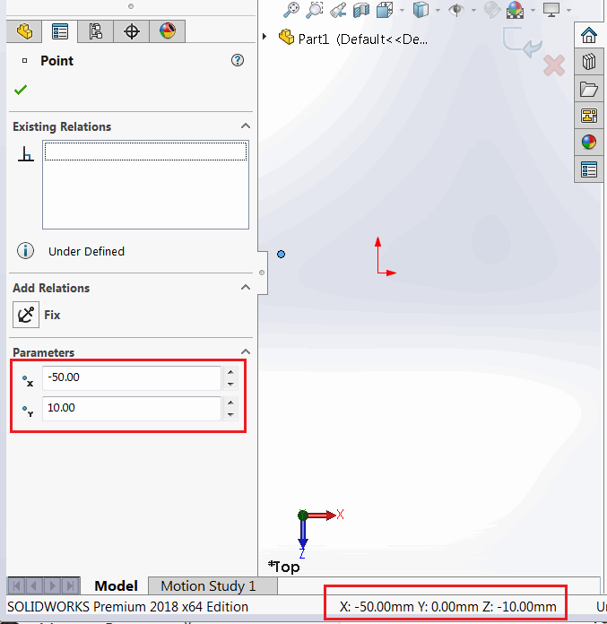
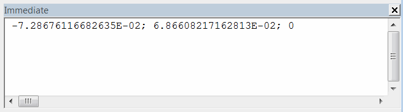
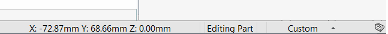

 解释SOLIDWORKS API中的模型到草图和草图到模型变换，以正确计算草图段的坐标
image: sketch-coordinate-systems.png
labels: [变换,草图]
---

在处理草图段（例如线段、弧线等）或点时，需要考虑到从SOLIDWORKS API返回的坐标值（例如[ISketchPoint::X](https://help.solidworks.com/2017/English/api/sldworksapi/SolidWorks.Interop.sldworks~SolidWorks.Interop.sldworks.ISketchPoint~X.html)属性）是相对于局部草图坐标系的。

这些值对于3D草图或在Front平面上创建的2D草图（如果未移动）将匹配，但在其他情况下将不同。

如下图所示，对于局部草图坐标系（在草图点属性管理器页面中），该点的值显示为{ -50, 10, 0 }，对于全局坐标系（在SOLIDWORKS状态栏中），该点的值显示为{ -50, 0, -10 }。这种差异是由于2D草图是在Top平面上创建的。

{ width=450 }

激活草图时，2D草图的局部坐标系显示为红色的X和Y箭头。全局坐标系在SOLIDWORKS模型窗口的右下角用红色、绿色和蓝色的三轴表示。

{ width=350 }

## 从草图点读取局部坐标

以下宏将读取所选草图点相对于局部草图坐标系的坐标，并将其输出到SOLIDWORKS的即时窗口中。

{ width=350 }

* 在Front平面上创建一个草图并创建一个草图点
* 选择此点
* 运行宏并与全局坐标值进行比较（结果以米为单位打印）
* 值将匹配

{ width=350 }

* 在任何平面上创建新的草图，但不是Front平面（例如Top平面）
* 重复上述步骤
* 现在坐标不匹配。

~~~ vb
Dim swApp As SldWorks.SldWorks

Sub main()

    Set swApp = Application.SldWorks
    
    Dim swModel As SldWorks.ModelDoc2
    
    Set swModel = swApp.ActiveDoc
    
    Dim swSkPt As SldWorks.SketchPoint
    Set swSkPt = swModel.SelectionManager.GetSelectedObject6(1, -1)
    
    Debug.Print swSkPt.X & "; " & swSkPt.Y & "; " & swSkPt.Z
    
End Sub

~~~

## 从草图点检索全局坐标

为了找到相对于全局坐标系的坐标值，需要通过[SOLIDWORKS API属性ISketch::ModelToSketchTransform](https://help.solidworks.com/2018/english/api/sldworksapi/SolidWorks.Interop.sldworks~SolidWorks.Interop.sldworks.ISketch~ModelToSketchTransform.html)找到草图到模型的[变换矩阵](/docs/codestack/solidworks-api/geometry/transformation/)，并将其应用于点的坐标。

下面的宏可以用于执行上一段中的步骤，但现在提取的坐标将与全局坐标系中的值匹配。

~~~ vb
Dim swApp As SldWorks.SldWorks

Sub main()

    Set swApp = Application.SldWorks
    
    Dim swModel As SldWorks.ModelDoc2
    
    Set swModel = swApp.ActiveDoc
    
    Dim swSkPt As SldWorks.SketchPoint
    Set swSkPt = swModel.SelectionManager.GetSelectedObject6(1, -1)
    
    Dim swSketch As SldWorks.Sketch
    Set swSketch = swSkPt.GetSketch
    
    '获取草图到模型的变换（通过求逆模型到草图的变换）
    Dim swTransform As SldWorks.MathTransform
    Set swTransform = swSketch.ModelToSketchTransform.Inverse
        
    Dim swMathUtils As SldWorks.MathUtility
    Set swMathUtils = swApp.GetMathUtility
    
    Dim dPt(2) As Double
    dPt(0) = swSkPt.X
    dPt(1) = swSkPt.Y
    dPt(2) = swSkPt.Z
    
    '从坐标创建数学点
    Dim swMathPt As SldWorks.MathPoint
    Set swMathPt = swMathUtils.CreatePoint(dPt)
    
    '通过变换移动点
    Set swMathPt = swMathPt.MultiplyTransform(swTransform)
    
    '读取新的坐标值
    Dim vPt As Variant
    vPt = swMathPt.ArrayData
    
    Debug.Print vPt(0) & "; " & vPt(1) & "; " & vPt(2)
    
End Sub
~~~

## 根据全局坐标在草图中创建点

当需要根据全局坐标值在2D草图中创建草图点时，应使用逆变换。以下示例根据XYZ值在活动草图中插入一个草图点。

~~~ vb
Dim swApp As SldWorks.SldWorks

Sub main()

    Set swApp = Application.SldWorks
    
    Dim swModel As SldWorks.ModelDoc2
    
    Set swModel = swApp.ActiveDoc
        
    Dim swSketch As SldWorks.Sketch
    Set swSketch = swModel.SketchManager.ActiveSketch
    
    '获取模型到草图的变换
    Dim swTransform As SldWorks.MathTransform
    Set swTransform = swSketch.ModelToSketchTransform
        
    Dim swMathUtils As SldWorks.MathUtility
    Set swMathUtils = swApp.GetMathUtility
    
    Dim dPt(2) As Double
    dPt(0) = 0.025
    dPt(1) = 0
    dPt(2) = 0.1
    
    '从坐标创建数学点
    Dim swMathPt As SldWorks.MathPoint
    Set swMathPt = swMathUtils.CreatePoint(dPt)
    
    '通过变换移动点
    Set swMathPt = swMathPt.MultiplyTransform(swTransform)
    
    '读取新的坐标值
    Dim vPt As Variant
    vPt = swMathPt.ArrayData
    
    swModel.SketchManager.CreatePoint vPt(0), vPt(1), vPt(2)
    
End Sub
~~~