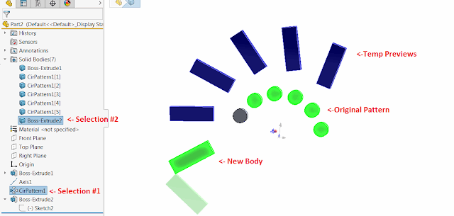

这个SOLIDWORKS API示例通过读取所选圆形模式的变换，并通过应用与圆形模式中相同的变换来创建指定种子体的模式的临时预览。

{ width=640 height=304 }

* 选择圆形模式特征作为第一个选定对象
  * 它必须使用参考轴作为方向选择任何不属于圆形模式特征的实体体
* 运行宏。宏将从模式中读取变换，并将相同的变换应用于在上一步中选择的体。
预览将使用临时体显示，当宏恢复执行时（即按F5或运行），这些体将立即被销毁。
* 在运行此宏时不会创建或删除任何临时特征

~~~ vb
Dim swApp As SldWorks.SldWorks
Dim swModel As SldWorks.ModelDoc2
Dim swMathUtils As SldWorks.MathUtility
Dim swSelMgr As SldWorks.SelectionMgr

Sub main()

    Set swApp = Application.SldWorks
    
    Set swModel = swApp.ActiveDoc
    
    Set swMathUtils = swApp.GetMathUtility
    
    Set swSelMgr = swModel.SelectionManager
    
    Dim swFeat As SldWorks.Feature
    Dim swBody As SldWorks.Body2
    Dim swCircPatt As SldWorks.CircularPatternFeatureData
    
    Set swFeat = swSelMgr.GetSelectedObject6(1, -1)
    
    If Not swFeat Is Nothing Then
        If swFeat.GetTypeName2 = "CirPattern" Then
            Set swCircPatt = swFeat.GetDefinition
        End If
    End If
    
    Set swBody = swSelMgr.GetSelectedObject6(2, -1)
    
    If swBody Is Nothing Then
        MsgBox "请将要进行模式的体作为第二个选择"
        End
    End If
    
    If Not swCircPatt Is Nothing Then
                
        Dim angle As Double
        Dim swOrigPt As SldWorks.MathPoint
        Dim swDirVec As SldWorks.MathVector
        Dim instances As Integer
        Dim vPreviewBodies As Variant
        
        GetCircularPatternParameters swCircPatt, swOrigPt, swDirVec, angle, instances
        
        vPreviewBodies = CreateCircularPatternPreview(swBody, swOrigPt, swDirVec, angle, instances)
        
        Stop
        
        ClearTempBodies vPreviewBodies
        
    Else
        MsgBox "请将圆形模式特征作为第一个选择"
    End If
    
End Sub

Sub GetCircularPatternParameters(swCircPatt As SldWorks.CircularPatternFeatureData, ByRef swOrigPt As MathPoint, ByRef swDirVec As MathVector, ByRef angle As Double, ByRef instances As Integer)
    
    swCircPatt.AccessSelections swModel, Nothing
    
    If swCircPatt.EqualSpacing Then
        angle = swCircPatt.Spacing / (swCircPatt.TotalInstances - 1)
    Else
        angle = swCircPatt.Spacing
    End If
    
    If swCircPatt.ReverseDirection Then
        angle = -angle
    End If
    
    instances = swCircPatt.TotalInstances - 2
    
    Dim swAxis As SldWorks.RefAxis
    Set swAxis = swCircPatt.Axis
        
    If swAxis Is Nothing Then
        MsgBox "只支持参考轴作为方向"
        End
    End If
    
    Dim vVec As Variant
    vVec = swAxis.GetRefAxisParams
    
    Dim dData(2) As Double
    
    dData(0) = vVec(0):  dData(1) = vVec(1): dData(2) = vVec(2)
    Set swOrigPt = swMathUtils.CreatePoint(dData)
    
    dData(0) = vVec(3) - vVec(0):  dData(1) = vVec(4) - vVec(1): dData(2) = vVec(5) - vVec(2)
    Set swDirVec = swMathUtils.CreateVector(dData)
    
    swCircPatt.ReleaseSelectionAccess
    
End Sub

Function CreateCircularPatternPreview(swBody As SldWorks.Body2, swOrigPt As MathPoint, swDirVec As MathVector, angle As Double, instances As Integer) As Variant
    
    Dim swPreviewBodies() As SldWorks.Body2
    ReDim swPreviewBodies(instances)
    
    Dim i As Integer
    
    For i = 0 To instances
        
        Dim swTransform As SldWorks.MathTransform

        Set swTransform = swMathUtils.CreateTransformRotateAxis(swOrigPt, swDirVec, angle * (i + 1))
        
        Set swPreviewBodies(i) = swBody.Copy
        
        swPreviewBodies(i).ApplyTransform swTransform
        
        swPreviewBodies(i).Display3 swModel, RGB(0, 0, 255), swTempBodySelectOptions_e.swTempBodySelectOptionNone
        
    Next
    
    CreateCircularPatternPreview = swPreviewBodies
        
End Function

Sub ClearTempBodies(vBodies As Variant)
    
    Dim i As Integer

    For i = 0 To UBound(vBodies)
        Set vBodies(i) = Nothing
    Next
    
End Sub
~~~