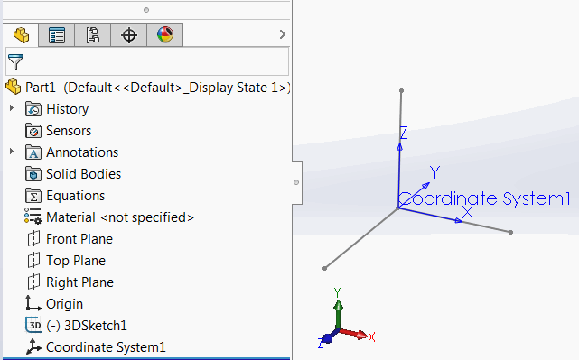
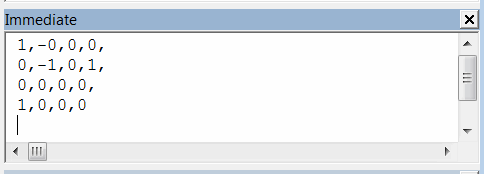

 使用VBA宏从选定的坐标系中提取4x4变换矩阵，并将结果输出到即时窗口中
image: coordinate-system.png
labels: [变换,坐标系]
---
{ width=450 }

这个VBA宏从特征管理器树中选定的坐标系中提取4x4 [变换矩阵](/docs/codestack/solidworks-api/geometry/transformation/)。

逗号分隔的结果将输出到VBA编辑器的即时窗口（Ctrl+G）中。

{ width=350 }

~~~ vb
Dim swApp As SldWorks.SldWorks

Sub main()

    Set swApp = Application.SldWorks
    
    Dim swModel As SldWorks.ModelDoc2
    
    Set swModel = swApp.ActiveDoc
    
    If Not swModel Is Nothing Then
        
        Dim swFeat As SldWorks.Feature
        Set swFeat = swModel.SelectionManager.GetSelectedObject6(1, -1)
        
        If Not swFeat Is Nothing Then
            
            If swFeat.GetTypeName2() = "CoordSys" Then
                
                Dim swCoordSys As SldWorks.CoordinateSystemFeatureData
                
                Set swCoordSys = swFeat.GetDefinition
                Dim swMathTransform As SldWorks.MathTransform
                Set swMathTransform = swCoordSys.Transform
                
                Dim vMatrix As Variant
                vMatrix = swMathTransform.ArrayData
                
                Debug.Print vMatrix(0) & "," & vMatrix(1) & "," & vMatrix(2) & "," & vMatrix(3) & ","
                Debug.Print vMatrix(4) & "," & vMatrix(5) & "," & vMatrix(6) & "," & vMatrix(7) & ","
                Debug.Print vMatrix(8) & "," & vMatrix(9) & "," & vMatrix(10) & "," & vMatrix(11) & ","
                Debug.Print vMatrix(12) & "," & vMatrix(13) & "," & vMatrix(14) & "," & vMatrix(15)
                
            Else
                MsgBox "选定的特征不是坐标系"
            End If
        Else
            MsgBox "请选择坐标系特征"
        End If
        
    Else
        MsgBox "请打开模型"
    End If
    
End Sub
~~~