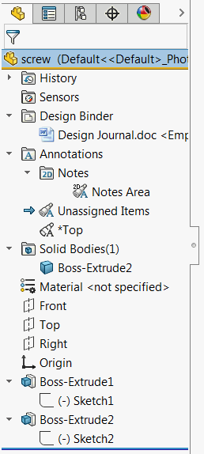

{ width=150 }

该示例演示了如何使用SOLIDWORKS API遍历特征管理器树中的节点。节点按照它们在树中呈现的顺序进行遍历，并提取出确切的文本。

[SOLIDWORKS API接口ITreeControlItem](https://help.solidworks.com/2018/english/api/sldworksapi/solidworks.interop.sldworks~solidworks.interop.sldworks.itreecontrolitem.html)表示节点元素，并允许进行自动化操作。

如果需要获取确切的特征层次结构和顺序，或者获取系统特征的节点（如历史记录、设计日志等），此宏可能会很有用。

~~~ vb
Const OFFSET_SYMBOL = " "

Dim swApp As SldWorks.SldWorks

Sub main()

    Set swApp = Application.SldWorks
    
    Dim swModel As SldWorks.ModelDoc2
    
    Set swModel = swApp.ActiveDoc

    If Not swModel Is Nothing Then
    
        Dim swFeatMgr As SldWorks.FeatureManager
        
        Set swFeatMgr = swModel.FeatureManager
        
        Dim swRootFeatNode As SldWorks.TreeControlItem
        
        Set swRootFeatNode = swFeatMgr.GetFeatureTreeRootItem2(swFeatMgrPane_e.swFeatMgrPaneBottom)
        
        If Not swRootFeatNode Is Nothing Then
            TraverseFeatureNode swRootFeatNode, ""
        End If
        
    Else
        MsgBox "请打开模型"
    End If
End Sub

Sub TraverseFeatureNode(featNode As SldWorks.TreeControlItem, offset As String)
    
    Debug.Print offset & featNode.Text
    
    Dim swChildFeatNode As SldWorks.TreeControlItem
    
    Set swChildFeatNode = featNode.GetFirstChild()
    
    While Not swChildFeatNode Is Nothing
        TraverseFeatureNode swChildFeatNode, offset + OFFSET_SYMBOL
        Set swChildFeatNode = swChildFeatNode.GetNext
    Wend
    
End Sub
~~~