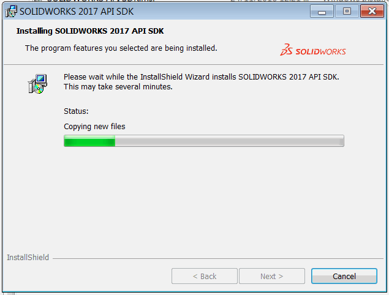
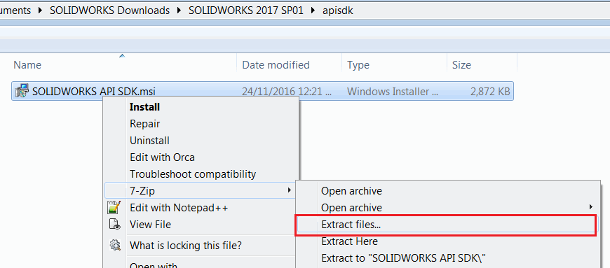
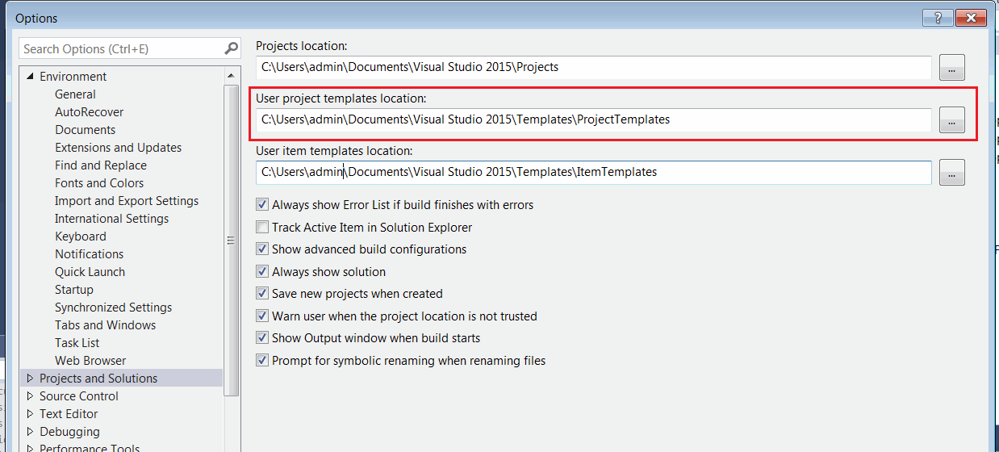
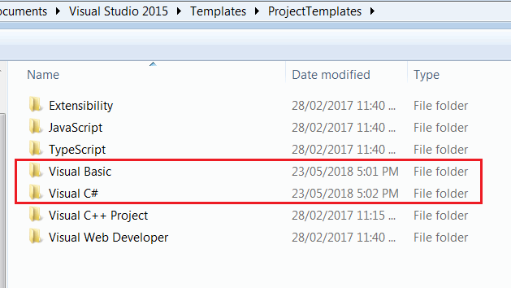
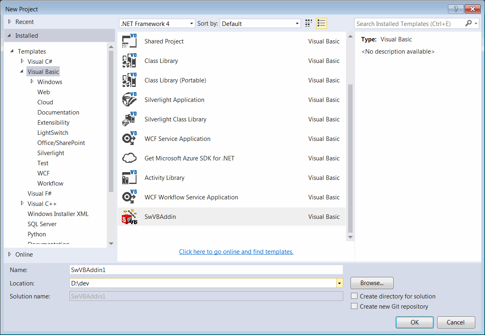
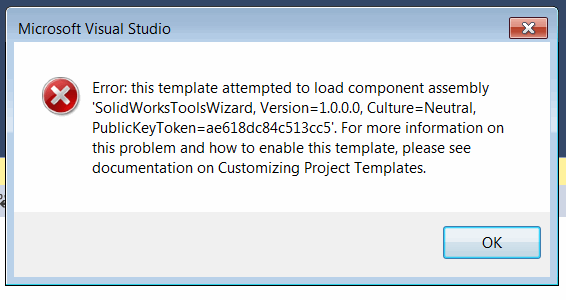
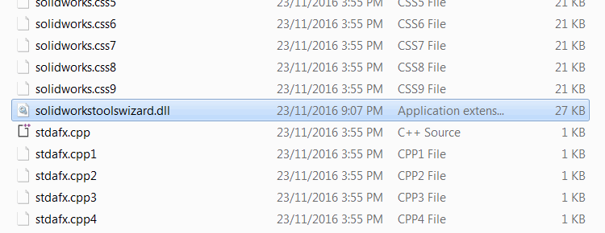
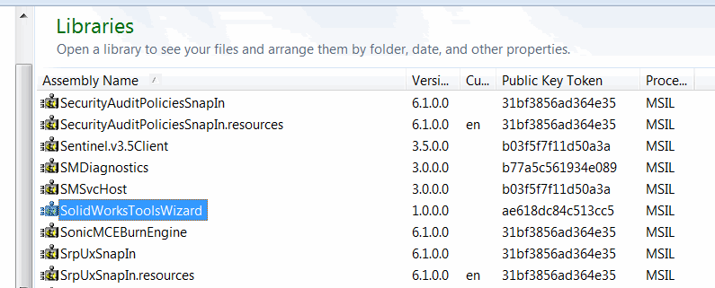

 当在Visual Studio C#和VB.NET项目中不显示插件模板时，修复SOLIDWORKS API SDK的安装问题
image: solidworks-api-sdk-installation.png
labels: [插件, 故障排除]
---
## 症状
{ width=250 }

在安装SOLIDWORKS API SDK后，无法在Visual Studio的新建项目对话框中找到C#和VB.NET的项目模板。

## 原因
在安装模板并在全局程序集缓存（GAC）中注册向导程序集时发生系统错误。这可能是由于权限问题引起的。

## 解决方法

* 找到_SOLIDWORKS API SDK.msi_文件。通常可以在安装DVD或SOLIDWORKS下载包的_apisdk_文件夹中找到。

* MSI包是一个zip存储。使用任何支持zip格式的存档工具（如WinRar、WinZip或7-Zip）解压（unzip）该文件。

{ width=500 }

* 在解压后的文件夹中找到VB.NET模板的_swvbaddin.zip_和C#模板的_swcsharpaddin.zip_。

* 打开Visual Studio，选择_Tools->Options..._菜单命令。导航到_Projects and Solutions_组。

{ width=400 }

* 复制_User project templates location_字段值的路径，并在资源管理器中打开此文件夹。

* 将_swvbaddin.zip_文件复制到_Visual Basic_文件夹中，将_swcsharpaddin.zip_文件复制到_Visual C#_文件夹中。不需要解压这些文件。

* 启动Visual Studio并创建新项目。现在可以选择C#和VB.NET项目模板。

{ width=500 }

如果在创建项目时显示以下错误：

* 导航到从_SOLIDWORKS API SDK.msi_文件解压的文件夹中，找到_SolidWorksToolsWizard.dll_

* 这个dll需要在全局程序集缓存（GAC）中注册。在资源管理器中导航到_%windir%\assembly_文件夹，并将dll文件拖放到该文件夹中

> 如果在将程序集注册到GAC时显示**访问被拒绝**错误，您可以使用Windows SDK中的gacutil，并从以管理员身份运行的**命令提示符**中运行它**gacutil.exe" /i "{solidworkstoolswizard.dll的完整路径}"**

或者按照[如何：将程序集安装到全局程序集缓存](https://docs.microsoft.com/zh-cn/dotnet/framework/app-domains/how-to-install-an-assembly-into-the-gac)文章中的指南注册程序集到GAC。