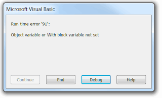

 修复在SOLIDWORKS的工具->宏->运行菜单中无法正常运行的宏，但在VBA编辑器中打开并通过F5或点击绿色箭头执行时可以正常工作
image: error-object-variable-or-with-block-variable-not-set.png
labels: [宏, 故障排除]
redirect-from:
  - /2018/04/macro-troubleshooting-multiple-entry-points-in-macro.html
---
## 症状

如果从SOLIDWORKS的工具->宏->运行菜单中运行，SOLIDWORKS宏无法正常工作。

这可能会产生类似于“运行时错误'91'：对象变量或With块变量未设置”的错误。

{ width=320 height=194 }

或者宏可能会表现异常，或者根本不执行任何步骤。
如果在VBA编辑器中打开并通过F5或点击绿色箭头（运行）按钮执行，宏将正常运行。

## 原因

当宏启动时，SOLIDWORKS会尝试找到入口点（要首先执行的子程序（sub））。这将是不包含任何参数的sub。

如果宏包含多个这样的sub，将会产生歧义，任何sub都可以成为入口点。

~~~ vb
Dim swApp As SldWorks.SldWorks
Dim swModel As SldWorks.ModelDoc2

Sub main() '此方法必须是入口点

    ConnectToSw
    CountFeatures
    
End Sub

Sub ConnectToSw() '此方法可以被选为入口点
    
    Set swApp = Application.SldWorks
    Set swModel = swApp.ActiveDoc
    
    If swModel Is Nothing Then
        MsgBox "请打开模型"
        End
    End If
    
End Sub

Sub CountFeatures() '此方法可以被选为入口点
    
    swApp.SendMsgToUser "活动模型中有 " & swModel.GetFeatureCount() & " 个特征"
    
End Sub
~~~

入口sub是关键的，因为它通常包含初始化例程，如果不按正确顺序执行，宏逻辑将受到影响。

## 解决方法

* 始终保留一个无参数的子程序（通常称为main）。对于不需要输入参数的其他sub，使用*dummy*参数以防止不正确的行为。可以传递任何值给此参数，因为它不会被使用（例如""或Empty）。

~~~ vb
Call AnotherProc(Empty) '使用空值调用sub
----
Sub AnotherProc(dummy) '未使用的dummy参数
End Sub
~~~

~~~ vb
Dim swApp As SldWorks.SldWorks
Dim swModel As SldWorks.ModelDoc2

Sub main() '此方法是唯一一个没有参数的方法

    ConnectToSw Empty
    CountFeatures Empty
    
End Sub

Sub ConnectToSw(dummy)
    
    Set swApp = Application.SldWorks
    Set swModel = swApp.ActiveDoc
    
    If swModel Is Nothing Then
        MsgBox "请打开模型"
        End
    End If
    
End Sub

Sub CountFeatures(dummy) '此方法可以被选为入口点
    
    swApp.SendMsgToUser "活动模型中有 " & swModel.GetFeatureCount() & " 个特征"
    
End Sub
~~~

* [将宏分配给按钮](/docs/codestack/solidworks-api/getting-started/macros/macro-buttons)。在这种情况下，将需要强制选择入口点sub，以防止宏中存在多个无参数sub时产生歧义。